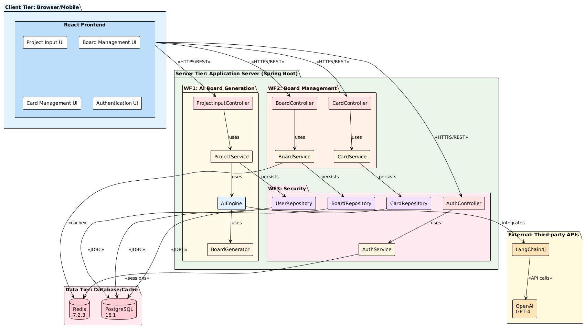
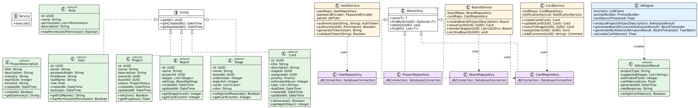
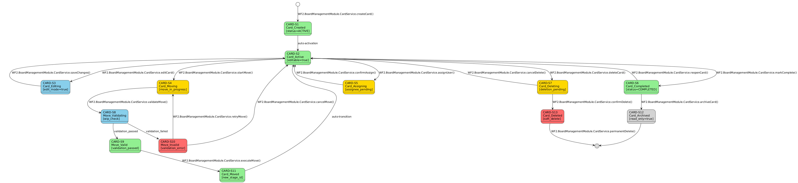
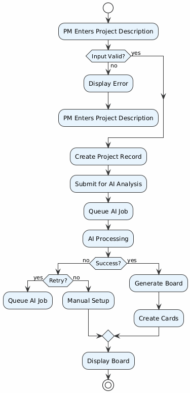
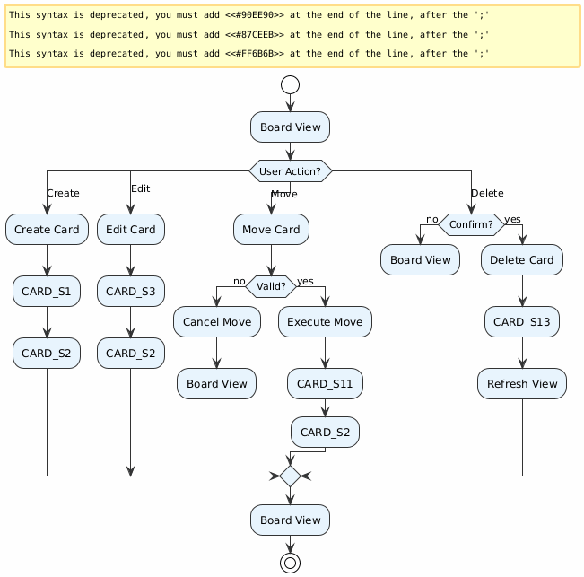

# Development Specification
## AI-Powered Workflow Management Application

---

# Dev Spec Header

## Version and Date

| Version | Date | Description |
|---------|------|-------------|
| 1.0 | 2024-02-15 | Initial development specification |

## Author and Role

| Author | Role | Version |
|--------|------|---------|
| Luke Hill | Lead Architect | 1.0 |

---

# User Story

> As a project manager, I want to provide a brief project description and have the AI automatically generate a kanban board with appropriate workflow stages and pre-populated work items, so that I can start managing the project immediately without spending hours setting up the board structure.

---

# Table of Contents

1. [Architecture Diagram](#architecture-diagram)
2. [Class Diagram](#class-diagram)
3. [List of Classes](#list-of-classes)
4. [State Diagrams](#state-diagrams)
5. [Flow Charts](#flow-charts)
6. [Possible Threats and Failures](#possible-threats-and-failures)
7. [Technologies](#technologies)
8. [APIs](#apis)
9. [Public Interfaces](#public-interfaces)
10. [Data Schemas](#data-schemas)
11. [Risks to Completion](#risks-to-completion)
12. [Security and Privacy](#security-and-privacy)

---

# Architecture Diagram

---

# Class Diagram

---

# List of Classes

## WF1 - Artificial Intelligence Board Generation Pipeline

| Label | Class Name | Type | Purpose |
|-------|------------|------|---------|
| WF1.1.1 | ProjectInputController | Controller | Handles HyperText Transfer Protocol requests for project creation |
| WF1.1.2 | ProjectDescription | Struct | Data Transfer Object containing project details |
| WF1.1.3 | ProjectService | Service | Business logic for project create, read, update, delete |
| WF1.2.1 | ArtificialIntelligenceEngine | Service | Core Artificial Intelligence component for analysis and generation |
| WF1.2.2 | PromptBuilder | Service | Constructs optimized prompts for Large Language Model |
| WF1.2.3 | LargeLanguageModelClient | Service | External Application Programming Interface client for Large Language Model services |
| WF1.2.4 | ArtificialIntelligenceAnalysisResult | Struct | Stores Artificial Intelligence-generated analysis results |
| WF1.3.1 | BoardGenerator | Service | Orchestrates board creation from Artificial Intelligence results |
| WF1.3.2 | BoardTemplate | Struct | Predefined or Artificial Intelligence-generated board configuration |
| WF1.3.3 | StageFactory | Service | Creates and configures workflow stages |

## WF2 - Work Item & Board Management

| Label | Class Name | Type | Purpose |
|-------|------------|------|---------|
| WF2.1.1 | WorkItemGenerator | Service | Generates tasks/cards from Artificial Intelligence analysis |
| WF2.1.2 | TaskTemplate | Struct | Template for creating work items |
| WF2.1.3 | TaskBatch | Struct | Collection of generated tasks |
| WF2.2.1 | BoardController | Controller | HyperText Transfer Protocol endpoints for board operations |
| WF2.2.2 | BoardService | Service | Core business logic for board operations |
| WF2.2.3 | CardController | Controller | HyperText Transfer Protocol endpoints for card operations |
| WF2.2.4 | CardService | Service | Business logic for card lifecycle |

## WF3 - Infrastructure & Security

| Label | Class Name | Type | Purpose |
|-------|------------|------|---------|
| WF3.1.1 | AuthController | Controller | HyperText Transfer Protocol endpoints for authentication |
| WF3.1.2 | AuthService | Service | Core authentication logic |
| WF3.1.3 | PermissionManager | Service | Role-based access control |
| WF3.1.4 | JsonWebTokenUtil | Utility | Json Web Token generation and validation |
| WF3.2.1 | UserRepository | Repository | Data access for User entity |
| WF3.2.2 | BoardRepository | Repository | Data access for Board entity |
| WF3.2.3 | CardRepository | Repository | Data access for Card entity |
| WF3.2.4 | ProjectRepository | Repository | Data access for Project entity |
| WF3.2.5 | DatabaseConnection | Service | Database connection management |

## WF4 - Domain Models

| Label | Class Name | Type | Purpose |
|-------|------------|------|---------|
| WF4.1 | User | Struct | Core user entity |
| WF4.2 | Project | Struct | Project entity |
| WF4.3 | Board | Struct | Kanban board entity |
| WF4.4 | Stage | Struct | Workflow stage/column |
| WF4.5 | Card | Struct | Work item/task entity |
| WF4.6 | Role | Struct | User role with permissions |

---

# State Diagrams

## Project Entity State Diagram

## Card Entity State Diagram

---

# Flow Charts

## Project Creation Flow

## Card Management Flow

---

# Possible Threats and Failures

## Frontend Web Application

| Label | Failure Mode | Effect | Recovery | Likelihood | Impact |
|-------|--------------|--------|----------|------------|--------|
| FE-R1 | Process crash | Blank page; lost work | Auto-reload; restore from localStorage | Medium | Medium |
| FE-R2 | Lost runtime state | Session context lost | Re-authenticate; restore from server | Medium | High |
| FE-C1 | Lost network | Cannot reach Application Programming Interface | Enable offline mode; queue actions | High | High |
| FE-I1 | Cross-Site Scripting attack | Malicious script execution | Content Security Policy headers; input sanitization | Medium | Critical |

## Backend Application Programming Interface Server

| Label | Failure Mode | Effect | Recovery | Likelihood | Impact |
|-------|--------------|--------|----------|------------|--------|
| API-R1 | Process crash | All requests fail | Auto-restart; health checks | Medium | Critical |
| API-R6 | Artificial Intelligence service Remote Procedure Call fail | Artificial Intelligence features unavailable | Fallback; queue for retry | Medium | High |
| API-C2 | Lost database access | Data operations fail | Replica failover; retry | Low | Critical |
| API-I1 | Denial of Service attack | Service unavailable | Web Application Firewall; rate limiting; auto-scale | Medium | Critical |

## Artificial Intelligence Processing Service

| Label | Failure Mode | Effect | Recovery | Likelihood | Impact |
|-------|--------------|--------|----------|------------|--------|
| AI-R1 | Process crash | Artificial Intelligence requests fail | Retry with backoff; fallback | Medium | High |
| AI-R3 | Model timeout | Slow/unresponsive Artificial Intelligence | Timeout handling; partial caching | High | Medium |
| AI-R4 | Artificial Intelligence hallucination | Incorrect suggestions | Output validation; human review | Medium | High |
| AI-C1 | Lost Artificial Intelligence provider access | Artificial Intelligence unavailable | Multi-provider fallback | Medium | Critical |

## Database

| Label | Failure Mode | Effect | Recovery | Likelihood | Impact |
|-------|--------------|--------|----------|------------|--------|
| DB-R1 | Process crash | All operations fail | Auto-restart; replica promotion | Low | Critical |
| DB-R7 | Out of space | Writes fail | Auto-scaling; alert thresholds | Low | Critical |
| DB-I1 | SQL injection | Unauthorized access | Parameterized queries; WAF | Low | Critical |

---

# Technologies

| Technology | Label | Version | Purpose | Source | Documentation URL |
|------------|-------|---------|---------|--------|-------------------|
| Java | TECH-LANG-001 | 21 Long Term Support | Backend development | OpenJDK | https://openjdk.org/projects/jdk/21/ |
| Spring Boot | TECH-FW-001 | 3.2.0 | Application framework | Spring.io | https://spring.io/projects/spring-boot |
| PostgreSQL | TECH-DB-001 | 16.1 | Primary database | PostgreSQL.org | https://www.postgresql.org/docs/16/ |
| Redis | TECH-DB-002 | 7.2.3 | Cache & sessions | Redis.io | https://redis.io/documentation |
| OpenAI GPT-4 | TECH-AI-001 | gpt-4-1106-preview | Artificial Intelligence analysis | OpenAI | https://platform.openai.com/docs/ |
| LangChain4j | TECH-AI-003 | 0.24.0 | Large Language Model integration | LangChain4j | https://github.com/langchain4j/langchain4j |
| React | TECH-FE-001 | 18.2.0 | Frontend User Interface | React.dev | https://react.dev |
| TypeScript | TECH-FE-002 | 5.3.2 | Type-safe frontend | TypeScriptlang.org | https://www.typescriptlang.org/docs/ |
| Spring Security | TECH-AUTH-001 | 6.2.0 | Authentication | Spring.io | https://spring.io/projects/spring-security |

---

# APIs

## REST API Endpoints

### Project Endpoints

| Method | Endpoint | Label | Description |
|--------|----------|-------|-------------|
| POST | `/projects` | WF1.1.1 | Create project |
| GET | `/projects` | WF1.1.2 | List projects |
| GET | `/projects/{id}` | WF1.1.3 | Get project |
| PUT | `/projects/{id}` | WF1.1.4 | Update project |
| DELETE | `/projects/{id}` | WF1.1.5 | Delete project |
| POST | `/projects/{id}/analyze` | WF1.1.6 | AI analysis |

### Board Endpoints

| Method | Endpoint | Label | Description |
|--------|----------|-------|-------------|
| GET | `/boards/{id}` | WF1.2.1 | Get board |
| POST | `/projects/{id}/board` | WF1.2.2 | Generate board |
| PUT | `/boards/{id}` | WF1.2.3 | Update board |
| POST | `/boards/{id}/reset` | WF1.2.4 | Reset board |

### Card Endpoints

| Method | Endpoint | Label | Description |
|--------|----------|-------|-------------|
| POST | `/columns/{id}/cards` | WF1.4.1 | Create card |
| GET | `/cards/{id}` | WF1.4.3 | Get card |
| PUT | `/cards/{id}` | WF1.4.4 | Update card |
| PUT | `/cards/{id}/move` | WF1.4.5 | Move card |
| DELETE | `/cards/{id}` | WF1.4.6 | Delete card |

---

# Public Interfaces

## Interface Types

| Interface | Protocol | Base URL | Authentication |
|-----------|----------|----------|----------------|
| REST API | HTTP/HTTPS | `/api/v1` | Bearer JWT Token in Authorization header |
| GraphQL | HTTP/HTTPS | `/graphql` | Bearer JWT Token in Authorization header |

---

## Module: WF1 - AI Board Generation Pipeline

### Component: WF1.1 - Project Input Module

#### Class: WF1.1.1 ProjectInputController

**Methods used within same component:**

| Label | Method | Return Type | Parameters | Description |
|-------|--------|-------------|------------|-------------|
| WF1.1.1.1 | `validateDescription()` | `ValidationResult` | `description: ProjectDescription` | Validates project description input |

**Methods used across components in same module:**

| Label | Method | Return Type | Parameters | Description |
|-------|--------|-------------|------------|-------------|
| WF1.1.1.2 | `handleProjectSubmission()` | `ResponseEntity<ProjectDTO>` | `request: CreateProjectRequest` | Handles project creation request, delegates to WF1.1.3 ProjectService |

**Methods used across modules:**
- None

#### Class: WF1.1.3 ProjectService

**Methods used within same component:**

| Label | Method | Return Type | Parameters | Description |
|-------|--------|-------------|------------|-------------|
| WF1.1.3.1 | `createProject()` | `Project` | `request: CreateProjectRequest, userId: UUID` | Creates project record |
| WF1.1.3.2 | `getProject()` | `Project` | `projectId: UUID` | Retrieves project by ID |
| WF1.1.3.3 | `updateProject()` | `Project` | `projectId: UUID, request: UpdateProjectRequest` | Updates project metadata |
| WF1.1.3.4 | `deleteProject()` | `void` | `projectId: UUID` | Soft deletes project |

**Methods used across components in same module:**

| Label | Method | Return Type | Parameters | Description |
|-------|--------|-------------|------------|-------------|
| WF1.1.3.5 | `submitForAnalysis()` | `AIAnalysisResult` | `projectId: UUID` | Submits project to WF1.2.1 AIEngine for analysis |

**Methods used across modules:**
- None

**Cross-component dependencies:**
- Uses WF1.2.1 AIEngine.analyzeProject()
- Uses WF1.2.4 AIAnalysisResult

---

### Component: WF1.2 - AI Processing Engine

#### Class: WF1.2.1 AIEngine

**Methods used within same component:**

| Label | Method | Return Type | Parameters | Description |
|-------|--------|-------------|------------|-------------|
| WF1.2.1.1 | `analyzeProject()` | `AIAnalysisResult` | `description: ProjectDescription` | Analyzes project description using LLM |
| WF1.2.1.2 | `generateBoardStructure()` | `BoardTemplate` | `analysis: AIAnalysisResult` | Generates board stages from analysis |
| WF1.2.1.3 | `generateWorkItems()` | `TaskBatch` | `analysis: AIAnalysisResult, template: BoardTemplate` | Generates task suggestions |

**Methods used across components in same module:**
- None (core AI processing is self-contained)

**Methods used across modules:**
- None

**Cross-component dependencies:**
- Uses WF1.2.2 PromptBuilder.buildAnalysisPrompt()
- Uses WF1.2.2 PromptBuilder.buildBoardPrompt()
- Uses WF1.2.2 PromptBuilder.buildTasksPrompt()
- Uses WF1.2.3 LLMClient.sendRequest()

#### Class: WF1.2.3 LLMClient

**Methods used within same component:**

| Label | Method | Return Type | Parameters | Description |
|-------|--------|-------------|------------|-------------|
| WF1.2.3.1 | `sendRequest()` | `LLMResponse` | `prompt: String` | Sends request to external LLM API |
| WF1.2.3.2 | `parseResponse()` | `Map<String,Object>` | `response: String` | Parses LLM JSON response |
| WF1.2.3.3 | `handleErrors()` | `AIError` | `exception: Exception` | Handles LLM API errors |

---

### Component: WF1.3 - Board Generation Module

#### Class: WF1.3.1 BoardGenerator

**Methods used within same component:**

| Label | Method | Return Type | Parameters | Description |
|-------|--------|-------------|------------|-------------|
| WF1.3.1.1 | `generateBoard()` | `Board` | `project: Project, aiResult: AIAnalysisResult` | Creates board from AI analysis |
| WF1.3.1.2 | `applyTemplate()` | `Board` | `board: Board, template: BoardTemplate` | Applies template to board |
| WF1.3.1.3 | `customizeStages()` | `Board` | `board: Board, stages: List<String>` | Customizes board stages |

**Cross-component dependencies:**
- Uses WF1.3.3 StageFactory.createStage()
- Uses WF1.3.3 StageFactory.createDefaultStages()

---

## Module: WF2 - Work Item & Board Management

### Component: WF2.2 - Board Management Module

#### Class: WF2.2.1 BoardController

**Methods used within same component:**
- None (controller delegates to service)

**Methods used across components in same module:**

| Label | Method | Return Type | Parameters | Description |
|-------|--------|-------------|------------|-------------|
| WF2.2.1.1 | `createBoard()` | `ResponseEntity<BoardDTO>` | `request: CreateBoardRequest` | Creates new board |
| WF2.2.1.2 | `getBoard()` | `ResponseEntity<BoardDTO>` | `boardId: UUID` | Retrieves board by ID |
| WF2.2.1.3 | `updateBoard()` | `ResponseEntity<BoardDTO>` | `boardId: UUID, request: UpdateBoardRequest` | Updates board |
| WF2.2.1.4 | `deleteBoard()` | `ResponseEntity<Void>` | `boardId: UUID` | Deletes board |
| WF2.2.1.5 | `listBoards()` | `ResponseEntity<List<BoardDTO>>` | `userId: UUID` | Lists user's boards |

**Methods used across modules:**

| Label | Method | Return Type | Parameters | Description |
|-------|--------|-------------|------------|-------------|
| WF2.2.1.6 | `authenticate()` | `AuthToken` | `credentials: LoginRequest` | Calls WF3.1.2 AuthService.authenticate() |

#### Class: WF2.2.2 BoardService

**Methods used within same component:**

| Label | Method | Return Type | Parameters | Description |
|-------|--------|-------------|------------|-------------|
| WF2.2.2.1 | `createBoard()` | `Board` | `request: CreateBoardRequest` | Creates board entity |
| WF2.2.2.2 | `moveCard()` | `Card` | `cardId: UUID, targetStageId: UUID` | Moves card between stages |
| WF2.2.2.3 | `reorderStages()` | `Board` | `boardId: UUID, stageOrder: List<UUID>` | Reorders board stages |
| WF2.2.2.4 | `archiveBoard()` | `void` | `boardId: UUID` | Archives board |

**Cross-component dependencies:**
- Uses WF3.2.2 BoardRepository.save()
- Uses WF3.2.2 BoardRepository.findById()
- Uses WF3.2.3 CardRepository.save()

#### Class: WF2.2.3 CardController

**Methods used across components in same module:**

| Label | Method | Return Type | Parameters | Description |
|-------|--------|-------------|------------|-------------|
| WF2.2.3.1 | `createCard()` | `ResponseEntity<CardDTO>` | `stageId: UUID, request: CreateCardRequest` | Creates new card |
| WF2.2.3.2 | `updateCard()` | `ResponseEntity<CardDTO>` | `cardId: UUID, request: UpdateCardRequest` | Updates card |
| WF2.2.3.3 | `moveCard()` | `ResponseEntity<CardDTO>` | `cardId: UUID, targetStageId: UUID` | Moves card |
| WF2.2.3.4 | `deleteCard()` | `ResponseEntity<Void>` | `cardId: UUID` | Deletes card |
| WF2.2.3.5 | `getCardHistory()` | `ResponseEntity<List<CardHistoryDTO>>` | `cardId: UUID` | Gets card history |

#### Class: WF2.2.4 CardService

**Methods used within same component:**

| Label | Method | Return Type | Parameters | Description |
|-------|--------|-------------|------------|-------------|
| WF2.2.4.1 | `createCard()` | `Card` | `card: Card` | Creates card entity |
| WF2.2.4.2 | `updateCard()` | `Card` | `cardId: UUID, card: Card` | Updates card |
| WF2.2.4.3 | `moveToStage()` | `Card` | `cardId: UUID, stageId: UUID` | Moves card to stage |
| WF2.2.4.4 | `assignUser()` | `Card` | `cardId: UUID, userId: UUID` | Assigns card to user |
| WF2.2.4.5 | `addComment()` | `Comment` | `cardId: UUID, content: String` | Adds comment to card |

**Cross-component dependencies:**
- Uses WF3.2.3 CardRepository.save()
- Uses WF3.2.3 CardRepository.findById()

---

## Module: WF3 - Infrastructure & Security

### Component: WF3.1 - User Authentication & Authorization

#### Class: WF3.1.1 AuthController

**Methods used across components in same module:**

| Label | Method | Return Type | Parameters | Description |
|-------|--------|-------------|------------|-------------|
| WF3.1.1.1 | `login()` | `ResponseEntity<AuthToken>` | `request: LoginRequest` | Authenticates user |
| WF3.1.1.2 | `logout()` | `ResponseEntity<Void>` | `token: String` | Logs out user |
| WF3.1.1.3 | `register()` | `ResponseEntity<UserDTO>` | `request: RegisterRequest` | Registers new user |
| WF3.1.1.4 | `refreshToken()` | `ResponseEntity<AuthToken>` | `token: String` | Refreshes access token |
| WF3.1.1.5 | `resetPassword()` | `ResponseEntity<Void>` | `email: String` | Initiates password reset |

#### Class: WF3.1.2 AuthService

**Methods used within same component:**

| Label | Method | Return Type | Parameters | Description |
|-------|--------|-------------|------------|-------------|
| WF3.1.2.1 | `authenticate()` | `AuthToken` | `email: String, password: String` | Validates credentials |
| WF3.1.2.2 | `authorize()` | `Boolean` | `userId: UUID, permission: Permission` | Checks user permission |
| WF3.1.2.3 | `generateToken()` | `String` | `user: User` | Generates JWT token |
| WF3.1.2.4 | `validateToken()` | `Boolean` | `token: String` | Validates JWT token |

**Cross-component dependencies:**
- Uses WF3.2.1 UserRepository.findByEmail()
- Uses WF3.1.4 JWTUtil.generateToken()
- Uses WF3.1.4 JWTUtil.validateToken()

#### Class: WF3.1.3 PermissionManager

**Methods used within same component:**

| Label | Method | Return Type | Parameters | Description |
|-------|--------|-------------|------------|-------------|
| WF3.1.3.1 | `checkPermission()` | `Boolean` | `user: User, permission: Permission` | Checks if user has permission |
| WF3.1.3.2 | `grantPermission()` | `void` | `role: Role, permission: Permission` | Grants permission to role |
| WF3.1.3.3 | `revokePermission()` | `void` | `role: Role, permission: Permission` | Revokes permission from role |
| WF3.1.3.4 | `getUserPermissions()` | `List<Permission>` | `user: User` | Gets all user permissions |

---

### Component: WF3.2 - Database Layer

#### Class: WF3.2.1 UserRepository

**Methods used across modules:**

| Label | Method | Return Type | Parameters | Description |
|-------|--------|-------------|------------|-------------|
| WF3.2.1.1 | `save()` | `User` | `user: User` | Saves user entity |
| WF3.2.1.2 | `findById()` | `Optional<User>` | `id: UUID` | Finds user by ID |
| WF3.2.1.3 | `findByEmail()` | `Optional<User>` | `email: String` | Finds user by email |
| WF3.2.1.4 | `delete()` | `void` | `id: UUID` | Deletes user |

**Used by:**
- WF1.1.3 ProjectService (for project ownership)
- WF2.2.4 CardService (for card assignment)
- WF3.1.2 AuthService (for authentication)

#### Class: WF3.2.2 BoardRepository

**Methods used across modules:**

| Label | Method | Return Type | Parameters | Description |
|-------|--------|-------------|------------|-------------|
| WF3.2.2.1 | `save()` | `Board` | `board: Board` | Saves board entity |
| WF3.2.2.2 | `findById()` | `Optional<Board>` | `id: UUID` | Finds board by ID |
| WF3.2.2.3 | `findByProjectId()` | `Optional<Board>` | `projectId: UUID` | Finds board by project |
| WF3.2.2.4 | `findByUser()` | `List<Board>` | `userId: UUID` | Finds boards by user |

**Used by:**
- WF2.2.2 BoardService

#### Class: WF3.2.3 CardRepository

**Methods used across modules:**

| Label | Method | Return Type | Parameters | Description |
|-------|--------|-------------|------------|-------------|
| WF3.2.3.1 | `save()` | `Card` | `card: Card` | Saves card entity |
| WF3.2.3.2 | `findById()` | `Optional<Card>` | `id: UUID` | Finds card by ID |
| WF3.2.3.3 | `findByStageId()` | `List<Card>` | `stageId: UUID` | Finds cards by stage |
| WF3.2.3.4 | `search()` | `List<Card>` | `query: String` | Searches cards |

**Used by:**
- WF2.2.2 BoardService
- WF2.2.4 CardService

#### Class: WF3.2.4 ProjectRepository

**Methods used across modules:**

| Label | Method | Return Type | Parameters | Description |
|-------|--------|-------------|------------|-------------|
| WF3.2.4.1 | `save()` | `Project` | `project: Project` | Saves project entity |
| WF3.2.4.2 | `findById()` | `Optional<Project>` | `id: UUID` | Finds project by ID |
| WF3.2.4.3 | `findByUserId()` | `List<Project>` | `userId: UUID` | Finds projects by user |
| WF3.2.4.4 | `search()` | `List<Project>` | `query: String` | Searches projects |

**Used by:**
- WF1.1.3 ProjectService

---

## Cross-Module Dependencies Summary

### WF1 (AI Board Generation) uses:
- **WF3.2.1** UserRepository.findById() - for project ownership validation

### WF2 (Board Management) uses:
- **WF3.1.2** AuthService.authenticate() - for request authentication
- **WF3.2.2** BoardRepository - for board persistence
- **WF3.2.3** CardRepository - for card persistence
- **WF3.2.1** UserRepository - for user lookups

### WF3 (Infrastructure) provides to all modules:
- **WF3.1.2** AuthService - authentication/authorization
- **WF3.2.x** Repositories - data persistence

---

# Data Schemas

## DS-001: users

**Runtime Class:** WF4.1 User

| Column | Type | Nullable | Notes | Storage Estimate |
|--------|------|----------|-------|------------------|
| id | UniversallyUniqueIdentifier | NO | Primary key | 16 bytes |
| email | VARCHAR(255) | NO | Unique | 50 bytes average |
| password_hash | VARCHAR(255) | NO | Bcrypt | 60 bytes |
| first_name | VARCHAR(100) | NO | - | 20 bytes average |
| last_name | VARCHAR(100) | NO | - | 20 bytes average |
| role | VARCHAR(20) | NO | ADMIN/MANAGER/MEMBER | 10 bytes average |
| created_at | TIMESTAMPTZ | NO | - | 8 bytes |

**Total Storage Per Row:** Approximately 184 bytes

## DS-002: projects

**Runtime Class:** WF4.2 Project

| Column | Type | Nullable | Notes | Storage Estimate |
|--------|------|----------|-------|------------------|
| id | UniversallyUniqueIdentifier | NO | Primary key | 16 bytes |
| name | VARCHAR(200) | NO | - | 50 bytes average |
| description | TEXT | YES | - | 200 bytes average |
| owner_id | UniversallyUniqueIdentifier | NO | Foreign Key to users | 16 bytes |
| status | VARCHAR(20) | NO | ACTIVE/ARCHIVED/DELETED | 10 bytes average |
| created_at | TIMESTAMPTZ | NO | - | 8 bytes |

**Total Storage Per Row:** Approximately 300 bytes

## DS-003: boards

**Runtime Class:** WF4.3 Board

| Column | Type | Nullable | Notes | Storage Estimate |
|--------|------|----------|-------|------------------|
| id | UniversallyUniqueIdentifier | NO | Primary key | 16 bytes |
| project_id | UniversallyUniqueIdentifier | NO | Foreign Key to projects | 16 bytes |
| name | VARCHAR(200) | NO | - | 50 bytes average |
| created_at | TIMESTAMPTZ | NO | - | 8 bytes |

**Total Storage Per Row:** Approximately 90 bytes

## DS-004: cards

**Runtime Class:** WF4.5 Card

| Column | Type | Nullable | Notes | Storage Estimate |
|--------|------|----------|-------|------------------|
| id | UniversallyUniqueIdentifier | NO | Primary key | 16 bytes |
| stage_id | UniversallyUniqueIdentifier | NO | Foreign Key to stages | 16 bytes |
| title | VARCHAR(300) | NO | - | 100 bytes average |
| description | TEXT | YES | - | 300 bytes average |
| assignee_id | UniversallyUniqueIdentifier | YES | Foreign Key to users | 16 bytes |
| priority | VARCHAR(10) | NO | LOW/MEDIUM/HIGH/CRITICAL | 8 bytes average |
| created_at | TIMESTAMPTZ | NO | - | 8 bytes |

**Total Storage Per Row:** Approximately 464 bytes

---

# Risks to Completion

## Risk Assessment Framework

Dimensions: Learn | Design | Implement | Verify | Maintain | Update

Risk Levels: Very Low | Low | Medium | High | Critical

## Module-Level Assessment

### WF1 - Artificial Intelligence Board Generation Pipeline

| Aspect | Risk Level | Rationale |
|--------|------------|-----------|
| Learn | Medium | Prompt engineering, Large Language Model Application Programming Interfaces new to team |
| Design | High | Prompt architecture, output validation |
| Implement | Medium | Application Programming Interface integration well-documented |
| Verify | High | Non-deterministic outputs |
| Maintain | Medium | Model updates may change behavior |
| Update | High | Provider model changes |

**Build vs Buy:** OpenAI Application Programming Interface (PRIMARY), Anthropic Claude (FALLBACK)

### WF2 - Work Item & Board Management

| Aspect | Risk Level | Rationale |
|--------|------------|-----------|
| Learn | Low | Kanban patterns well-understood |
| Design | Medium | Real-time updates, conflict resolution |
| Implement | Low | Established libraries available |
| Verify | Medium | E2E testing for drag-and-drop |
| Maintain | Low | Mature patterns |
| Update | Medium | React breaking changes |

**Build vs Buy:** Custom Build (SELECTED)

### WF3 - Infrastructure & Security

| Aspect | Risk Level | Rationale |
|--------|------------|-----------|
| Learn | Medium | OAuth 2.0, Json Web Token expertise needed |
| Design | Medium | Token lifecycle, Role-Based Access Control |
| Implement | Low | Spring Security handles complexity |
| Verify | High | Penetration testing required |
| Maintain | Low | Managed services |
| Update | Low | Provider-managed updates |

**Build vs Buy:** Auth0 (Enterprise), Firebase Auth (Startup)

## Technology Risk Matrix

| Technology | Risk Level | Primary Concern | Fallback |
|------------|------------|-----------------|----------|
| OpenAI GPT-4 | HIGH | Application Programming Interface availability; cost | Anthropic Claude |
| LangChain4j | MEDIUM | Breaking updates | Direct Application Programming Interface |
| Spring Boot | LOW | Mature; Long Term Support | N/A |
| PostgreSQL | LOW | Well-understood | Read replicas |

## Top Risk Categories

| Rank | Category | Risk | Mitigation |
|------|----------|------|------------|
| 1 | Artificial Intelligence Service Dependency | HIGH | Multi-provider architecture |
| 2 | Artificial Intelligence Output Quality | HIGH | Output validation; human review |
| 3 | Security Vulnerabilities | HIGH | Automated scanning; penetration testing |
| 4 | Data Loss | HIGH | Backups; replication |

---

# Security and Privacy

## Personally Identifiable Information Handling

### Temporarily Stored

| Field | Purpose | Path | Disposal |
|-------|---------|------|----------|
| Json Web Token | Authentication | AuthService -> Client -> Requests | 15 min expiration |
| Refresh Token | Token renewal | AuthService -> Client -> AuthService | 7 days or logout |

### Long-Term Stored

| Field | Storage | Encryption |
|-------|---------|------------|
| email | PostgreSQL | AES-256 at rest |
| password_hash | PostgreSQL | bcrypt |
| first_name | PostgreSQL | AES-256 at rest |
| last_name | PostgreSQL | AES-256 at rest |

## Access Control (Role-Based Access Control)

| Role | Permissions |
|------|-------------|
| ADMIN | All operations; user management |
| MANAGER | Create projects; manage team members |
| MEMBER | View assigned projects; edit assigned cards |
| VIEWER | Read-only access |

## Minor Personally Identifiable Information Handling

- Service available to users of all ages
- Users under 13 require verifiable parental consent (Children's Online Privacy Protection Act)
- Users 13-17 can use service with standard account creation
- Same features and protections for all users regardless of age

## Audit Procedures

| Audit Type | Frequency | Scope |
|------------|-----------|-------|
| Access Log Review | Weekly | All Personally Identifiable Information database queries |
| Failed Login Analysis | Daily | Brute force attempts |
| Permission Review | Quarterly | Role-Based Access Control assignments |

## Personnel & Procedures

| Role | Responsibility |
|------|----------------|
| Data Protection Officer | Oversee Personally Identifiable Information handling and compliance |
| Security Engineer | Implement encryption and access controls |
| Development Team | Follow secure coding practices |
| DevOps Team | Manage infrastructure security |

---

*Document Version: 1.0*
*Last Updated: 2024-02-15*
