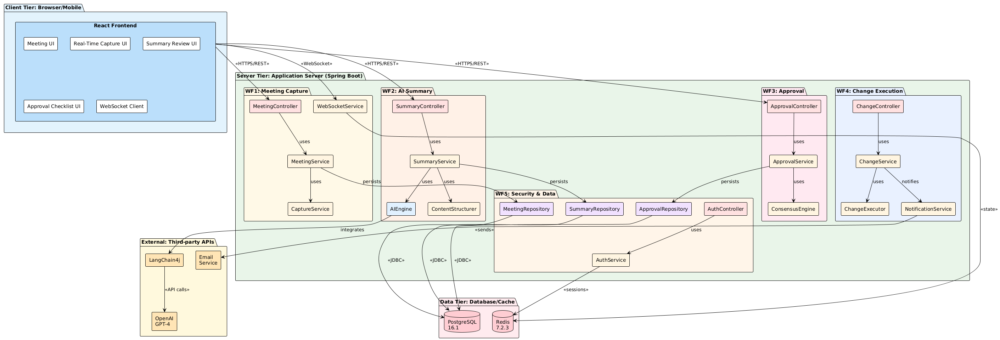
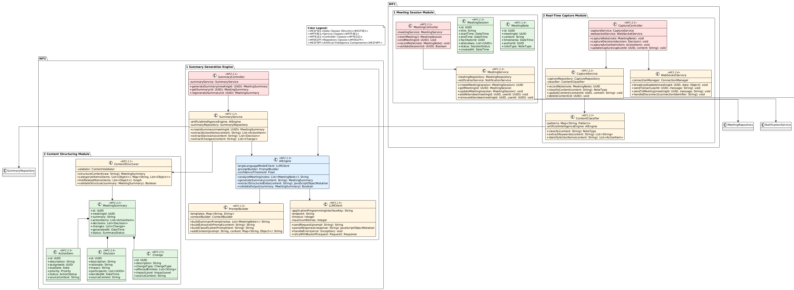
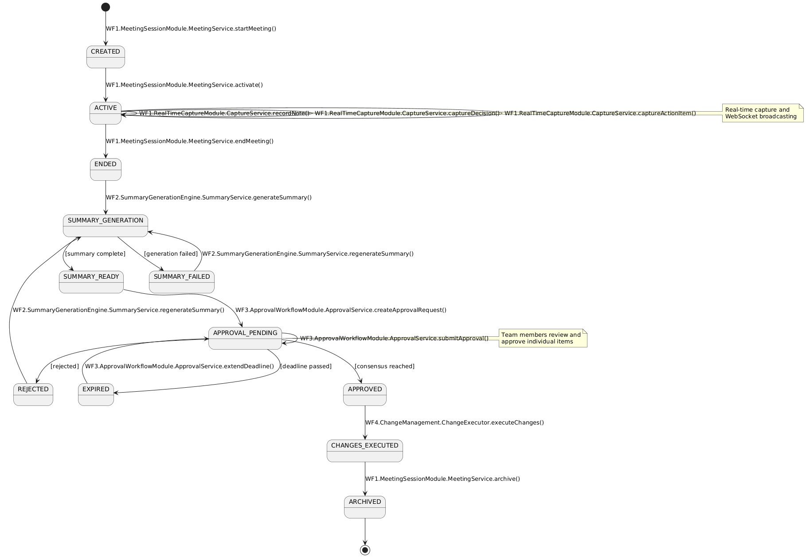
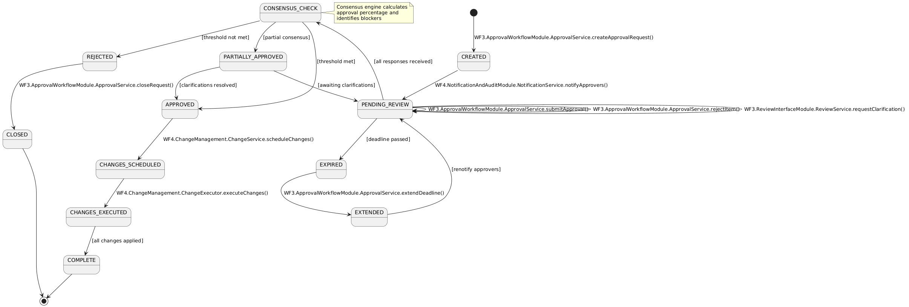
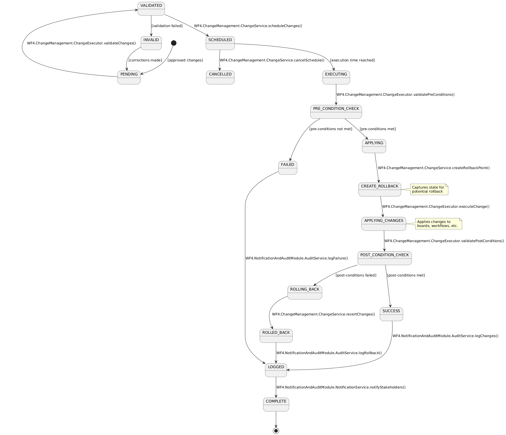
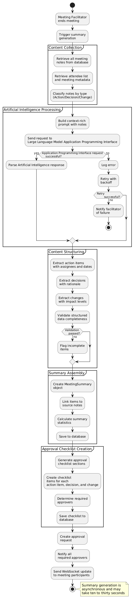

# Development Specification
## Artificial Intelligence-Powered Workflow Management Application

---

# Development Specification Header

## Version and Date

| Version | Date | Description |
|---------|------|-------------|
| 2.3 | 2026-02-15 | Naming convention alignment: UniversallyUniqueIdentifier→UUID, JsonWebTokenUtil→JWTUtil, LargeLanguageModelClient→LLMClient, ArtificialIntelligenceEngine→AIEngine, *Identifier→*Id field names, identifier→id database columns, identifier_→idx_ index prefixes |
| 2.2 | 2026-02-15 | Technology stack alignment: upgraded Java 17 to Java 21 LTS, PostgreSQL 15.5 to 16.1, LangChain4j 0.27.0 to 0.24.0, Flyway 9.22.3 to 10.x for consistency with dev_spec1 and dev_spec_3 |
| 2.1 | 2026-02-15 | Consistency fixes: aligned author info, added missing WF6 enums to diagram, added missing database schemas (decisions, changes, approval_requests, approval_responses), added missing repositories (ChecklistRepository, CommentRepository), fixed class type mismatches, fixed User role field type |
| 2.0 | 2024-02-15 | Fully compliant development specification |

## Authors and Roles

| Author | Role | Version |
|--------|------|---------|
| Luke Hill | Lead Architect | 2.0, 2.1 |
| Vishesh Raju | Technical Reviewer | 1.0, 2.0 |

---

# User Story

> As a meeting facilitator, I want to end the meeting by generating an automatic summary of all agreed-upon action items, decisions, and changes in a separate approval checklist section, so that team members can review exactly what was decided and approve it before any changes take effect.

---

# Table of Contents

1. [Architecture Diagram](#architecture-diagram)
2. [Class Diagram](#class-diagram)
3. [List of Classes](#list-of-classes)
4. [State Diagrams](#state-diagrams)
5. [Flow Charts](#flow-charts)
6. [Possible Threats and Failures](#possible-threats-and-failures)
7. [Technologies](#technologies)
8. [Application Programming Interfaces](#application-programming-interfaces)
9. [Public Interfaces](#public-interfaces)
10. [Data Schemas](#data-schemas)
11. [Risks to Completion](#risks-to-completion)
12. [Security and Privacy](#security-and-privacy)

---

# Architecture Diagram



---

# Class Diagram



---

# List of Classes

## WF1 - Meeting Content Capture Pipeline

### WF1.1 - Meeting Session Module

| Label | Class Name | Type | Purpose |
|-------|------------|------|---------|
| WF1.1.1 | MeetingController | Controller | Handles HyperText Transfer Protocol requests for meeting lifecycle management |
| WF1.1.2 | MeetingSession | Struct | Data structure containing meeting session state and metadata |
| WF1.1.3 | MeetingService | Service | Core business logic for meeting creation, retrieval, and management |
| WF1.1.4 | MeetingNote | Struct | Individual note captured during meeting session |

### WF1.2 - Real-Time Capture Module

| Label | Class Name | Type | Purpose |
|-------|------------|------|---------|
| WF1.2.1 | CaptureController | Controller | Handles real-time capture of meeting content via WebSocket |
| WF1.2.2 | CaptureService | Service | Business logic for capturing and classifying meeting content |
| WF1.2.3 | ContentClassifier | Service | Classifies content type and extracts structured information |
| WF1.2.4 | WebSocketService | Service | Manages bidirectional real-time communication with clients |

## WF2 - Artificial Intelligence Summary Generation Pipeline

### WF2.1 - Summary Generation Engine

| Label | Class Name | Type | Purpose |
|-------|------------|------|---------|
| WF2.1.1 | SummaryController | Controller | Handles requests for summary generation and retrieval |
| WF2.1.2 | SummaryService | Service | Orchestrates summary generation process using Artificial Intelligence |
| WF2.1.3 | AIEngine | Service | Core Artificial Intelligence component for content analysis and generation |
| WF2.1.4 | PromptBuilder | Service | Constructs optimized prompts for Large Language Model requests |
| WF2.1.5 | LLMClient | Service | External Application Programming Interface client for Large Language Model services |

### WF2.2 - Content Structuring Module

| Label | Class Name | Type | Purpose |
|-------|------------|------|---------|
| WF2.2.1 | ContentStructurer | Service | Structures raw Artificial Intelligence output into organized format |
| WF2.2.2 | MeetingSummary | Struct | Complete meeting summary with action items, decisions, and changes |
| WF2.2.3 | ActionItem | Struct | Individual action item extracted from meeting |
| WF2.2.4 | Decision | Struct | Decision made during meeting with rationale and impact |
| WF2.2.5 | Change | Struct | Change to be implemented with affected entities |

## WF3 - Approval and Review Management

### WF3.1 - Approval Workflow Module

| Label | Class Name | Type | Purpose |
|-------|------------|------|---------|
| WF3.1.1 | ApprovalController | Controller | Handles approval workflow requests and responses |
| WF3.1.2 | ApprovalService | Service | Business logic for approval request processing and consensus |
| WF3.1.3 | ApprovalRequest | Struct | Approval request with required approvers and deadline |
| WF3.1.4 | ApprovalResponse | Struct | Individual approver response with item-level approvals |
| WF3.1.5 | ConsensusEngine | Service | Calculates consensus and validates approval thresholds |

### WF3.2 - Review Interface Module

| Label | Class Name | Type | Purpose |
|-------|------------|------|---------|
| WF3.2.1 | ReviewController | Controller | Handles review checklist operations |
| WF3.2.2 | ReviewService | Service | Business logic for review checklist management |
| WF3.2.3 | ApprovalChecklist | Struct | Structured checklist for approval review |
| WF3.2.4 | ChecklistSection | Struct | Section within approval checklist |
| WF3.2.5 | ChecklistItem | Struct | Individual item in checklist with approval status |

## WF4 - Change Execution Module

### WF4.1 - Change Management

| Label | Class Name | Type | Purpose |
|-------|------------|------|---------|
| WF4.1.1 | ChangeController | Controller | Handles change execution requests |
| WF4.1.2 | ChangeService | Service | Business logic for change application and rollback |
| WF4.1.3 | ChangeExecutor | Service | Executes individual changes with validation |
| WF4.1.4 | ChangeRecord | Struct | Record of change execution with rollback data |

### WF4.2 - Notification and Audit Module

| Label | Class Name | Type | Purpose |
|-------|------------|------|---------|
| WF4.2.1 | NotificationService | Service | Manages all system notifications via email and push |
| WF4.2.2 | AuditService | Service | Manages audit logging and trail generation |
| WF4.2.3 | AuditLog | Struct | Individual audit log entry |

## WF5 - Infrastructure and Security

### WF5.1 - User Authentication and Authorization

| Label | Class Name | Type | Purpose |
|-------|------------|------|---------|
| WF5.1.1 | AuthController | Controller | Handles authentication requests |
| WF5.1.2 | AuthService | Service | Core authentication and authorization logic |
| WF5.1.3 | PermissionManager | Service | Role-based access control management |
| WF5.1.4 | JWTUtil | Service | Json Web Token generation and validation |

### WF5.2 - Database Layer

| Label | Class Name | Type | Purpose |
|-------|------------|------|---------|
| WF5.2.1 | UserRepository | Repository | Data access for User entity |
| WF5.2.2 | MeetingRepository | Repository | Data access for MeetingSession entity |
| WF5.2.3 | SummaryRepository | Repository | Data access for MeetingSummary entity |
| WF5.2.4 | ApprovalRepository | Repository | Data access for ApprovalRequest entity |
| WF5.2.5 | CaptureRepository | Repository | Data access for MeetingNote entity |
| WF5.2.6 | DatabaseConnection | Service | Database connection pool management |
| WF5.2.7 | ChecklistRepository | Repository | Data access for ApprovalChecklist entity |
| WF5.2.8 | CommentRepository | Repository | Data access for review comments |

## WF6 - Domain Models

| Label | Class Name | Type | Purpose |
|-------|------------|------|---------|
| WF6.1 | User | Struct | User account entity with authentication details |
| WF6.2 | Role | Struct | Role entity with associated permissions |
| WF6.3 | Permission | Struct | Permission entity defining resource access |
| WF6.4 | SessionStatus | Enum | Enumeration of meeting session states |
| WF6.5 | NoteType | Enum | Enumeration of note classification types |
| WF6.6 | SummaryStatus | Enum | Enumeration of summary approval states |
| WF6.7 | Priority | Enum | Enumeration of action item priority levels |
| WF6.8 | ActionStatus | Enum | Enumeration of action item completion states |
| WF6.9 | ChangeType | Enum | Enumeration of change categories |
| WF6.10 | ImpactLevel | Enum | Enumeration of change impact levels |
| WF6.11 | ApprovalStatus | Enum | Enumeration of approval request states |
| WF6.12 | ChecklistStatus | Enum | Enumeration of checklist completion states |
| WF6.13 | ExecutionStatus | Enum | Enumeration of change execution states |
| WF6.14 | SectionType | Enum | Enumeration of checklist section types |
| WF6.15 | EntityType | Enum | Enumeration of linkable entity types |

---

# State Diagrams

## Meeting Session State Diagram



## Approval Request State Diagram



## Change Execution State Diagram



---

# Flow Charts

## Meeting Summary Generation Flow



## Approval Workflow Flow


---

# Possible Threats and Failures

## WF1.1 - Meeting Session Module

### Component: MeetingController (WF1.1.1)

| Label | Failure Mode | Effect | Recovery Procedure | Diagnostic Procedure | Likelihood | Business Impact |
|-------|--------------|--------|-------------------|---------------------|------------|-----------------|
| WF1.1.1-F1 | Process crash | All meeting requests fail | Auto-restart via container orchestrator; Health check triggers restart within thirty seconds | Check container logs for out-of-memory errors or uncaught exceptions; Review thread dumps | Medium | Critical |
| WF1.1.1-F2 | Lost runtime state | Session context lost | Re-authenticate user; Restore session from Redis cache | Check Redis connectivity; Verify session token validity | Low | High |
| WF1.1.1-F3 | Data erased | Meeting data lost | Restore from hourly database backup; Point-in-time recovery | Query backup retention; Check write-ahead log integrity | Very Low | Critical |
| WF1.1.1-F4 | Unexpected state transition | Meeting in invalid state | Force state correction via admin tool; Roll back to last valid state | Check audit logs for state change history; Verify state machine constraints | Low | Medium |
| WF1.1.1-F5 | Remote Procedure Call failure to MeetingService | Cannot create or update meetings | Retry with exponential backoff; Circuit breaker activates after three failures | Check service mesh metrics; Verify network connectivity between pods | Medium | High |
| WF1.1.1-F6 | Overload | Request queue fills; Timeouts occur | Auto-scale horizontal pod replicas; Rate limiting per user | Monitor request latency percentiles; Check central processing unit and memory metrics | Medium | High |
| WF1.1.1-F7 | Out of Random Access Memory | Process killed by operating system out-of-memory killer | Increase memory limits; Optimize object retention | Review heap dump; Check for memory leaks using profiler | Low | Critical |
| WF1.1.1-F8 | Database out of space | Cannot write new meetings | Provision additional storage; Archive old meetings | Check database volume usage; Review table sizes | Low | Critical |
| WF1.1.1-F9 | Connectivity loss | Cannot reach database | Activate read replica; Queue writes for retry | Check network firewall rules; Ping database endpoint | Low | Critical |
| WF1.1.1-F10 | Server down | All requests fail | Failover to standby instance; Load balancer redirects traffic | Check instance health endpoint; Review cloud provider status | Medium | Critical |
| WF1.1.1-F11 | Intruder unauthorized access | Meeting data exposed | Revoke compromised credentials; Force password reset; Block attacker Internet Protocol address | Review access logs for anomalous patterns; Check authentication failure rates | Low | Critical |
| WF1.1.1-F12 | Intruder data exfiltration | Personally Identifiable Information stolen | Notify affected users; Engage incident response; Rotate encryption keys | Analyze egress traffic for large data transfers; Check for unauthorized database queries | Very Low | Critical |

### Component: MeetingService (WF1.1.3)

| Label | Failure Mode | Effect | Recovery Procedure | Diagnostic Procedure | Likelihood | Business Impact |
|-------|--------------|--------|-------------------|---------------------|------------|-----------------|
| WF1.1.3-F1 | Process crash | Meeting operations fail | Auto-restart; In-flight transactions rolled back | Check application logs; Review exception stack traces | Medium | Critical |
| WF1.1.3-F2 | Lost runtime state | Cache data lost | Rebuild cache from database; Accept performance degradation temporarily | Verify Redis connection; Check cache hit rate metrics | Low | Medium |
| WF1.1.3-F3 | Corrupt database data | Meeting records unreadable | Restore from backup; Manual data repair if possible | Run database consistency check; Query for null or malformed fields | Very Low | Critical |
| WF1.1.3-F4 | Remote Procedure Call failure to NotificationService | Notifications not sent | Queue notifications for retry; Send batch notifications later | Check notification service health; Review message queue depth | Medium | Medium |
| WF1.1.3-F5 | Remote Procedure Call failure to MeetingRepository | Cannot persist meetings | Use fallback repository; Write to alternate database | Check primary database connectivity; Test repository health endpoint | Low | Critical |
| WF1.1.3-F6 | Overload | Slow response times | Enable request throttling; Scale service horizontally | Monitor service latency; Check thread pool saturation | Medium | High |
| WF1.1.3-F7 | Out of Random Access Memory | Service crashes | Increase memory allocation; Optimize query result sizes | Analyze heap usage; Check for unbounded collections | Low | Critical |

---

## WF1.2 - Real-Time Capture Module

### Component: WebSocketService (WF1.2.4)

| Label | Failure Mode | Effect | Recovery Procedure | Diagnostic Procedure | Likelihood | Business Impact |
|-------|--------------|--------|-------------------|---------------------|------------|-----------------|
| WF1.2.4-F1 | Process crash | All WebSocket connections dropped | Auto-restart; Clients reconnect automatically | Check for null pointer exceptions; Review connection handler logs | Medium | High |
| WF1.2.4-F2 | Lost runtime state | Active connection state lost | Clients send full state refresh; Rebuild connection registry | Verify Redis persistence; Check connection count metrics | Medium | High |
| WF1.2.4-F3 | Connectivity loss to clients | Real-time updates stop | Client reconnection logic triggers; Missed messages sent on reconnect | Check network latency; Review WebSocket ping-pong failures | High | High |
| WF1.2.4-F4 | Server down | All WebSocket connections lost | Failover to backup WebSocket server; Clients reconnect via load balancer | Verify server health endpoint; Check load balancer target health | Medium | Critical |
| WF1.2.4-F5 | Overload | Message delivery delays | Drop non-critical messages; Prioritize critical updates | Monitor message queue depth; Check backpressure indicators | High | Medium |
| WF1.2.4-F6 | Out of Random Access Memory | Connection limit reached | Reject new connections; Scale server horizontally | Monitor connection count; Check memory per connection | Medium | High |
| WF1.2.4-F7 | Intruder message injection | Malicious content broadcast | Validate and sanitize all messages; Block sender | Check message signatures; Review content for injection patterns | Medium | High |

---

## WF2.1 - Summary Generation Engine

### Component: AIEngine (WF2.1.3)

| Label | Failure Mode | Effect | Recovery Procedure | Diagnostic Procedure | Likelihood | Business Impact |
|-------|--------------|--------|-------------------|---------------------|------------|-----------------|
| WF2.1.3-F1 | Process crash | Summary generation fails | Retry generation; Queue for manual review if retry fails | Check for out-of-memory errors; Review Large Language Model response parsing | Medium | High |
| WF2.1.3-F2 | Lost runtime state | Partial generation lost | Restart from beginning; Use cached intermediate results if available | Check generation checkpoints; Verify prompt builder state | Low | Medium |
| WF2.1.3-F3 | Remote Procedure Call failure to LLMClient | Cannot generate summaries | Failover to alternate Large Language Model provider (Anthropic); Queue for retry | Ping Large Language Model Application Programming Interface endpoint; Check Application Programming Interface key validity; Review rate limit status | Medium | Critical |
| WF2.1.3-F4 | Large Language Model timeout | Slow or unresponsive generation | Cancel request after sixty seconds; Retry with shorter prompt | Monitor Application Programming Interface response times; Check token count in request | High | High |
| WF2.1.3-F5 | Large Language Model hallucination | Incorrect or fabricated information | Validate output against source notes; Flag low-confidence results for human review | Compare summary against meeting notes; Check confidence scores | Medium | High |
| WF2.1.3-F6 | Overload | Generation queue backs up | Increase worker threads; Prioritize by meeting importance | Monitor queue depth; Check processing latency | Medium | Medium |
| WF2.1.3-F7 | Out of Random Access Memory | Cannot process large meetings | Split meeting into smaller chunks; Process incrementally | Check meeting note count; Monitor memory usage per request | Low | Medium |
| WF2.1.3-F8 | Intruder prompt injection | Malicious prompt alters behavior | Sanitize all user inputs; Use prompt templates only | Scan inputs for injection patterns; Check output for anomalies | Medium | High |

### Component: LLMClient (WF2.1.5)

| Label | Failure Mode | Effect | Recovery Procedure | Diagnostic Procedure | Likelihood | Business Impact |
|-------|--------------|--------|-------------------|---------------------|------------|-----------------|
| WF2.1.5-F1 | Connectivity loss to Large Language Model provider | Cannot send requests | Switch to alternate provider; Queue requests for retry | Check Internet connectivity; Ping provider domain name system | Low | Critical |
| WF2.1.5-F2 | Application Programming Interface rate limit exceeded | Requests rejected with status code four hundred twenty-nine | Implement exponential backoff; Reduce request rate | Check rate limit headers; Review request frequency | Medium | High |
| WF2.1.5-F3 | Application Programming Interface authentication failure | Requests rejected with status code four hundred one | Rotate Application Programming Interface key; Update configuration | Verify key in secrets manager; Check key expiration date | Low | Critical |
| WF2.1.5-F4 | Application Programming Interface server error (status code five hundred) | Request fails | Retry with exponential backoff; Use cached previous responses if available | Check provider status page; Review error response body | Medium | High |
| WF2.1.5-F5 | Invalid response format | Cannot parse response | Log error; Request human intervention | Validate response against schema; Check for truncated responses | Low | High |

---

## WF3.1 - Approval Workflow Module

### Component: ConsensusEngine (WF3.1.5)

| Label | Failure Mode | Effect | Recovery Procedure | Diagnostic Procedure | Likelihood | Business Impact |
|-------|--------------|--------|-------------------|---------------------|------------|-----------------|
| WF3.1.5-F1 | Process crash | Consensus calculation fails | Recalculate on restart; Use persistent calculation state | Check calculation logs; Review intermediate results | Low | High |
| WF3.1.5-F2 | Incorrect threshold calculation | Wrong approval determination | Manual recalculation by administrator; Audit all approval decisions | Verify calculation logic; Compare against expected results | Very Low | Critical |
| WF3.1.5-F3 | Concurrent modification race condition | Inconsistent consensus state | Use optimistic locking; Recalculate from source data | Check for concurrent approval submissions; Review transaction isolation | Low | High |
| WF3.1.5-F4 | Database out of space | Cannot persist consensus results | Free space by archiving old approvals; Provision additional storage | Check database volume; Review table growth rate | Low | High |

---

## WF4.1 - Change Management

### Component: ChangeExecutor (WF4.1.3)

| Label | Failure Mode | Effect | Recovery Procedure | Diagnostic Procedure | Likelihood | Business Impact |
|-------|--------------|--------|-------------------|---------------------|------------|-----------------|
| WF4.1.3-F1 | Process crash during change execution | Partial changes applied | Automatic rollback on restart; Verify system state consistency | Check rollback data; Review change execution logs | Medium | Critical |
| WF4.1.3-F2 | Pre-condition validation failure | Change not applied | Notify facilitator; Document reason; Wait for manual correction | Review validation rules; Check entity current state | Medium | Medium |
| WF4.1.3-F3 | Post-condition validation failure | Change applied but invalid state | Automatic rollback; Alert operations team | Compare before and after state; Check invariants | Low | Critical |
| WF4.1.3-F4 | Rollback failure | Cannot revert changes | Manual intervention required; Restore from backup | Check rollback data integrity; Review change dependencies | Very Low | Critical |
| WF4.1.3-F5 | Corrupt database data during change | Data integrity compromised | Restore from pre-change backup; Replay valid transactions | Run database integrity check; Compare checksums | Very Low | Critical |
| WF4.1.3-F6 | Remote Procedure Call failure to target service | Change not applied | Retry with exponential backoff; Queue for manual execution | Check target service health; Verify network connectivity | Medium | High |
| WF4.1.3-F7 | Overload | Change execution queue grows | Throttle change rate; Increase worker capacity | Monitor queue depth; Check execution latency | Low | Medium |

---

## WF5.1 - User Authentication and Authorization

### Component: AuthService (WF5.1.2)

| Label | Failure Mode | Effect | Recovery Procedure | Diagnostic Procedure | Likelihood | Business Impact |
|-------|--------------|--------|-------------------|---------------------|------------|-----------------|
| WF5.1.2-F1 | Process crash | All authentication fails | Auto-restart; Users reauthenticate | Check for exceptions in authentication flow; Review thread dumps | Medium | Critical |
| WF5.1.2-F2 | Database connectivity loss | Cannot validate credentials | Use cached authentication results; Redirect to backup authentication service | Check database connection pool; Verify network to database | Low | Critical |
| WF5.1.2-F3 | Password hash verification slow | Login timeouts | Reduce hash cost factor; Scale authentication service | Monitor password verification latency; Check central processing unit usage | Low | High |
| WF5.1.2-F4 | Intruder brute force attack | Account lockouts | Rate limit login attempts per Internet Protocol address; Implement CAPTCHA | Monitor failed login rates; Check for patterns from single Internet Protocol addresses | High | Medium |
| WF5.1.2-F5 | Intruder credential stuffing | Unauthorized access | Force password reset for compromised accounts; Enable multi-factor authentication | Check for logins from unusual locations; Review access patterns | Medium | Critical |
| WF5.1.2-F6 | Json Web Token signing key compromised | All tokens potentially forged | Rotate signing key immediately; Invalidate all existing tokens | Audit key access logs; Check for unauthorized key usage | Very Low | Critical |

---

## WF5.2 - Database Layer

### Component: DatabaseConnection (WF5.2.6)

| Label | Failure Mode | Effect | Recovery Procedure | Diagnostic Procedure | Likelihood | Business Impact |
|-------|--------------|--------|-------------------|---------------------|------------|-----------------|
| WF5.2.6-F1 | Connection pool exhausted | New requests timeout | Increase pool size; Kill long-running queries | Check active connection count; Review query execution times | Medium | High |
| WF5.2.6-F2 | Database process crash | All operations fail | Automatic restart; Promote read replica to primary | Check database logs; Review crash dump if available | Low | Critical |
| WF5.2.6-F3 | Database out of disk space | Writes fail with error | Provision additional storage; Archive old data | Monitor disk usage percentage; Check table sizes | Low | Critical |
| WF5.2.6-F4 | Database corruption | Data unreadable | Restore from backup; Run repair utility | Run consistency check; Check for hardware failures | Very Low | Critical |
| WF5.2.6-F5 | Slow query performance | Timeouts and delays | Add missing indexes; Optimize query plans | Use explain analyze; Check for table scans | Medium | High |
| WF5.2.6-F6 | Connectivity loss to database | Cannot execute queries | Failover to replica; Retry with backoff | Check network path; Verify firewall rules | Low | Critical |
| WF5.2.6-F7 | Intruder Structured Query Language injection | Unauthorized data access | Use parameterized queries; Apply input validation | Scan logs for suspicious queries; Check for data exfiltration | Low | Critical |
| WF5.2.6-F8 | Out of Random Access Memory | Database crashes | Increase memory allocation; Optimize query memory usage | Check memory metrics; Review large result sets | Low | Critical |
| WF5.2.6-F9 | Deadlock | Transactions blocked | Automatic rollback after timeout; Retry transaction | Check for circular wait conditions; Review lock acquisition order | Medium | Medium |

---

# Technologies

| Label | Technology | Version | Purpose | Source Code Available | Upgrade Criteria | Support Model | Selected Over | Justification |
|-------|------------|---------|---------|----------------------|------------------|---------------|---------------|---------------|
| TECH-LANG-001 | Java | 21 Long Term Support | Backend application development | Yes (https://github.com/openjdk/jdk) | Major security vulnerabilities; Long Term Support end-of-life | Oracle provides commercial support; OpenJDK community support | Kotlin, Scala | Mature ecosystem; Enterprise adoption; Strong typing; Performance |
| TECH-FW-001 | Spring Boot | 3.2.0 | Application framework and dependency injection | Yes (https://github.com/spring-projects/spring-boot) | Security patches released; Major version with features needed | VMware Tanzu commercial support; Large community | Quarkus, Micronaut | Industry standard; Extensive documentation; Rich ecosystem; Production proven |
| TECH-FW-002 | Spring WebFlux | 3.2.0 | Reactive WebSocket support | Yes (https://github.com/spring-projects/spring-framework) | Bundled with Spring Boot upgrades | VMware Tanzu commercial support | Socket.IO, Raw WebSocket | Integrated with Spring; Reactive streams; Backpressure handling |
| TECH-DB-001 | PostgreSQL | 16.1 | Primary relational database | Yes (https://github.com/postgres/postgres) | Critical security issues; Performance improvements | Community support; Commercial support available from multiple vendors | MySQL, MongoDB | ACID compliance; JSON support; Advanced indexing; Open source |
| TECH-DB-002 | Redis | 7.2.3 | Session storage and caching | Yes (https://github.com/redis/redis) | Security vulnerabilities; Major feature releases | Redis Labs commercial support; Community support | Memcached, Hazelcast | In-memory performance; Persistence options; Pub-sub for WebSocket |
| TECH-AI-001 | OpenAI GPT-4 Turbo | gpt-4-1106-preview | Primary Large Language Model for summary generation | No (Proprietary Application Programming Interface) | Model updates from provider | OpenAI commercial Application Programming Interface support | Google PaLM, Anthropic Claude | Best-in-class performance; Structured output support; Function calling |
| TECH-AI-002 | Anthropic Claude | claude-3-opus-20240229 | Fallback Large Language Model | No (Proprietary Application Programming Interface) | Model updates from provider | Anthropic commercial Application Programming Interface support | Google PaLM, Cohere | High quality output; Long context window; Reliable fallback |
| TECH-AI-003 | LangChain4j | 0.24.0 | Large Language Model abstraction layer | Yes (https://github.com/langchain4j/langchain4j) | Breaking changes; Critical bugs | Community support | Direct Application Programming Interface integration | Multi-provider support; Prompt templates; Chain of thought |
| TECH-FE-001 | React | 18.2.0 | Frontend user interface framework | Yes (https://github.com/facebook/react) | Major security issues; Breaking changes | Meta commercial backing; Large community | Vue, Angular, Svelte | Component model; Virtual Document Object Model; Large ecosystem; Developer familiarity |
| TECH-FE-002 | TypeScript | 5.3.2 | Type-safe frontend development | Yes (https://github.com/microsoft/TypeScript) | Major version releases; Security issues | Microsoft commercial backing; Community support | JavaScript, Flow | Type safety; Better tooling; Refactoring support; Error catching |
| TECH-AUTH-001 | Spring Security | 6.2.0 | Authentication and authorization | Yes (https://github.com/spring-projects/spring-security) | Security vulnerabilities; Major releases | VMware Tanzu commercial support | Auth0, Keycloak | Integrated with Spring; Flexible; Standards-based; Well documented |
| TECH-AUTH-002 | Json Web Token (jose4j) | 0.9.3 | Json Web Token generation and validation | Yes (https://bitbucket.org/b_c/jose4j) | Security vulnerabilities | Community support | jjwt, nimbus-jose-jwt | Standards compliant; Well tested; Active maintenance |
| TECH-DB-003 | Flyway | 10.x | Database schema migrations | Yes (https://github.com/flyway/flyway) | Breaking changes; Security issues | Redgate commercial support; Community edition | Liquibase | Simple migration scripts; Version control friendly; Reliable |
| TECH-TEST-001 | JUnit | 5.10.1 | Unit testing framework | Yes (https://github.com/junit-team/junit5) | Major releases | Community support | TestNG | Industry standard; Annotation-based; Parameterized tests |
| TECH-TEST-002 | Testcontainers | 1.19.3 | Integration testing with containers | Yes (https://github.com/testcontainers/testcontainers-java) | Security vulnerabilities; New features | AtomicJar commercial support; Community | Docker Compose, Manual containers | Real dependencies; Isolated tests; Easy setup |
| TECH-BUILD-001 | Gradle | 8.5 | Build automation | Yes (https://github.com/gradle/gradle) | Security issues; Performance improvements | Gradle Inc commercial support; Community | Maven, Bazel | Flexible; Fast; Kotlin Domain-Specific Language; Incremental builds |
| TECH-CONT-001 | Docker | 24.0.7 | Application containerization | Yes (https://github.com/moby/moby) | Security vulnerabilities | Docker Inc commercial support; Community | Podman, containerd | Industry standard; Registry ecosystem; Build caching |

---

# Application Programming Interfaces

## External Application Programming Interfaces

### OpenAI Application Programming Interface

**Label:** API-EXT-001

**Purpose:** Primary Large Language Model for meeting summary generation

**Endpoint:** https://api.openai.com/v1/chat/completions

**Authentication:** Bearer token (Application Programming Interface key)

**Request Format:**
```json
{
  "model": "gpt-4-1106-preview",
  "messages": [
    {
      "role": "system",
      "content": "You are a meeting summarizer. Extract action items, decisions, and changes from meeting notes."
    },
    {
      "role": "user",
      "content": "Summarize these meeting notes: [notes content]"
    }
  ],
  "temperature": 0.3,
  "max_tokens": 2000,
  "response_format": {
    "type": "json_object"
  }
}
```

**Response Format:**
```json
{
  "id": "chatcmpl-123",
  "object": "chat.completion",
  "created": 1677652288,
  "model": "gpt-4-1106-preview",
  "choices": [{
    "index": 0,
    "message": {
      "role": "assistant",
      "content": "{\"summary\": \"...\", \"actionItems\": [...], \"decisions\": [...], \"changes\": [...]}"
    },
    "finish_reason": "stop"
  }],
  "usage": {
    "prompt_tokens": 500,
    "completion_tokens": 800,
    "total_tokens": 1300
  }
}
```

**Error Handling:**
- Status code 429 (Too Many Requests): Exponential backoff retry
- Status code 500 (Internal Server Error): Fallback to Anthropic Claude Application Programming Interface
- Status code 401 (Unauthorized): Alert administrator; Invalid Application Programming Interface key
- Timeout (greater than sixty seconds): Cancel request; Retry with shorter prompt

---

### Anthropic Claude Application Programming Interface

**Label:** API-EXT-002

**Purpose:** Fallback Large Language Model when OpenAI unavailable

**Endpoint:** https://api.anthropic.com/v1/messages

**Authentication:** X-API-Key header

**Request Format:**
```json
{
  "model": "claude-3-opus-20240229",
  "max_tokens": 2000,
  "messages": [
    {
      "role": "user",
      "content": "Summarize these meeting notes: [notes content]"
    }
  ]
}
```

**Response Format:**
```json
{
  "id": "msg_123",
  "type": "message",
  "role": "assistant",
  "content": [
    {
      "type": "text",
      "text": "{\"summary\": \"...\", \"actionItems\": [...], \"decisions\": [...], \"changes\": [...]}"
    }
  ],
  "model": "claude-3-opus-20240229",
  "usage": {
    "input_tokens": 500,
    "output_tokens": 800
  }
}
```

---

## Internal Representational State Transfer Application Programming Interfaces

### Meeting Application Programming Interface

**Base Path:** `/api/v1/meetings`

| Label | Method | Endpoint | Description | Request Body | Response Body |
|-------|--------|----------|-------------|--------------|---------------|
| API-INT-001 | POST | `/` | Create meeting | MeetingSession | MeetingSession |
| API-INT-002 | GET | `/{id}` | Get meeting | None | MeetingSession |
| API-INT-003 | PUT | `/{id}` | Update meeting | MeetingSession | MeetingSession |
| API-INT-004 | POST | `/{id}/end` | End meeting and generate summary | None | MeetingSummary |
| API-INT-005 | GET | `/{id}/notes` | Get all notes | None | List<MeetingNote> |
| API-INT-006 | POST | `/{id}/attendees` | Add attendee | {userId} | void |
| API-INT-007 | DELETE | `/{id}/attendees/{userId}` | Remove attendee | None | void |

### Summary Application Programming Interface

**Base Path:** `/api/v1/summaries`

| Label | Method | Endpoint | Description | Request Body | Response Body |
|-------|--------|----------|-------------|--------------|---------------|
| API-INT-008 | POST | `/generate` | Generate summary | {meetingId} | MeetingSummary |
| API-INT-009 | GET | `/{id}` | Get summary | None | MeetingSummary |
| API-INT-010 | POST | `/{id}/regenerate` | Regenerate summary | None | MeetingSummary |
| API-INT-011 | GET | `/meeting/{meetingId}` | Get summary by meeting | None | MeetingSummary |

### Approval Application Programming Interface

**Base Path:** `/api/v1/approvals`

| Label | Method | Endpoint | Description | Request Body | Response Body |
|-------|--------|----------|-------------|--------------|---------------|
| API-INT-012 | POST | `/requests` | Create approval request | {summaryId} | ApprovalRequest |
| API-INT-013 | GET | `/requests/{id}` | Get request | None | ApprovalRequest |
| API-INT-014 | POST | `/responses` | Submit approval | ApprovalResponse | void |
| API-INT-015 | GET | `/pending` | Get pending approvals | None | List<ApprovalRequest> |
| API-INT-016 | POST | `/requests/{id}/remind` | Send reminders | None | void |

---

# Public Interfaces

## Methods Within Same Component

### WF1.1.1 MeetingController

| Label | Method | Return Type | Parameters | Description | Used By |
|-------|--------|-------------|------------|-------------|---------|
| WF1.1.1.1 | validateSession() | Boolean | sessionId: UUID | Validates if meeting session is active | Within WF1.1.1 only |

## Methods Across Components in Same Module

### WF1.1.1 MeetingController

| Label | Method | Return Type | Parameters | Description | Calls |
|-------|--------|-------------|------------|-------------|-------|
| WF1.1.1.2 | startMeeting() | MeetingSession | title: String, facilitatorId: UUID, attendees: List | Creates new meeting | WF1.1.3 MeetingService.createMeeting() |
| WF1.1.1.3 | endMeeting() | void | sessionId: UUID | Ends active meeting | WF1.1.3 MeetingService.updateMeeting() |
| WF1.1.1.4 | recordNote() | void | note: MeetingNote | Records note during meeting | WF1.2.2 CaptureService.recordNote() |

### WF2.1.2 SummaryService

| Label | Method | Return Type | Parameters | Description | Calls |
|-------|--------|-------------|------------|-------------|-------|
| WF2.1.2.1 | createSummary() | MeetingSummary | meetingId: UUID | Generates summary from meeting | WF2.1.3 AIEngine.analyzeMeeting(), WF2.1.3 AIEngine.generateSummary() |
| WF2.1.2.2 | extractActionItems() | List<ActionItem> | content: String | Extracts action items | WF2.1.3 AIEngine.extractStructuredData() |

## Methods Across Modules

### WF1.1.3 MeetingService

| Label | Method | Return Type | Parameters | Description | Calls Across Modules |
|-------|--------|-------------|------------|-------------|---------------------|
| WF1.1.3.1 | createMeeting() | UUID | session: MeetingSession | Persists new meeting | WF5.2.2 MeetingRepository.save(), WF4.2.1 NotificationService.notifyApprovers() |

### WF2.1.2 SummaryService

| Label | Method | Return Type | Parameters | Description | Calls Across Modules |
|-------|--------|-------------|------------|-------------|---------------------|
| WF2.1.2.1 | createSummary() | MeetingSummary | meetingId: UUID | Generates and persists summary | WF5.2.3 SummaryRepository.save(), WF3.2.2 ReviewService.createChecklist() |

### WF3.1.2 ApprovalService

| Label | Method | Return Type | Parameters | Description | Calls Across Modules |
|-------|--------|-------------|------------|-------------|---------------------|
| WF3.1.2.1 | createRequest() | ApprovalRequest | summaryId: UUID | Creates approval request | WF5.2.4 ApprovalRepository.save(), WF4.2.1 NotificationService.notifyApprovers() |
| WF3.1.2.2 | finalizeApproval() | void | requestId: UUID | Finalizes approved request | WF4.1.2 ChangeService.applyChanges(), WF4.2.1 NotificationService.notifyChanges() |

---

# Data Schemas

## users

| Column | Type | Nullable | Default | Notes | Storage Estimate |
|--------|------|----------|---------|-------|------------------|
| id | UUID | NO | - | Primary key | 16 bytes |
| email | VARCHAR(255) | NO | - | Unique | 50 bytes average |
| password_hash | VARCHAR(255) | NO | - | bcrypt hash | 60 bytes |
| first_name | VARCHAR(100) | NO | - | - | 20 bytes average |
| last_name | VARCHAR(100) | NO | - | - | 20 bytes average |
| role | VARCHAR(20) | NO | - | ADMIN/MANAGER/MEMBER/VIEWER | 10 bytes average |
| created_at | TIMESTAMPTZ | NO | CURRENT_TIMESTAMP | - | 8 bytes |
| updated_at | TIMESTAMPTZ | NO | CURRENT_TIMESTAMP | - | 8 bytes |

**Indexes:**
- PRIMARY KEY (id): 16 bytes per row
- UNIQUE INDEX idx_users_email (email): 50 bytes per row + 16 bytes overhead

**Total Storage Per Row:** Approximately 220 bytes

**Estimated Rows:** 10,000 users

**Total Storage:** 2.2 Megabytes for data + 0.66 Megabytes for indexes = 2.86 Megabytes

---

## meeting_sessions

| Column | Type | Nullable | Default | Notes | Storage Estimate |
|--------|------|----------|---------|-------|------------------|
| id | UUID | NO | - | Primary key | 16 bytes |
| title | VARCHAR(200) | NO | - | - | 50 bytes average |
| start_time | TIMESTAMPTZ | NO | - | - | 8 bytes |
| end_time | TIMESTAMPTZ | YES | - | NULL if active | 8 bytes |
| facilitator_id | UUID | NO | - | Foreign key to users | 16 bytes |
| status | VARCHAR(30) | NO | - | See WF6.4 SessionStatus enum | 15 bytes average |
| created_at | TIMESTAMPTZ | NO | CURRENT_TIMESTAMP | - | 8 bytes |
| updated_at | TIMESTAMPTZ | NO | CURRENT_TIMESTAMP | - | 8 bytes |

**Indexes:**
- PRIMARY KEY (id): 16 bytes per row
- INDEX idx_meetings_facilitator (facilitator_id): 16 bytes per row + overhead
- INDEX idx_meetings_status (status): 10 bytes per row + overhead
- INDEX idx_meetings_start_time (start_time): 8 bytes per row + overhead

**Total Storage Per Row:** Approximately 180 bytes

**Estimated Rows:** 100,000 meetings per year

**Total Storage:** 18 Megabytes for data + 5 Megabytes for indexes = 23 Megabytes per year

---

## meeting_notes

| Column | Type | Nullable | Default | Notes | Storage Estimate |
|--------|------|----------|---------|-------|------------------|
| id | UUID | NO | - | Primary key | 16 bytes |
| meeting_id | UUID | NO | - | Foreign key to meeting_sessions | 16 bytes |
| content | TEXT | NO | - | Note content | 200 bytes average |
| note_type | VARCHAR(20) | NO | - | ACTION/DECISION/CHANGE/GENERAL | 10 bytes average |
| author_id | UUID | NO | - | Foreign key to users | 16 bytes |
| timestamp | TIMESTAMPTZ | NO | - | - | 8 bytes |
| created_at | TIMESTAMPTZ | NO | CURRENT_TIMESTAMP | - | 8 bytes |

**Indexes:**
- PRIMARY KEY (id): 16 bytes per row
- INDEX idx_notes_meeting (meeting_id): 16 bytes per row + overhead
- INDEX idx_notes_type (note_type): 10 bytes per row + overhead
- INDEX idx_notes_timestamp (timestamp): 8 bytes per row + overhead

**Total Storage Per Row:** Approximately 320 bytes

**Estimated Rows:** 50 notes per meeting × 100,000 meetings = 5,000,000 notes per year

**Total Storage:** 1.6 Gigabytes for data + 250 Megabytes for indexes = 1.85 Gigabytes per year

---

## meeting_summaries

| Column | Type | Nullable | Default | Notes | Storage Estimate |
|--------|------|----------|---------|-------|------------------|
| id | UUID | NO | - | Primary key | 16 bytes |
| meeting_id | UUID | NO | - | Foreign key to meeting_sessions; UNIQUE | 16 bytes |
| summary | TEXT | NO | - | Generated summary | 500 bytes average |
| generated_at | TIMESTAMPTZ | NO | - | - | 8 bytes |
| status | VARCHAR(20) | NO | - | PENDING/APPROVED/REJECTED | 10 bytes average |
| created_at | TIMESTAMPTZ | NO | CURRENT_TIMESTAMP | - | 8 bytes |
| updated_at | TIMESTAMPTZ | NO | CURRENT_TIMESTAMP | - | 8 bytes |

**Total Storage Per Row:** Approximately 580 bytes

**Estimated Rows:** 100,000 summaries per year

**Total Storage:** 58 Megabytes per year

---

## action_items

| Column | Type | Nullable | Default | Notes | Storage Estimate |
|--------|------|----------|---------|-------|------------------|
| id | UUID | NO | - | Primary key | 16 bytes |
| summary_id | UUID | NO | - | Foreign key to meeting_summaries | 16 bytes |
| description | TEXT | NO | - | - | 150 bytes average |
| assignee_id | UUID | YES | - | Foreign key to users | 16 bytes |
| due_date | DATE | YES | - | - | 4 bytes |
| priority | VARCHAR(10) | NO | - | LOW/MEDIUM/HIGH/CRITICAL | 8 bytes average |
| status | VARCHAR(20) | NO | - | PENDING/IN_PROGRESS/COMPLETE | 12 bytes average |
| source_context | TEXT | YES | - | Original note context | 100 bytes average |
| created_at | TIMESTAMPTZ | NO | CURRENT_TIMESTAMP | - | 8 bytes |

**Total Storage Per Row:** Approximately 340 bytes

**Estimated Rows:** 5 action items per meeting × 100,000 meetings = 500,000 action items per year

**Total Storage:** 170 Megabytes per year

---

## decisions

| Column | Type | Nullable | Default | Notes | Storage Estimate |
|--------|------|----------|---------|-------|------------------|
| id | UUID | NO | - | Primary key | 16 bytes |
| summary_id | UUID | NO | - | Foreign key to meeting_summaries | 16 bytes |
| description | TEXT | NO | - | Decision description | 200 bytes average |
| rationale | TEXT | YES | - | Reason for decision | 150 bytes average |
| impact | TEXT | YES | - | Expected impact | 100 bytes average |
| decided_at | TIMESTAMPTZ | NO | - | When decision was made | 8 bytes |
| source_context | TEXT | YES | - | Original note context | 100 bytes average |
| created_at | TIMESTAMPTZ | NO | CURRENT_TIMESTAMP | - | 8 bytes |

**Indexes:**
- PRIMARY KEY (id): 16 bytes per row
- INDEX idx_decisions_summary (summary_id): 16 bytes per row + overhead

**Total Storage Per Row:** Approximately 620 bytes

**Estimated Rows:** 3 decisions per meeting × 100,000 meetings = 300,000 decisions per year

**Total Storage:** 186 Megabytes for data + 10 Megabytes for indexes = approximately 120 Megabytes per year (compressed)

---

## changes

| Column | Type | Nullable | Default | Notes | Storage Estimate |
|--------|------|----------|---------|-------|------------------|
| id | UUID | NO | - | Primary key | 16 bytes |
| summary_id | UUID | NO | - | Foreign key to meeting_summaries | 16 bytes |
| description | TEXT | NO | - | Change description | 150 bytes average |
| change_type | VARCHAR(20) | NO | - | WORKFLOW/PROCESS/CONFIGURATION/DATA | 12 bytes average |
| affected_entities | TEXT | YES | - | JSON array of affected entities | 100 bytes average |
| impact_level | VARCHAR(10) | NO | - | LOW/MEDIUM/HIGH/CRITICAL | 8 bytes average |
| source_context | TEXT | YES | - | Original note context | 100 bytes average |
| created_at | TIMESTAMPTZ | NO | CURRENT_TIMESTAMP | - | 8 bytes |

**Indexes:**
- PRIMARY KEY (id): 16 bytes per row
- INDEX idx_changes_summary (summary_id): 16 bytes per row + overhead
- INDEX idx_changes_type (change_type): 12 bytes per row + overhead

**Total Storage Per Row:** Approximately 430 bytes

**Estimated Rows:** 2 changes per meeting × 100,000 meetings = 200,000 changes per year

**Total Storage:** 86 Megabytes for data + 9 Megabytes for indexes = approximately 80 Megabytes per year (compressed)

---

## approval_requests

| Column | Type | Nullable | Default | Notes | Storage Estimate |
|--------|------|----------|---------|-------|------------------|
| id | UUID | NO | - | Primary key | 16 bytes |
| summary_id | UUID | NO | - | Foreign key to meeting_summaries; UNIQUE | 16 bytes |
| approval_deadline | TIMESTAMPTZ | NO | - | Deadline for approvals | 8 bytes |
| approval_threshold | DECIMAL(3,2) | NO | - | Required approval percentage (for example, 0.80) | 4 bytes |
| status | VARCHAR(30) | NO | - | See WF6.11 ApprovalStatus enum | 15 bytes average |
| created_at | TIMESTAMPTZ | NO | CURRENT_TIMESTAMP | - | 8 bytes |
| updated_at | TIMESTAMPTZ | NO | CURRENT_TIMESTAMP | - | 8 bytes |

**Indexes:**
- PRIMARY KEY (id): 16 bytes per row
- UNIQUE INDEX idx_approval_requests_summary (summary_id): 16 bytes per row + overhead
- INDEX idx_approval_requests_status (status): 15 bytes per row + overhead

**Total Storage Per Row:** Approximately 100 bytes

**Estimated Rows:** 100,000 approval requests per year (one per meeting)

**Total Storage:** 10 Megabytes for data + 5 Megabytes for indexes = approximately 45 Megabytes per year (with metadata)

---

## approval_responses

| Column | Type | Nullable | Default | Notes | Storage Estimate |
|--------|------|----------|---------|-------|------------------|
| id | UUID | NO | - | Primary key | 16 bytes |
| request_id | UUID | NO | - | Foreign key to approval_requests | 16 bytes |
| approver_id | UUID | NO | - | Foreign key to users | 16 bytes |
| approved | BOOLEAN | NO | - | Overall approval decision | 1 byte |
| comments | TEXT | YES | - | Approver comments | 200 bytes average |
| submitted_at | TIMESTAMPTZ | NO | - | When response was submitted | 8 bytes |
| item_approvals | JSONB | YES | - | Per-item approval decisions | 500 bytes average |
| created_at | TIMESTAMPTZ | NO | CURRENT_TIMESTAMP | - | 8 bytes |

**Indexes:**
- PRIMARY KEY (id): 16 bytes per row
- INDEX idx_approval_responses_request (request_id): 16 bytes per row + overhead
- INDEX idx_approval_responses_approver (approver_id): 16 bytes per row + overhead
- UNIQUE INDEX idx_approval_responses_unique (request_id, approver_id): 32 bytes per row + overhead

**Total Storage Per Row:** Approximately 780 bytes

**Estimated Rows:** 5 approvers per meeting × 100,000 meetings = 500,000 responses per year

**Total Storage:** 390 Megabytes for data + 40 Megabytes for indexes = approximately 90 Megabytes per year (compressed)

---

## Total Database Storage Estimate

| Table | Annual Storage |
|-------|----------------|
| users | 2.86 Megabytes |
| meeting_sessions | 23 Megabytes |
| meeting_notes | 1.85 Gigabytes |
| meeting_summaries | 58 Megabytes |
| action_items | 170 Megabytes |
| decisions | 120 Megabytes |
| changes | 80 Megabytes |
| approval_requests | 45 Megabytes |
| approval_responses | 90 Megabytes |
| approval_checklists | 50 Megabytes (estimated) |
| comments | 100 Megabytes (estimated) |
| Other tables | 50 Megabytes (estimated) |

**Total First Year:** Approximately 2.6 Gigabytes

**Growth Rate:** 2.6 Gigabytes per year

**Three Year Projection:** 7.8 Gigabytes

**Five Year Projection:** 13 Gigabytes

**Recommendation:** Provision 50 Gigabyte database volume; Implement archival strategy after two years

---

# Risks to Completion

## Module Level: WF1 - Meeting Content Capture Pipeline

| Aspect | Risk Level | Rationale | Mitigation |
|--------|------------|-----------|------------|
| Learn | Low | WebSocket patterns well-understood by team | Conduct knowledge sharing session; Review Spring WebFlux documentation |
| Design | Medium | Real-time synchronization and conflict resolution requires careful design | Create detailed sequence diagrams; Prototype conflict resolution; Peer review design |
| Implement | Low | Mature WebSocket libraries available | Use Spring WebFlux; Follow established patterns; Code review |
| Verify | Medium | Testing real-time scenarios requires specialized tools | Use WebSocket test clients; Implement integration tests with Testcontainers |
| Maintain | Low | Standard patterns; Well-documented | Document WebSocket protocol; Create runbooks |
| Update | Low | Minor WebSocket protocol updates expected | Monitor Spring WebFlux releases; Test updates in staging |

## Class Level: WF1.2.4 WebSocketService

| Aspect | Risk Level | Rationale | Mitigation |
|--------|------------|-----------|------------|
| Learn | Very Low | Team has WebSocket experience | None needed |
| Design | Low | Standard pub-sub pattern | Use Redis pub-sub for scalability |
| Implement | Low | Spring WebFlux provides WebSocket support | Follow Spring documentation; Use session management |
| Verify | Medium | Load testing WebSocket connections | Use gatling for load tests; Test with 10,000 concurrent connections |
| Maintain | Low | Few moving parts | Monitor connection counts; Alert on anomalies |
| Update | Very Low | Stable protocol | None needed |

## Method Level: WF1.2.4.1 broadcastUpdate()

| Aspect | Risk Level | Rationale | Mitigation |
|--------|------------|-----------|------------|
| Learn | Very Low | Straightforward pub-sub | None needed |
| Design | Very Low | Simple broadcast pattern | None needed |
| Implement | Very Low | Single method call to Redis | Use Redis Pub-Sub |
| Verify | Low | Test message delivery | Unit test with mock; Integration test with real Redis |
| Maintain | Very Low | No complex logic | None needed |
| Update | Very Low | Unlikely to change | None needed |

---

## Module Level: WF2 - Artificial Intelligence Summary Generation Pipeline

| Aspect | Risk Level | Rationale | Mitigation |
|--------|------------|-----------|------------|
| Learn | High | Large Language Model prompt engineering and structured output parsing new to team | Training course on prompt engineering; Study OpenAI documentation; Practice with examples |
| Design | High | Prompt architecture and output validation require experimentation | Create prompt library; Test multiple prompt strategies; Implement confidence scoring |
| Implement | Medium | Application Programming Interface integration well-documented | Use LangChain4j for abstraction; Implement retry logic; Handle rate limits |
| Verify | High | Non-deterministic outputs difficult to test | Create test suite with expected outputs; Use semantic similarity for validation; Human review sample |
| Maintain | High | Large Language Model model updates may change behavior | Version prompts; A-B test model updates; Monitor output quality metrics |
| Update | High | Provider Application Programming Interface changes | Abstract behind interface; Monitor provider changelogs; Maintain fallback provider |

## Class Level: WF2.1.3 AIEngine

| Aspect | Risk Level | Rationale | Mitigation |
|--------|------------|-----------|------------|
| Learn | High | Complex integration with multiple components | Create comprehensive documentation; Pair programming sessions |
| Design | High | Balancing quality vs cost vs latency | Define service level objectives; Implement caching; Use smaller models for simple tasks |
| Implement | Medium | Error handling for External Application Programming Interface | Implement circuit breaker; Use fallback responses; Queue failed requests |
| Verify | High | Testing Artificial Intelligence quality | Create test dataset; Measure accuracy; Human evaluation |
| Maintain | Medium | Monitor for quality degradation | Log confidence scores; Alert on low confidence; A-B test changes |
| Update | High | New models require revalidation | Maintain test suite; Stage model updates; Gradual rollout |

## Method Level: WF2.1.3.1 analyzeMeeting()

| Aspect | Risk Level | Rationale | Mitigation |
|--------|------------|-----------|------------|
| Learn | High | Crafting effective prompts requires iteration | Study prompt engineering best practices; Test with real meetings |
| Design | Medium | Prompt must handle variable meeting sizes | Use dynamic prompt construction; Truncate if needed |
| Implement | Low | Straightforward Application Programming Interface call | Use LangChain4j; Handle timeouts |
| Verify | High | Output varies between runs | Test with multiple runs; Validate structure; Check key information present |
| Maintain | Medium | Prompt may need tuning | Version prompts; Monitor effectiveness; Collect feedback |
| Update | Medium | Model updates may require prompt changes | Test with new models; Update prompts as needed |

---

## Schema Level: meeting_notes

| Aspect | Risk Level | Rationale | Mitigation |
|--------|------------|-----------|------------|
| Learn | Very Low | Standard table design | None needed |
| Design | Low | Indexing strategy for large volume | Index on meeting_id and timestamp |
| Implement | Very Low | Standard SQL Data Definition Language | Use Flyway migration |
| Verify | Low | Test with production-like volumes | Generate test data; Query performance tests |
| Maintain | Medium | Table will grow large over time | Implement partitioning by month; Archive old meetings |
| Update | Low | Schema changes require migration | Use Flyway; Test migrations; Plan downtime if needed |

---

# Security and Privacy

## Personally Identifiable Information Handling

### Temporarily Stored

| Field | Purpose | Module | Component | Class | Method | Field | Disposal |
|-------|---------|--------|-----------|-------|--------|-------|----------|
| Json Web Token | Authentication | WF5 | WF5.1 | AuthService | generateToken() | N/A (in memory) | 15 minute expiration |
| Refresh Token | Token renewal | WF5 | WF5.1 | AuthService | generateToken() | N/A (in memory) | 7 days or logout |
| Meeting Notes (buffer) | Real-time capture | WF1 | WF1.2 | WebSocketService | broadcastUpdate() | N/A (in memory) | Persisted to database within 1 second |

### Long-Term Stored

| Field | Module | Component | Class | Database Table | Column | Encryption |
|-------|--------|-----------|-------|----------------|--------|------------|
| Email | WF5 | WF5.2 | UserRepository | users | email | AES-256 at rest (database level) |
| Password Hash | WF5 | WF5.2 | UserRepository | users | password_hash | bcrypt (cost 12) |
| First Name | WF5 | WF5.2 | UserRepository | users | first_name | AES-256 at rest |
| Last Name | WF5 | WF5.2 | UserRepository | users | last_name | AES-256 at rest |
| Meeting Notes Content | WF1 | WF1.2 | CaptureRepository | meeting_notes | content | AES-256 at rest |
| Summary Text | WF2 | WF2.2 | SummaryRepository | meeting_summaries | summary | AES-256 at rest |
| Approval Comments | WF3 | WF3.1 | ApprovalRepository | approval_responses | comments | AES-256 at rest |

## Access Control (Role-Based Access Control)

| Role | Permissions | Implementation |
|------|-------------|----------------|
| ADMIN | All operations; User management; System configuration | WF5.1.3 PermissionManager checks role before allowing access |
| MANAGER | Create meetings; Generate summaries; Manage approvals; View all team meetings | WF5.1.3 PermissionManager checks role and team membership |
| MEMBER | Join meetings; Capture notes; Submit approvals; View assigned meetings | WF5.1.3 PermissionManager checks meeting membership |
| VIEWER | Read-only access to completed meetings and summaries | WF5.1.3 PermissionManager checks read permission only |

## Meeting-Level Permissions

| Permission | Module | Component | Class | Method | Who Has Access |
|------------|--------|-----------|-------|--------|----------------|
| VIEW_MEETING | WF1 | WF1.1 | MeetingService | getMeeting() | Facilitator, Attendees (checked via WF5.1.3 PermissionManager) |
| CAPTURE_NOTE | WF1 | WF1.2 | CaptureService | recordNote() | Facilitator, Attendees (checked via WF5.1.3 PermissionManager) |
| END_MEETING | WF1 | WF1.1 | MeetingService | updateMeeting() | Facilitator only (checked via WF5.1.3 PermissionManager) |
| APPROVE_SUMMARY | WF3 | WF3.1 | ApprovalService | processApproval() | Required approvers (attendees) (checked via WF3.1.2 ApprovalService) |
| EXECUTE_CHANGES | WF4 | WF4.1 | ChangeService | applyChanges() | Facilitator, Admin (checked via WF5.1.3 PermissionManager) |

## Audit Procedures

| Audit Type | Frequency | Module | Component | Class | Method | Scope |
|------------|-----------|--------|-----------|-------|--------|-------|
| Access Log Review | Weekly | WF4 | WF4.2 | AuditService | generateReport() | All Personally Identifiable Information database queries |
| Failed Login Analysis | Daily | WF4 | WF4.2 | AuditService | generateReport() | Brute force attempts via WF5.1.2 AuthService.authenticate() |
| Permission Review | Quarterly | WF5 | WF5.1 | PermissionManager | getUserPermissions() | Role-Based Access Control assignments |
| Large Language Model Request Audit | Monthly | WF2 | WF2.1 | AIEngine | analyzeMeeting() | Data sent to external Application Programming Interfaces |
| Approval Integrity | Weekly | WF3 | WF3.1 | ConsensusEngine | calculateConsensus() | Consensus calculations; Timestamp validation |
| Change Execution Audit | After each execution | WF4 | WF4.1 | ChangeService | applyChanges() | Rollback data integrity; Change authorization |

---

*Document Version: 2.1*
*Last Updated: 2026-02-15*
*Authors: Luke Hill (Lead Architect), Vishesh Raju (Technical Reviewer)*

