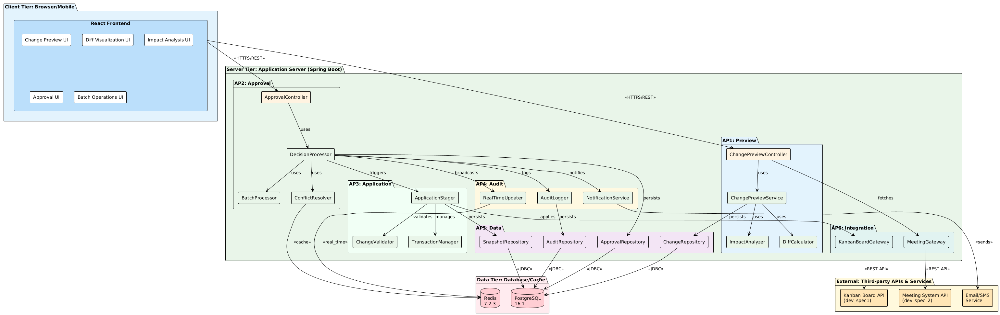
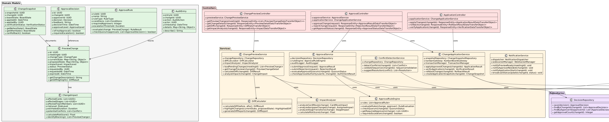
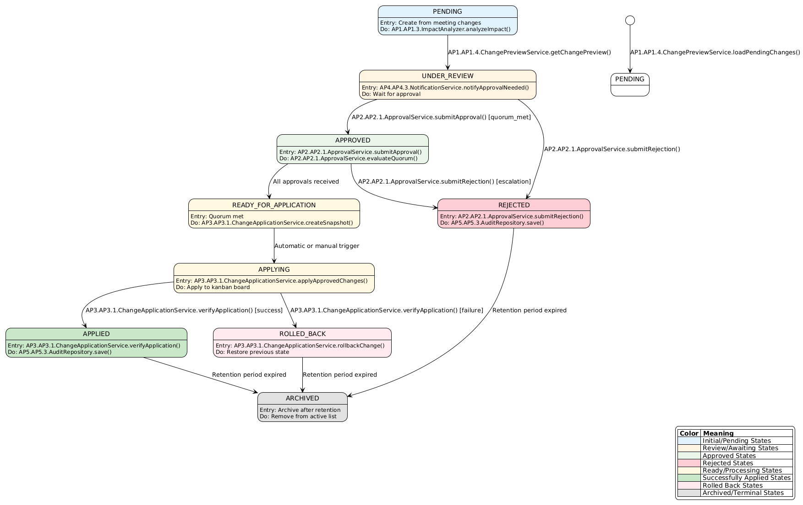
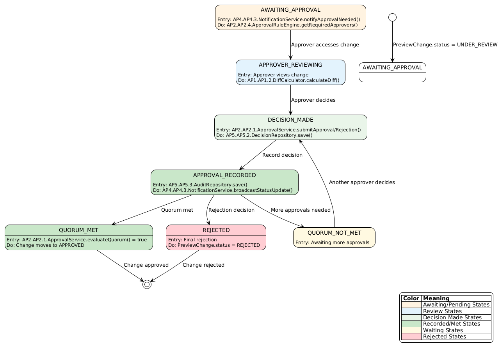
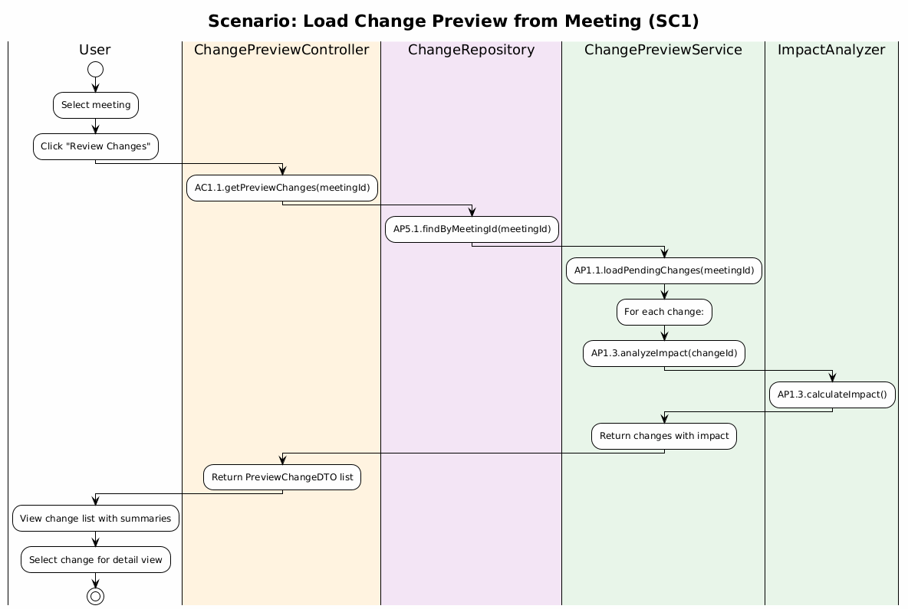
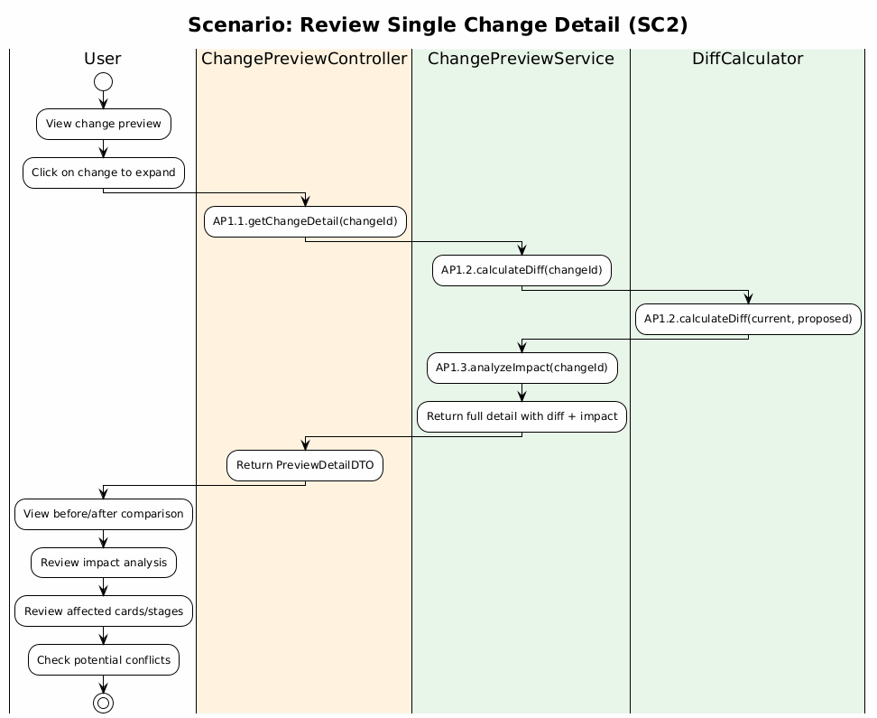
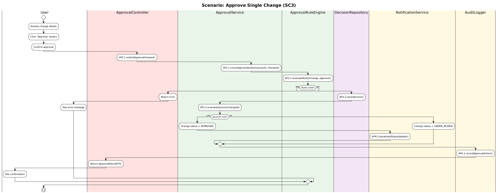
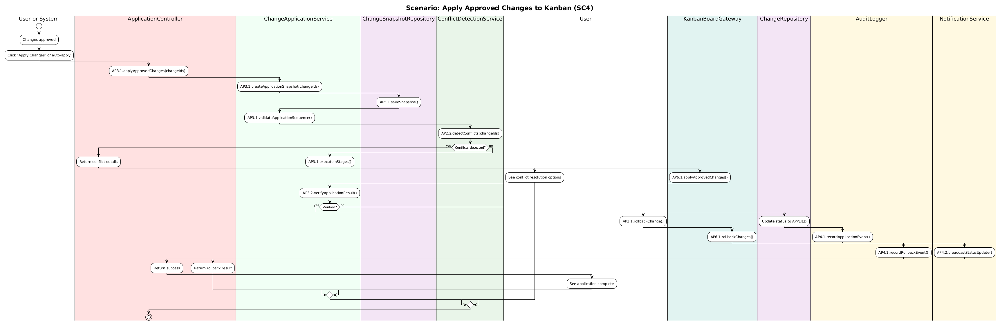
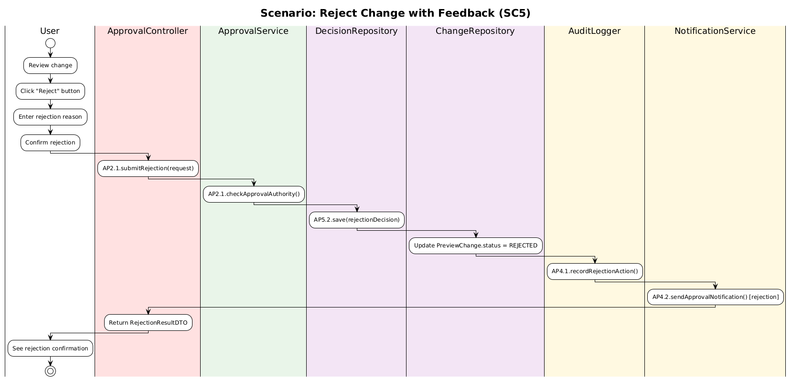
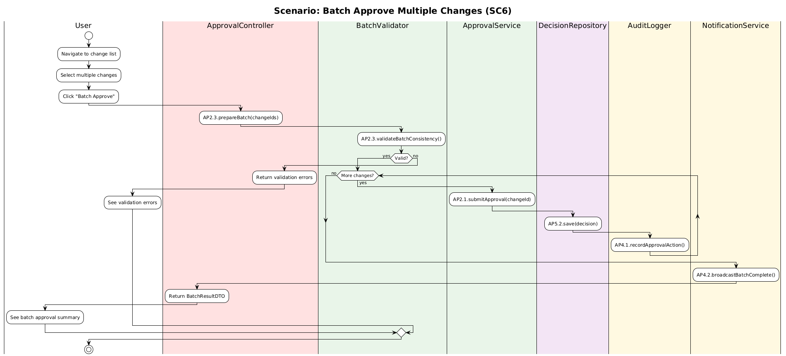

# Development Specification
## Kanban Change Review and Approval System

---

# Dev Spec Header

## Version and Date

| Version | Date | Description |
|---------|------|-------------|
| 1.0 | 2026-02-15 | Development specification for approval and preview workflow |
| 1.1 | 2026-02-15 | Fixed PreviewStatus enum consistency, resolved guideline violations (abbreviations, URLs, access levels, interface documentation, minors Personally Identifiable Information), reformatted to match dev_spec1 style |
| 1.2 | 2026-02-15 | Comprehensive guideline compliance fixes (see Revision History for details) |
| 1.3 | 2026-02-15 | Consistency alignment with dev_spec1.md (Java 21, PostgreSQL 16.1, role naming) |

## Author and Role

| Author | Role | Version |
|--------|------|---------|
| Swechcha Ambati | Software Engineer | 1.2 |

---

# User Story

> As a team member, I want to review and approve kanban changes from the meeting checklist before they're applied, so that I maintain control and prevent errors.

---

# Table of Contents

1. [Architecture Diagram](#architecture-diagram)
2. [Class Diagram](#class-diagram)
3. [List of Classes](#list-of-classes)
4. [State Diagrams](#state-diagrams)
5. [Flow Charts](#flow-charts)
6. [Possible Threats and Failures](#possible-threats-and-failures)
7. [Technologies](#technologies)
8. [APIs](#apis)
9. [Public Interfaces](#public-interfaces)
10. [Data Schemas](#data-schemas)
11. [Security and Privacy](#security-and-privacy)
12. [Risks to Completion](#risks-to-completion)
13. [Glossary](#glossary)
14. [Revision History](#revision-history)

---

# Architecture Diagram

## Overview

The Change Preview and Approval System provides a comprehensive interface for reviewing and controlling kanban modifications derived from meeting checklists. The system emphasizes transparency and explicit control.

## Acceptance Criteria

1. **Change Preview Display**
   - System generates a detailed "Change Preview" screen showing all proposed modifications
   - Changes are NOT automatically applied after meeting checklist approval
   - Visual diff display showing before/after states
   - Changes are organized by type (new cards, moved cards, updated cards, deleted cards)

2. **Review Capabilities**
   - Team members can view detailed change information
   - Impact analysis visible (affected cards, stages, team members)
   - Change metadata displayed (who requested, when, from which meeting)
   - Search and filter options available

3. **Approval Workflow**
   - Team members can approve individual changes
   - Batch approval of multiple changes
   - Rejection with optional feedback
   - Approval status tracking and history

4. **Safety & Control**
   - Explicit user confirmation required before applying changes
   - Conflict detection and resolution
   - Rollback capability after application
   - Audit trail of all decisions

---

### Architecture Diagram



---

# Class Diagram

## Core Classes and Relationships



---

# List of Classes

## AP1: Preview & Preparation Module

| Label | Class Name | Type | Purpose |
|-------|-----------|------|---------|
| **AP1.1.1** | `ChangePreviewView` | User Interface | Renders change previews and diff visualizations |
| **AP1.1.2** | `ChangePreviewController` | Controller | Handles user interactions for preview display |
| **AP1.2.1** | `DiffViewer` | User Interface | Renders before/after comparison views |
| **AP1.2.2** | `DiffController` | Controller | Manages diff calculation requests |
| **AP1.2.3** | `DiffCalculator` | Service | Calculate differences between states |
| **AP1.3.1** | `ImpactViewer` | User Interface | Displays impact analysis summaries |
| **AP1.3.2** | `ImpactController` | Controller | Handles impact analysis requests |
| **AP1.3.3** | `ImpactAnalyzer` | Service | Analyzes change impacts on cards, stages, and team members |
| **AP1.4.1** | `ChangePreviewService` | Service | Load and display pending changes |

## AP2: Approval & Decision Module

| Label | Class Name | Type | Purpose |
|-------|-----------|------|---------|
| **AP2.1.1** | `ApprovalComponent` | User Interface | Renders approval buttons and confirmation dialogs |
| **AP2.1.2** | `ApprovalController` | Controller | Handles approval/rejection submission |
| **AP2.1.3** | `ApprovalService` | Service | Handle approval/rejection decisions |
| **AP2.2.1** | `DecisionProcessor` | Service | Processes approval decisions and evaluates quorum |
| **AP2.2.2** | `ConflictResolver` | Service | Detects and resolves conflicts between changes |
| **AP2.2.3** | `ConflictDetectionService` | Service | Identify and resolve conflicts |
| **AP2.3.1** | `BatchProcessor` | Service | Prepares and executes batch approval operations |
| **AP2.3.2** | `BatchValidator` | Service | Validates batch consistency and dependencies |
| **AP2.4.1** | `ApprovalRuleEngine` | Service | Evaluate approval rules and quorum requirements |

## AP3: Change Application Module

| Label | Class Name | Type | Purpose |
|-------|-----------|------|---------|
| **AP3.1.1** | `ApplicationStager` | Service | Prepares and stages change application |
| **AP3.1.2** | `TransactionManager` | Service | Manages transactions, commits, and rollbacks |
| **AP3.1.3** | `ChangeApplicationService` | Service | Apply approved changes to kanban board |
| **AP3.2.1** | `ChangeValidator` | Service | Validates application results and board integrity |
| **AP3.2.2** | `ConsistencyChecker` | Service | Verifies kanban rules and referential integrity |

## AP4: History & Audit Module

| Label | Class Name | Type | Purpose |
|-------|-----------|------|---------|
| **AP4.1.1** | `AuditLogger` | Service | Records all approval, rejection, and application events |
| **AP4.1.2** | `HistoryRepository` | Repository | Persists approval and change history |
| **AP4.2.1** | `AlertDispatcher` | Service | Sends notifications for approvals and status changes |
| **AP4.2.2** | `RealTimeUpdater` | Service | Broadcasts real-time status updates via WebSocket |
| **AP4.3.1** | `NotificationService` | Service | Send approval and status notifications |

## AP5: Data Layer Module

| Label | Class Name | Type | Purpose |
|-------|-----------|------|---------|
| **AP5.1.1** | `ChangeRepository` | Repository (Data Storage) | Manage preview changes persistence |
| **AP5.1.2** | `ChangeSnapshotRepository` | Repository (Data Storage) | Manage change snapshots for rollback |
| **AP5.2.1** | `ApprovalRepository` | Repository (Data Storage) | Stores approval records |
| **AP5.2.2** | `DecisionRepository` | Repository (Data Storage) | Manage approval decisions persistence |
| **AP5.3.1** | `AuditRepository` | Repository (Data Storage) | Manage audit trail records |

## AP6: External Integration Module

| Label | Class Name | Type | Purpose |
|-------|-----------|------|---------|
| **AP6.1.1** | `KanbanBoardGateway` | Gateway | Integrates with kanban board for state fetch and application |
| **AP6.2.1** | `MeetingGateway` | Gateway | Integrates with meeting system for proposed changes |

## Domain Model Classes (Data Structures)

| Label | Class Name | Purpose | Key Properties |
|-------|-----------|---------|-----------------|
| **DM1.1** | `PreviewChange` | Represents a pending kanban change | `id: Universally Unique Identifier`, `meetingId: Universally Unique Identifier`, `changeType: ChangeType`, `currentState: Map<String, Object>`, `proposedState: Map<String, Object>`, `status: PreviewStatus` |
| **DM1.2** | `ApprovalDecision` | Represents an approval/rejection | `id: Universally Unique Identifier`, `changeId: Universally Unique Identifier`, `approverId: Universally Unique Identifier`, `decision: Decision`, `feedback: String`, `decisionTime: DateTime` |
| **DM1.3** | `ChangeImpact` | Impact analysis data | `affectedCards: List<Universally Unique Identifier>`, `affectedStages: List<Universally Unique Identifier>`, `riskLevel: RiskLevel`, `potentialConflicts: List<Conflict>` |
| **DM1.4** | `ChangeSnapshot` | Snapshot of change before/after | `snapshotId: Universally Unique Identifier`, `changeId: Universally Unique Identifier`, `boardState: BoardState`, `appliedAt: DateTime`, `verificationStatus: VerificationStatus` |
| **DM1.5** | `ApprovalRule` | Rule for approval evaluation | `ruleId: Universally Unique Identifier`, `name: String`, `conditions: List<Condition>`, `requiredApprovers: Integer`, `escalationThreshold: Duration` |
| **DM1.6** | `AuditEntry` | Audit trail record | `entryId: Universally Unique Identifier`, `changeId: Universally Unique Identifier`, `action: AuditAction`, `actor: Universally Unique Identifier`, `timestamp: DateTime`, `details: Map<String, Object>` |

## Data Transfer Object Classes (Data Structures)

| Label | Class Name | Purpose | Fields |
|-------|-----------|---------|--------|
| **DTO1.1** | `PreviewChangeDataTransferObject` | Transfer preview change data | `id`, `type`, `status`, `impactLevel`, `createdAt` |
| **DTO1.2** | `PreviewDetailDataTransferObject` | Detailed preview information | `change`, `diff`, `impact`, `approvalStatus`, `metadata` |
| **DTO1.3** | `ApprovalRequestDataTransferObject` | Approval request data | `changeId`, `approverId`, `feedback` |
| **DTO1.4** | `DiffDataTransferObject` | Diff visualization data | `added`, `removed`, `modified`, `highlights` |
| **DTO1.5** | `ImpactDataTransferObject` | Impact analysis data | `affectedCards`, `riskLevel`, `conflicts`, `estimatedDuration` |
| **DTO1.6** | `ApprovalResultDataTransferObject` | Approval operation result | `success`, `changeId`, `status`, `message` |
| **DTO1.7** | `ApplicationResultDataTransferObject` | Application operation result | `appliedChangeCount`, `failedCount`, `rollbackInfo` |

## Enum Classes (Data Structures)

| Label | Class Name | Values | Purpose |
|-------|-----------|--------|---------|
| **EN1.1** | `ChangeType` | MOVE_CARD, UPDATE_CARD, CREATE_CARD, DELETE_CARD | Type of kanban change |
| **EN1.2** | `PreviewStatus` | PENDING, UNDER_REVIEW, APPROVED, REJECTED, READY_FOR_APPLICATION, APPLYING, APPLIED, ROLLED_BACK, ARCHIVED | Change lifecycle status |
| **EN1.3** | `ImpactLevel` | LOW, MEDIUM, HIGH, CRITICAL | Severity of change impact |
| **EN1.4** | `RiskLevel` | LOW, MEDIUM, HIGH, CRITICAL | Risk assessment level |
| **EN1.5** | `Decision` | APPROVE, REJECT, DEFER | Approval decision type |

---

# State Diagrams

## System State Data Fields

```
ApprovalSystemState = {
    previewChanges: List<PreviewChange>,
    pendingApprovals: Map<UUID, List<ApprovalDecision>>,
    activeWorkflows: List<ApprovalWorkflow>,
    changeSnapshots: Map<UUID, ChangeSnapshot>,
    notificationQueue: List<Notification>,
    auditLog: List<AuditEntry>,
    userSessions: Map<UUID, UserSession>
}
```

## PreviewChange State Diagram



## Approval Decision Workflow State Diagram



---

# Flow Charts

## Scenario: Load and Display Change Preview

**Scenario Description (SC1):** When a user wants to review proposed kanban changes from a meeting, they select the meeting and click "Review Changes". The system loads all pending changes associated with that meeting, performs impact analysis on each change to show affected cards and stages, and displays a summary list. The user can then select individual changes for detailed review.

**State Diagram Reference:** This flow begins at **PENDING** state and transitions to **UNDER_REVIEW** state when the user views the change details.



## Scenario: Review Change with Diff

**Scenario Description (SC2):** After viewing the change list, a user clicks on a specific change to see detailed information. The system calculates the visual diff between current and proposed states, runs a comprehensive impact analysis, and presents a before/after comparison. The user can review affected cards, stages, and potential conflicts before making an approval decision.

**State Diagram Reference:** This flow occurs while in the **UNDER_REVIEW** state, where the user is actively reviewing changes before transitioning to **APPROVED** or **REJECTED**.



## Scenario: Approve Single Change

**Scenario Description (SC3):** When a user decides to approve a change, they click the "Approve" button and confirm their decision. The system validates that the user has approval authority, evaluates approval rules, records the decision, and checks if quorum has been met. If quorum is met, the change transitions to approved status; otherwise, it remains under review awaiting additional approvals. All actions are logged to the audit trail.

**State Diagram Reference:** This flow transitions from **UNDER_REVIEW** state to either **APPROVED** state (if quorum met) or remains in **UNDER_REVIEW** (if more approvals needed).



## Scenario: Apply Approved Changes

**Scenario Description (SC4):** Once changes have been approved (quorum met), the system or user triggers application to the kanban board. The system creates a snapshot of the current board state for potential rollback, validates the application sequence, detects any conflicts, and then applies changes in stages. If application succeeds, the changes are verified and marked applied. If verification fails, the system automatically rolls back to the snapshot state.

**State Diagram Reference:** This flow transitions from **READY_FOR_APPLICATION** state through **APPLYING** state, then to either **APPLIED** state (success) or **ROLLED_BACK** state (failure).



## Scenario: Reject Change with Feedback

**Scenario Description (SC5):** When a user determines a change should not be made, they click "Reject" and provide a reason for rejection. The system validates the user's authority, records the rejection decision with feedback, updates the change status, logs the action to the audit trail, and notifies relevant stakeholders of the rejection.

**State Diagram Reference:** This flow transitions from **UNDER_REVIEW** state directly to **REJECTED** state.



## Scenario: Batch Approve Multiple Changes

**Scenario Description (SC6):** When a user wants to approve multiple changes at once, they select the desired changes from the list and click "Batch Approve". The system validates that the batch is consistent (no conflicting changes), then processes each approval sequentially. Each decision is recorded and audited. Upon completion, the system broadcasts a batch completion notification with a summary of results.

**State Diagram Reference:** This flow processes multiple changes, each transitioning from **UNDER_REVIEW** to **APPROVED** (or remaining **UNDER_REVIEW** if more approvals are needed).



---

# Possible Threats and Failures

## Component Failure Analysis

#### AP1: Preview & Preparation Module

| Failure Mode | Code | Effect | Likelihood | Impact | Recovery Procedure |
|-------------|------|--------|------------|--------|-------------------|
| Slow diff calculation | TF1.1 | Users wait long time for preview | Medium | Medium | Implement caching, async computation, progress indicators |
| Diff calculation error | TF1.2 | Wrong before/after displayed | Low | Critical | Unit test with edge cases, golden file testing |
| Impact analysis timeout | TF1.3 | Cannot complete impact analysis | Low | Medium | Set reasonable timeouts, cache partial results |
| Memory overflow on large changes | TF1.4 | Service crash with huge diffs | Low | High | Implement streaming, chunking, memory limits |
| Race condition in state fetch | TF1.5 | Inconsistent current state shown | Medium | High | Use database transactions, optimistic locking |

#### AP2: Approval & Decision Module

| Failure Mode | Code | Effect | Likelihood | Impact | Recovery Procedure |
|-------------|------|--------|------------|--------|-------------------|
| Race condition in quorum check | TF2.1 | Duplicate approvals counted | Medium | Critical | Implement database-level uniqueness constraint |
| Approval not persisted | TF2.2 | Approval lost, must re-approve | Low | High | Use transactions, verify write before response |
| Unauthorized approval accepted | TF2.3 | Wrong user approves change | Low | Critical | Strict authority checks, audit every decision |
| Decision logic error | TF2.4 | Wrong state transition | Low | Critical | Comprehensive state machine testing, property-based testing |

#### AP3: Change Application Module

| Failure Mode | Code | Effect | Likelihood | Impact | Recovery Procedure |
|-------------|------|--------|------------|--------|-------------------|
| Partial application failure | TF3.1 | Kanban in inconsistent state | Medium | Critical | Transactional application, rollback on any failure |
| Verification failure | TF3.2 | Applied changes not verified correct | Low | Critical | Comprehensive verification logic, post-application checks |
| Snapshot corrupt | TF3.3 | Cannot rollback if needed | Low | Critical | Snapshot validation, redundant snapshots |
| Network timeout to Kanban board | TF3.4 | Application fails, retry logic needed | Medium | High | Circuit breaker, retry with exponential backoff |

## Data Integrity Threats

| Threat Type | Code | Affected Components | Prevention | Detection | Response |
|------------|------|-------------------|-----------|-----------|----------|
| Concurrent approvals | DIT1 | AP2.1 | Database constraints, optimistic locking | Audit log analysis | Manual review and correction |
| Partial state update | DIT2 | AP3.1 | Transactional boundaries, rollback logic | Consistency checks | Automatic rollback |
| Snapshot inconsistency | DIT3 | AP3.2 | Snapshot validation on save/load | Hash verification | Reconstruction from audit log |
| Decision loss | DIT4 | AP5.2 | Persistent storage, backup | Transaction logging | Restore from backup |

## Connectivity Failures

| Failure Type | Code | Affected Components | Effect | Recovery Procedure |
|-------------|------|-------------------|--------|-------------------|
| Database unavailable | CF1 | All repositories | Cannot load/save changes | Connection pooling, retry logic, failover |
| Kanban board Application Programming Interface down | CF2 | AP6.1 gateway | Cannot apply changes | Circuit breaker, queue for later, manual application |
| Notification service down | CF3 | AP4.2 notifier | Cannot notify users | Queue notifications, retry scheduling |
| Meeting data Application Programming Interface down | CF4 | AP6.2 gateway | Cannot load initial changes | Cached data, manual upload option |

## Security Threats

| Threat Type | Code | Effect | Prevention | Detection | Response |
|------------|------|--------|-----------|-----------|----------|
| Unauthorized approval | ST1 | Wrong user approves | Role-based access control, authority checks | Audit log review | Undo approval, incident response |
| Approval manipulation | ST2 | User alters feedback/timestamp | Immutable audit log, digital signatures | Tamper detection | Forensic analysis, investigation |
| Decision replay | ST3 | Approve same change twice | Idempotency checks, sequence numbers | Duplicate detection | Dedup logic, incident response |
| Access to sensitive diffs | ST4 | Viewing restricted board changes | Role-based visibility, encryption | Access log monitoring | Investigation, access revocation |

## Runtime Failures

| Failure Type | Code | Affected Components | Effect | Recovery Procedure |
|-------------|------|-------------------|--------|-------------------|
| Process crashed | RF1 | All services | Service unavailable, user requests fail | Auto-restart via Kubernetes, health checks, load balancer failover |
| Lost all runtime state | RF2 | All services | Session data lost, in-progress operations abandoned | Store critical state in Redis, transaction recovery from database, user re-authentication |
| Erased all stored data | RF3 | AP5 Data Layer | Complete data loss, all changes and history lost | Point-in-time database backups (hourly), off-site replication, disaster recovery procedure |

## Hardware Failures

| Failure Type | Code | Affected Components | Effect | Recovery Procedure |
|-------------|------|-------------------|--------|-------------------|
| Server down | HF1 | All services | Service unavailable | Multi-server deployment, auto-failover, Kubernetes pod rescheduling |
| Loaded bad configuration file | HF2 | All services | Incorrect behavior, potential security issues | Configuration validation on startup, rollback to previous config, configuration versioning |
| System moved to new geographic location | HF3 | All services | Latency changes, compliance issues | Geographic-aware routing, data residency compliance, multi-region deployment |
| Server out of RAM | HF4 | All services | Service crashes, slow performance | Memory limits, horizontal scaling, memory monitoring alerts |
| Server overloaded | HF5 | All services | Slow response, request timeouts | Auto-scaling, load balancing, rate limiting, circuit breakers |
| Database out of space | HF6 | AP5 Data Layer | Cannot save new changes, write failures | Storage monitoring, auto-expansion, data archival policies, alert thresholds |

## Intruder/Security Threats

| Threat Type | Code | Affected Components | Effect | Prevention | Detection | Response |
|------------|------|-------------------|--------|-----------|-----------|----------|
| Denial of service attack | IS1 | All public endpoints | Service unavailable to legitimate users | Rate limiting, Web Application Firewall, Distributed Denial of Service protection | Traffic anomaly detection, monitoring | Traffic filtering, scaling, incident response |
| Operating system compromised | IS2 | All services | Full system access, data breach | Hardened containers, minimal attack surface, regular patching | Intrusion detection, file integrity monitoring | Isolate system, forensics, rebuild from known-good images |
| Project code rewritten | IS3 | All services | Malicious functionality added | Code signing, protected CI/CD pipeline, branch protection | Code review, deployment verification checksums | Rollback to verified version, security audit |
| Database copied | IS4 | AP5 Data Layer | Data breach, privacy violation | Encryption at rest, access logging, network isolation | Access log analysis, anomaly detection | Incident response, breach notification, access revocation |
| Bot signs up and spams users | IS5 | AP4.2 NotificationService | Spam notifications, resource waste | CAPTCHA, rate limiting, account verification | Unusual activity patterns, spam detection | Account suspension, cleanup, IP blocking |
| HyperText Transfer Protocol session hijacked | IS6 | All user-facing services | Unauthorized actions as legitimate user | Secure cookies (HttpOnly, Secure, SameSite), session timeout | Session anomaly detection, IP verification | Session invalidation, forced re-authentication |

---

# Technologies

## Core Backend Technologies

| Label | Technology | Purpose | Why Picked | Version | Documentation |
|-------|-----------|---------|------------|---------|----------------|
| T1.1 | Java 21 | Primary language | Mature, strong typing, performance | 21 Long Term Support | https://openjdk.org/projects/jdk/21/ |
| T1.2 | Spring Boot 3.x | Framework | Rapid development, ecosystem | 3.2.x | https://spring.io/projects/spring-boot |
| T1.3 | Spring Data JPA | Object-Relational Mapping/Persistence | Reduced boilerplate, pagination | 3.2.x | https://spring.io/projects/spring-data-jpa |
| T1.4 | PostgreSQL 16 | Database | ACID, reliability, JSON support | 16.1 | https://www.postgresql.org/docs/16/ |
| T1.5 | Redis | Caching | Performance, session management | 7.x | https://redis.io/documentation |
| T1.6 | Flyway | Database versioning | Schema versioning, consistency | 10.x | https://flywaydb.org/documentation |

## Frontend Technologies

| Label | Technology | Purpose | Why Picked | Version | Documentation |
|-------|-----------|---------|------------|---------|----------------|
| T2.1 | React 18 | User Interface Framework | Components, ecosystem | 18.x | https://react.dev |
| T2.2 | TypeScript 5.x | Type safety | Compile-time error detection | 5.3.x | https://www.typescriptlang.org/docs/ |
| T2.3 | Material-UI (MUI) 5.x | Component library | Professional User Interface, accessibility | 5.14.x | https://mui.com/material-ui/getting-started/ |
| T2.4 | diff-match-patch | Text diffing | Google's robust algorithm | 20121119 | https://github.com/google/diff-match-patch |
| T2.5 | Zustand | State management | Lightweight, predictable | 4.4.x | https://github.com/pmndrs/zustand |
| T2.6 | Axios | HyperText Transfer Protocol client | Interceptors, error handling | 1.6.x | https://axios-http.com/docs/intro |

### 10.3 Infrastructure Technologies

| Label | Technology | Purpose | Why Picked | Version | Documentation |
|-------|-----------|---------|------------|---------|----------------|
| T3.1 | Docker | Containerization | Consistent deployments | 24.x | https://docs.docker.com |
| T3.2 | Kubernetes | Orchestration | Scaling, self-healing | 1.28.x | https://kubernetes.io/docs/ |
| T3.3 | Prometheus | Metrics | Monitoring, alerting | 2.48.x | https://prometheus.io/docs/ |
| T3.4 | ELK Stack | Logging | Analysis, debugging | 8.x | https://www.elastic.co/guide/index.html |

### 10.4 Testing Technologies

| Label | Technology | Purpose | Why Picked | Version | Documentation |
|-------|-----------|---------|------------|---------|----------------|
| T4.1 | JUnit 5 | Unit testing | Standard Java testing | 5.10.x | https://junit.org/junit5/docs/current/user-guide/ |
| T4.2 | Mockito | Mocking | Clean Application Programming Interface, verification | 5.x | https://javadoc.io/doc/org.mockito/mockito-core/latest/org/mockito/Mockito.html |
| T4.3 | TestContainers | Integration testing | Real database testing | 1.19.x | https://www.testcontainers.org/ |
| T4.4 | Jest | JavaScript testing | Fast, snapshots | 29.x | https://jestjs.io/docs/getting-started |
| T4.5 | React Testing Library | Component testing | User-centric | 14.x | https://testing-library.com/docs/react-testing-library/intro/ |
| T4.6 | Cypress | End-to-End testing | Reliable, debugging | 13.x | https://docs.cypress.io |

---

# APIs

### 11.1 ChangePreviewController APIs

| Label | Method | Access | Endpoint | Return Type | Parameters | Description |
|-------|--------|--------|----------|-------------|------------|-------------|
| AP1.1.1 | `getPreviewChanges()` | + public | `GET /api/preview/changes` | `ResponseEntity<List<PreviewChangeDataTransferObject>>` | `meetingId`, `pageable` | Get all pending changes from meeting |
| AP1.1.2 | `getChangeDetail()` | + public | `GET /api/preview/changes/{changeId}` | `ResponseEntity<PreviewDetailDataTransferObject>` | `changeId` | Get full change detail with diff |
| AP1.1.3 | `getDiff()` | + public | `GET /api/preview/changes/{changeId}/diff` | `ResponseEntity<DiffDataTransferObject>` | `changeId` | Get detailed diff visualization |
| AP1.1.4 | `getImpactAnalysis()` | + public | `GET /api/preview/changes/{changeId}/impact` | `ResponseEntity<ImpactDataTransferObject>` | `changeId` | Get impact analysis |
| AP1.1.5 | `getPreviewStats()` | + public | `GET /api/preview/statistics` | `ResponseEntity<PreviewStatsDataTransferObject>` | `meetingId` | Get preview statistics |

### 11.2 ApprovalController APIs

| Label | Method | Access | Endpoint | Return Type | Parameters | Description |
|-------|--------|--------|----------|-------------|------------|-------------|
| AP2.1.1 | `approveChange()` | + public | `POST /api/approval/approve` | `ResponseEntity<ApprovalResultDataTransferObject>` | `ApprovalRequestDataTransferObject` | Approve single change |
| AP2.1.2 | `rejectChange()` | + public | `POST /api/approval/reject` | `ResponseEntity<RejectionResultDataTransferObject>` | `RejectionRequestDataTransferObject` | Reject single change |
| AP2.1.3 | `approveBatch()` | + public | `POST /api/approval/batch-approve` | `ResponseEntity<BatchResultDataTransferObject>` | `BatchApprovalRequestDataTransferObject` | Approve multiple changes |
| AP2.1.4 | `getApprovalStatus()` | + public | `GET /api/approval/status/{changeId}` | `ResponseEntity<ApprovalStatusDataTransferObject>` | `changeId` | Get approval status |

### 11.3 ApplicationController APIs

| Label | Method | Access | Endpoint | Return Type | Parameters | Description |
|-------|--------|--------|----------|-------------|------------|-------------|
| AP3.1.1 | `applyChanges()` | + public | `POST /api/application/apply` | `ResponseEntity<ApplicationResultDataTransferObject>` | `ApplicationRequestDataTransferObject` | Apply approved changes |
| AP3.1.2 | `verifyApplication()` | + public | `GET /api/application/verify/{changeId}` | `ResponseEntity<VerificationDataTransferObject>` | `changeId` | Verify application success |
| AP3.1.3 | `rollbackChange()` | + public | `POST /api/application/rollback/{changeId}` | `ResponseEntity<RollbackResultDataTransferObject>` | `changeId` | Rollback applied change |

### 11.4 Internal Service APIs

#### ChangePreviewService

| Method | Access | Parameters | Return Type | Description |
|--------|--------|-----------|-------------|-------------|
| `loadPendingChanges()` | + public | `meetingId: UUID` | `List<PreviewChange>` | Load all pending changes for meeting |
| `getChangePreview()` | + public | `changeId: UUID` | `PreviewChange` | Get change with metadata |
| `calculateDiff()` | - private | `changeId: UUID` | `DiffResult` | Calculate diff visualization |
| `analyzeImpact()` | - private | `changeId: UUID` | `ChangeImpact` | Analyze change impact |

#### ApprovalService

| Method | Access | Parameters | Return Type | Description |
|--------|--------|-----------|-------------|-------------|
| `submitApproval()` | + public | `request: ApprovalRequestDataTransferObject` | `ApprovalResult` | Record approval decision |
| `submitRejection()` | + public | `request: RejectionRequestDataTransferObject` | `RejectionResult` | Record rejection decision |
| `evaluateQuorum()` | - private | `changeId: UUID` | `QuorumStatus` | Check if quorum met |
| `checkApprovalAuthority()` | - private | `userId: UUID, changeId: UUID` | `AuthCheckResult` | Verify user authority |

#### ChangeApplicationService

| Method | Access | Parameters | Return Type | Description |
|--------|--------|-----------|-------------|-------------|
| `applyApprovedChanges()` | + public | `changeIds: List<UUID>` | `ApplicationResult` | Apply to kanban board |
| `verifyApplication()` | - private | `changeId: UUID` | `VerificationResult` | Verify application success |
| `rollbackChange()` | + public | `changeId: UUID` | `RollbackResult` | Rollback to previous state |
| `createSnapshot()` | - private | `changeId: UUID` | `ChangeSnapshot` | Create before/after snapshot |

---

# Public Interfaces

### 12.1 REST Application Programming Interface Interfaces (External)

#### Available Interface Formats

| Format | Base URL | Auth | Content-Type | Description |
|--------|----------|------|--------------|-------------|
| **JSON/REST** | `/api/` | Bearer Token (JSON Web Token) | application/json | Default REST Application Programming Interface for all clients |
| **GraphQL** | `/graphql` | Bearer Token (JSON Web Token) | application/json | Query language for frontend flexibility |
| **gRPC (Google Remote Procedure Call)** | `:50051` | mutual Transport Layer Security Certificate | application/grpc | High-performance service-to-service |

#### Language-Specific Implementations

| Language | Framework | Client Library | Example Call | Documentation |
|----------|-----------|-----------------|-------------|----------------|
| **Java** | Spring Boot | RestTemplate / Webclient | `/api/preview/changes` | See ApprovalService javadoc |
| **C#** | .NET 6+ | HttpClient | `GET /api/preview/changes` | See GitHub: CSharp-ApprovalClient |
| **Python** | Flask/Django | requests library | `requests.get('/api/preview/changes')` | See pip: approval-client-python |
| **JavaScript/TypeScript** | React / Node.js | Axios / Fetch API | `await api.getPreviewChanges()` | See npm: @approval/client |
| **cURL** | Command-line | curl | `curl -H "Authorization: Bearer $TOKEN" https://api.example.com/api/preview/changes` | Standard REST operations |

#### Preview Changes Endpoints

| Endpoint | HTTP | Purpose | Impl. Component |
|----------|------|---------|-----------------|
| `/api/preview/changes` | GET | List pending changes | AP1.1.ChangePreviewController |
| `/api/preview/changes/{id}` | GET | Get change detail | AP1.1.ChangePreviewController |
| `/api/preview/changes/{id}/diff` | GET | Get diff visualization | AP1.1.ChangePreviewController |
| `/api/preview/changes/{id}/impact` | GET | Get impact analysis | AP1.1.ChangePreviewController |

#### Approval Endpoints

| Endpoint | HTTP | Purpose | Impl. Component |
|----------|------|---------|-----------------|
| `/api/approval/approve` | POST | Approve change | AP2.1.ApprovalController |
| `/api/approval/reject` | POST | Reject change | AP2.1.ApprovalController |
| `/api/approval/batch-approve` | POST | Batch approve | AP2.1.ApprovalController |
| `/api/approval/status/{id}` | GET | Get approval status | AP2.1.ApprovalController |

#### Application Endpoints

| Endpoint | HTTP | Purpose | Impl. Component |
|----------|------|---------|-----------------|
| `/api/application/apply` | POST | Apply changes | AP3.1.ApplicationController |
| `/api/application/verify/{id}` | GET | Verify application | AP3.1.ApplicationController |
| `/api/application/rollback/{id}` | POST | Rollback change | AP3.1.ApplicationController |

### 12.2 Event-Based Interfaces (Async)

#### WebSocket Channels

| Channel | Direction | Purpose | Data |
|---------|-----------|---------|------|
| `/topic/preview-updates` | Server → Client | Real-time preview updates | `PreviewUpdateEvent` |
| `/topic/approval-status` | Server → Client | Approval status changes | `ApprovalStatusEvent` |
| `/topic/application-progress` | Server → Client | Application progress | `ApplicationProgressEvent` |

#### Message Bus Topics

| Topic | Publisher | Subscribers | Data |
|-------|-----------|-------------|------|
| `preview.change.created` | ChangePreviewService | NotificationService | `PreviewChangeCreatedEvent` |
| `approval.decision.made` | ApprovalService | AuditService, NotificationService | `ApprovalDecisionEvent` |
| `changes.applied` | ChangeApplicationService | AuditService, NotificationService | `ChangesAppliedEvent` |

### 12.3 Component-to-Component Interfaces

#### AP1 → AP2 (Preview to Approval)

| Source | Target | Method | Purpose |
|--------|--------|--------|---------|
| AP1.1.ChangePreviewController | AP2.1.ApprovalController | approveChange() | User submits approval |
| AP1.1.ChangePreviewView | AP2.1.ApprovalComponent | submitApprovalRequest() | Capture approval |

#### AP2 → AP3 (Approval to Application)

| Source | Target | Method | Purpose |
|--------|--------|--------|---------|
| AP2.1.ApprovalService | AP3.1.ChangeApplicationService | applyApprovedChanges() | Apply approved changes |
| AP2.2.DecisionProcessor | AP3.1.ApplicationStager | executeApplication() | Execute staged application |

#### AP* → AP4 (All to Audit)

| Source | Target | Method | Purpose |
|--------|--------|--------|---------|
| AP*.* | AP4.1.AuditLogger | recordAction() | Audit all decisions |
| AP*.* | AP4.1.HistoryRepository | saveHistory() | Persist history |

---

# Data Schemas

### 13.1 Preview Changes Database

#### DS1.1: preview_changes Table

**Runtime Class:** `PreviewChange` (DM1.1)

| Column | Type | Nullable | Default | Key | Description |
|--------|------|----------|---------|-----|-------------|
| `id` | Universally Unique Identifier | NO | gen_random_uuid() | Primary Key | Unique Identifier |
| `change_id` | Universally Unique Identifier | NO | - | UNIQUE | Public change identifier |
| `meeting_id` | Universally Unique Identifier | YES | NULL | Foreign Key | Related meeting |
| `change_type` | VARCHAR(50) | NO | - | - | MOVE_CARD, UPDATE_CARD, CREATE_CARD, DELETE_CARD |
| `target_board_id` | Universally Unique Identifier | NO | - | - | Target kanban board |
| `target_card_id` | Universally Unique Identifier | YES | NULL | - | Affected card |
| `current_state` | JSON Binary | NO | - | - | Current state snapshot |
| `proposed_state` | JSON Binary | NO | - | - | Proposed changes |
| `impact_level` | VARCHAR(20) | NO | 'MEDIUM' | - | LOW, MEDIUM, HIGH, CRITICAL |
| `status` | VARCHAR(30) | NO | 'PENDING' | - | PENDING, UNDER_REVIEW, APPROVED, REJECTED, etc. |
| `requested_by` | Universally Unique Identifier | NO | - | - | User who requested |
| `requested_at` | TIMESTAMP | NO | CURRENT_TIMESTAMP | - | Creation time |
| `expires_at` | TIMESTAMP | YES | NULL | - | Expiration deadline |
| `created_at` | TIMESTAMP | NO | CURRENT_TIMESTAMP | - | Record creation |
| `updated_at` | TIMESTAMP | NO | CURRENT_TIMESTAMP | - | Last update |
| `version` | INTEGER | NO | 0 | - | Optimistic locking |

**Indexes:**
- PRIMARY KEY (`id`)
- UNIQUE INDEX (`change_id`)
- INDEX (`status`, `impact_level`)
- INDEX (`meeting_id`)
- INDEX (`expires_at`)

#### DS1.2: approval_decisions Table

**Runtime Class:** `ApprovalDecision` (DM1.2)

| Column | Type | Nullable | Default | Key | Description |
|--------|------|----------|---------|-----|-------------|
| `id` | Universally Unique Identifier | NO | gen_random_uuid() | Primary Key | Unique Identifier |
| `decision_id` | Universally Unique Identifier | NO | - | UNIQUE | Public decision identifier |
| `change_id` | Universally Unique Identifier | NO | - | Foreign Key | Related change |
| `approver_id` | Universally Unique Identifier | NO | - | - | User who approved |
| `decision` | VARCHAR(20) | NO | - | - | APPROVE or REJECT |
| `feedback` | TEXT | YES | NULL | - | Optional feedback |
| `decided_at` | TIMESTAMP | NO | CURRENT_TIMESTAMP | - | Decision time |
| `is_final` | BOOLEAN | NO | false | - | Final approval indicator |
| `created_at` | TIMESTAMP | NO | CURRENT_TIMESTAMP | - | Record creation |

**Indexes:**
- PRIMARY KEY (`id`)
- UNIQUE INDEX (`decision_id`)
- INDEX (`change_id`, `approver_id`)
- INDEX (`approver_id`)

#### DS1.3: change_snapshots Table

**Runtime Class:** `ChangeSnapshot` (DM1.4)

| Column | Type | Nullable | Default | Key | Description |
|--------|------|----------|---------|-----|-------------|
| `id` | Universally Unique Identifier | NO | gen_random_uuid() | Primary Key | Unique Identifier |
| `snapshot_id` | Universally Unique Identifier | NO | - | UNIQUE | Public snapshot identifier |
| `change_id` | Universally Unique Identifier | NO | - | Foreign Key | Related change |
| `board_state_before` | JSON Binary | NO | - | - | State before application |
| `board_state_after` | JSON Binary | YES | NULL | - | State after application |
| `applied_at` | TIMESTAMP | YES | NULL | - | Application timestamp |
| `applied_by` | Universally Unique Identifier | YES | NULL | - | User who applied |
| `verification_status` | VARCHAR(20) | NO | 'PENDING' | - | PENDING, VERIFIED, FAILED |
| `created_at` | TIMESTAMP | NO | CURRENT_TIMESTAMP | - | Record creation |

**Indexes:**
- PRIMARY KEY (`id`)
- UNIQUE INDEX (`snapshot_id`)
- INDEX (`change_id`)
- INDEX (`applied_at`)

#### DS1.4: audit_trail Table

**Runtime Class:** `AuditEntry` (DM1.6)

| Column | Type | Nullable | Default | Key | Description |
|--------|------|----------|---------|-----|-------------|
| `id` | Universally Unique Identifier | NO | gen_random_uuid() | Primary Key | Unique Identifier |
| `entry_id` | Universally Unique Identifier | NO | - | UNIQUE | Public entry identifier |
| `change_id` | Universally Unique Identifier | NO | - | Foreign Key | Related change |
| `action` | VARCHAR(50) | NO | - | - | CREATED, APPROVED, REJECTED, APPLIED, etc. |
| `actor_id` | Universally Unique Identifier | NO | - | - | User performing action |
| `actor_role` | VARCHAR(50) | YES | NULL | - | User's role at time of action |
| `action_timestamp` | TIMESTAMP | NO | CURRENT_TIMESTAMP | - | Action time |
| `details` | JSON Binary | YES | NULL | - | Action-specific details |
| `ip_address` | INET | YES | NULL | - | Source Internet Protocol address |
| `created_at` | TIMESTAMP | NO | CURRENT_TIMESTAMP | - | Record creation |

**Indexes:**
- PRIMARY KEY (`id`)
- UNIQUE INDEX (`entry_id`)
- INDEX (`change_id`)
- INDEX (`actor_id`)
- INDEX (`action`, `action_timestamp`)
- INDEX (`action_timestamp`)

### 13.2 Estimated Storage

| Table | Row Count (Annual) | Avg Size | Total | Retention |
|-------|-------------------|----------|-------|-----------|
| preview_changes | 50,000 | 3KB | 150MB | 2 years |
| approval_decisions | 150,000 | 500B | 75MB | 2 years |
| change_snapshots | 50,000 | 5KB | 250MB | 1 year |
| audit_trail | 300,000 | 1KB | 300MB | 3 years |

**Total Annual Growth:** ~775MB + indexes (~250MB) = ~1GB/year

---

# Security and Privacy

### 14.1 Temporary Personally Identifiable Information

| Temporary Personally Identifiable Information | Justification | Source | Path Through System | Usage | Disposal | Protection |
|-----|---------------|--------|---------------------|-------|----------|------------|
| User session token | Required for authentication and authorization | Identity provider (OAuth/OIDC) | AP2.1.ApprovalController → AP2.2.DecisionProcessor → AP5.ApprovalRepository | Verify user identity for approval actions | Expires after session timeout (30 min idle, 8 hour max) | Stored only in memory, encrypted in transit, HttpOnly cookies |
| User password (during login) | Required for authentication | User input | External identity provider only (not stored in this system) | Authentication only | Immediately after authentication completes | TLS 1.3 encryption, never logged, never stored |
| Approval request body | Contains user identifier during processing | User interface | AP2.1.ApprovalController → AP2.1.ApprovalService | Process approval decision | Immediately after database persistence | Memory only, cleared after request completes |

### 14.2 Long-Term Personally Identifiable Information

#### Personally Identifiable Information Stored Long-Term

| Personally Identifiable Information | Storage | Duration | Protection |
|-----|---------|----------|------------|
| User Identifier | approval_decisions, audit_trail | 2-3 years | Encryption at rest, Role-Based Access Control |
| User action | audit_trail | 3 years | Immutable records, access logging |
| Internet Protocol address | audit_trail | 90 days | Encryption, Time-To-Live purge |

#### Encryption Standards

| Data Location | Encryption | Standard | Key Mgmt |
|---------------|------------|----------|----------|
| At Rest (Database) | AES-256 | NIST approved | Vault-managed |
| In Transit (Network) | TLS 1.3 | Industry standard | Certificate-based |
| In Transit (Internal) | mutual Transport Layer Security | Internal Certificate Authority | Automated rotation |

### 14.3 Access Control

| Resource | Role | Permission | Condition |
|----------|------|-----------|-----------|
| Preview changes | MEMBER | READ | Assigned to them |
| Approval decisions | MEMBER | READ, CREATE | Authority-based |
| Application operations | MANAGER | EXECUTE | Approval gained |
| Audit trail | ADMIN | READ | All records |
| Rollback operations | ADMIN | EXECUTE | Authorization required |

### 14.4 Audit & Compliance

| Requirement | Implementation |
|-------------|-----------------|
| Full audit trail | Every action logged to immutable database |
| Action accountability | User Identifier + timestamp on all decisions |
| Decision visibility | Approval history accessible to stakeholders |
| Rollback tracking | Rollback operations audited and logged |
| Access logging | All Application Programming Interface calls logged with user/role |

### 14.5 Personnel & Procedures

#### Database Security Responsibility

| Database/Storage | Responsible Person | Role | Contact |
|-----------------|-------------------|------|---------|
| PreviewChangesDatabase (AP7.1) | Database Administrator | Manages access, backups, encryption | dba-team@internal.example |
| ApprovalDecisionsDatabase (AP7.2) | Database Administrator | Manages access, backups, encryption | dba-team@internal.example |
| ChangeSnapshotsDatabase (AP7.3) | Database Administrator | Manages access, backups, encryption | dba-team@internal.example |
| AuditTrailDatabase (AP7.4) | Database Administrator + Security Officer | Manages access, immutability enforcement | dba-team@internal.example, security@internal.example |

#### Security Officer

| Role | Responsibility | Audit Frequency |
|------|---------------|-----------------|
| Information Security Officer | Audits that security practices are followed by all personnel with access to secure data | Quarterly reviews |
| Data Protection Officer | Ensures compliance with data protection regulations | Annual compliance audit |

#### Customer-Visible Privacy Policy

| Policy Element | Location | When Shown |
|---------------|----------|------------|
| Privacy Policy | `/legal/privacy` | Linked in application footer, shown during first login |
| Data Usage Notice | Login page | Displayed before authentication |
| Cookie Consent | Application entry | Modal on first visit |

**Policy Content Summary:** The privacy policy explains what data is collected (user actions, approval decisions), how long it is stored (2-3 years), who can access it (team members, admins), and user rights (data export, deletion upon account termination).

#### Access Grant Procedures

| Access Type | Approval Required | Documentation Required |
|------------|-------------------|----------------------|
| Team Member (standard) | Manager approval | Employment verification |
| Admin (elevated) | Security Officer approval | Background check, role justification |
| Direct database access | Database Administrator + Security Officer | Incident ticket, time-limited access |

#### Audit Procedures for Personally Identifiable Information Access

| Audit Type | Frequency | Scope | Auditor |
|-----------|-----------|-------|---------|
| Routine access review | Weekly (automated) | All Personally Identifiable Information queries | Automated monitoring system |
| Non-routine access review | Per occurrence | Any direct database access, admin actions | Security Officer |
| Comprehensive audit | Quarterly | All access patterns, policy compliance | External auditor |

### 14.6 Minors (Under 18 Years)

| Criterion | Response | Justification |
|-----------|----------|----------------|
| **Soliciting minors' Personally Identifiable Information** | No | System is designed for enterprise team collaboration (Kanban board management). No user account registration solicits age or accepts minors. |
| **Storing minors' Personally Identifiable Information** | No | Only team Identifier, meeting attendance, and approval history are stored. No age data or personally identifying information specific to minors is collected. |
| **Guardian consent** | Not applicable | Since no minors' Personally Identifiable Information is solicited or stored, guardian consent is not required. |
| **Child safety policy** | Not required | The system is not user-facing to minors and does not collect any minor-specific data. However, if any user reports being under 18, their account must be escalated to account deletion. |
| **Access by bad actors** | Preventative measures: | 1. Role-based access control restricts approvers to verified team members 2. Background check procedures for team leads (organizational responsibility) 3. Audit trail logs all approver identities 4. Two-factor authentication for all accounts |

---

# Risks to Completion

### 15.1 Technical Risks

| Risk | Likelihood | Impact | Mitigation |
|------|------------|--------|------------|
| Diff algorithm performance on large changes | Medium | Medium | Test with large diffs, optimize algorithm, cache results |
| Race conditions in concurrent approvals | Medium | Critical | Database constraints, optimistic locking, comprehensive testing |
| Kanban integration complexity | Medium | High | Define clear Application Programming Interface contracts, integration tests |
| State machine state explosion | Low | High | Careful state design, property-based testing |
| Real-time notification scalability | Medium | Medium | Use proven publish/subscribe systems, load test |

### 15.2 Implementation Risks

| Component | Risk | Difficulty | Mitigation |
|-----------|------|-----------|------------|
| DiffCalculator | Correctness with edge cases | High | Golden file testing, extensive edge case coverage |
| DecisionProcessor | Race conditions | High | Database-level constraints, comprehensive testing |
| ChangeApplicationService | Data consistency | Critical | All-or-nothing transactions, rollback capability |
| ConflictDetectionService | Accuracy | Medium | Machine learning validation, human review option |

### 15.3 Integration Risks

| Integration | Risk | Likelihood | Mitigation |
|-------------|------|-----------|------------|
| Kanban board Application Programming Interface changes | Medium | Medium | Version Application Programming Interface, maintain backwards compatibility |
| Meeting checklist format changes | Low | Medium | Schema versioning, adapter pattern |
| Database scale issues | Low | Medium | Indices, query optimization, partitioning strategy |

### 15.4 Per-Component Difficulty Analysis

| Module/Component | Learn | Design | Implement | Verify | Maintain | Update | Notes |
|-----------------|-------|--------|-----------|--------|----------|--------|-------|
| **AP1: Preview & Preparation** | Low | Medium | Medium | High | Low | Low | Standard Model-View-Controller patterns |
| AP1.2.DiffCalculator | Medium | High | High | High | Medium | Low | Complex algorithm, many edge cases |
| AP1.3.ImpactAnalyzer | Low | Medium | Medium | Medium | Low | Low | Business logic intensive |
| **AP2: Approval & Decision** | Low | High | High | Critical | Medium | Medium | State machine complexity |
| AP2.2.DecisionProcessor | Medium | High | High | Critical | High | Medium | Race conditions, state transitions |
| AP2.4.ApprovalRuleEngine | Low | Medium | Medium | High | High | Medium | Evolving business rules |
| **AP3: Change Application** | Medium | High | Critical | Critical | High | Medium | Data consistency critical |
| AP3.1.TransactionManager | Medium | High | High | Critical | Medium | Low | Must be bulletproof |
| AP3.2.ChangeValidator | Low | Medium | Medium | High | Medium | Medium | Validation rules evolve |
| **AP4: History & Audit** | Low | Low | Low | Medium | Low | Low | Straightforward logging |
| **AP5: Data Layer** | Low | Low | Low | Medium | Low | Low | Standard repository pattern |
| **AP6: External Integration** | Medium | Medium | Medium | High | High | High | External dependencies |

### 15.5 Off-the-Shelf Technology Assessment

| Technology | Build vs Buy | Source Available | Support Contract | Maintenance Plan | Version Strategy |
|-----------|--------------|------------------|------------------|------------------|------------------|
| **diff-match-patch** | Buy (Open Source) | Yes (Apache 2.0) | No vendor support | Community maintained | Pin to stable version, evaluate annually |
| **Spring Boot** | Buy (Open Source) | Yes (Apache 2.0) | Pivotal/VMware commercial support available | Well-maintained, 6-month release cycle | Follow Long Term Support releases, upgrade within 6 months of security patches |
| **PostgreSQL** | Buy (Open Source) | Yes (PostgreSQL License) | Third-party support available | Community maintained, excellent | Major version every year, stay within 2 versions |
| **Redis** | Buy (Open Source) | Yes (BSD License) | Redis Labs commercial support | Very stable | Follow stable releases |
| **React/TypeScript** | Buy (Open Source) | Yes (MIT) | No vendor support | Facebook/Microsoft maintained | Follow major releases with 6-month lag |
| **Material-UI** | Buy (Open Source) | Yes (MIT) | No vendor support | Well-maintained | Follow Material Design spec updates |

#### Support and Security Considerations

| Technology | Security Fix Response | Bug Fix Responsibility | Source Access | Customization Needed |
|-----------|----------------------|----------------------|---------------|---------------------|
| diff-match-patch | Self-patch or wait for community | Self or community | Full access | Minor (wrapper around library) |
| Spring Boot | Vendor provides patches promptly | Vendor | Full access | None expected |
| PostgreSQL | Community provides patches promptly | Community | Full access | None expected |
| Redis | Redis Labs or community | Vendor/Community | Full access | None expected |
| React | Community patches promptly | Self or community | Full access | None expected |

---

# Glossary

| Term | Definition |
|------|------------|
| Approval Decision | User's choice to approve or reject a change |
| Change Preview | Detailed visualization of proposed changes before application |
| Conflict | Two changes that cannot be applied simultaneously |
| Diff | Difference between current and proposed state |
| Impact Analysis | Assessment of change effects on system |
| Quorum | Required number of approvals for decision |
| Rollback | Reversal of applied changes to previous state |
| Snapshot | State snapshot before/after change application |

---

# Revision History

| Version | Date | Author | Changes |
|---------|------|--------|---------|
| 1.0 | 2026-02-15 | Swechcha Ambati | Initial development specification for approval and preview workflow |
| 1.1 | 2026-02-15 | Swechcha Ambati | Fixed PreviewStatus enum consistency, resolved guideline violations (abbreviations, URLs, access levels, interface documentation, minors Personally Identifiable Information), reformatted to match dev_spec1 style |
| 1.2 | 2026-02-15 | Swechcha Ambati | Comprehensive guideline compliance fixes: expanded all abbreviations (Data Transfer Object, Model-View-Controller, Object-Relational Mapping, End-to-End, Personally Identifiable Information, Role-Based Access Control, Primary Key, Foreign Key, JSON Binary, Universally Unique Identifier, JSON Web Token, mutual Transport Layer Security, Google Remote Procedure Call); restructured List of Classes by module (AP1-AP6); added legend and full method scopes to State Diagrams; added prose descriptions and state diagram references to Flow Charts; added missing failure categories (Runtime, Hardware, Intruder/Security); added labels and runtime class mapping to Data Schemas; enhanced Risks to Completion with per-component difficulty analysis and off-the-shelf technology assessment; added Temporary Personally Identifiable Information section, Personnel & Procedures, and audit procedures to Security and Privacy; added this Revision History section |
| 1.3 | 2026-02-15 | Swechcha Ambati | Consistency alignment with dev_spec1.md: updated Java version (17 → 21 Long Term Support), PostgreSQL version (15.x → 16.1), author table format, and role naming (Team Member/Team Lead/Admin → MEMBER/MANAGER/ADMIN) |

---

*End of Development Specification Document*
