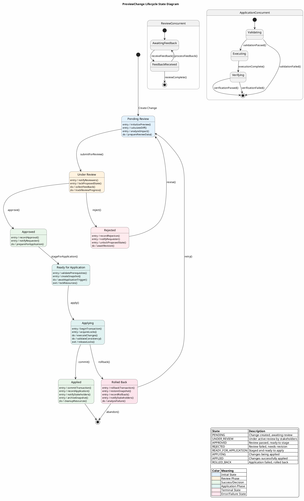
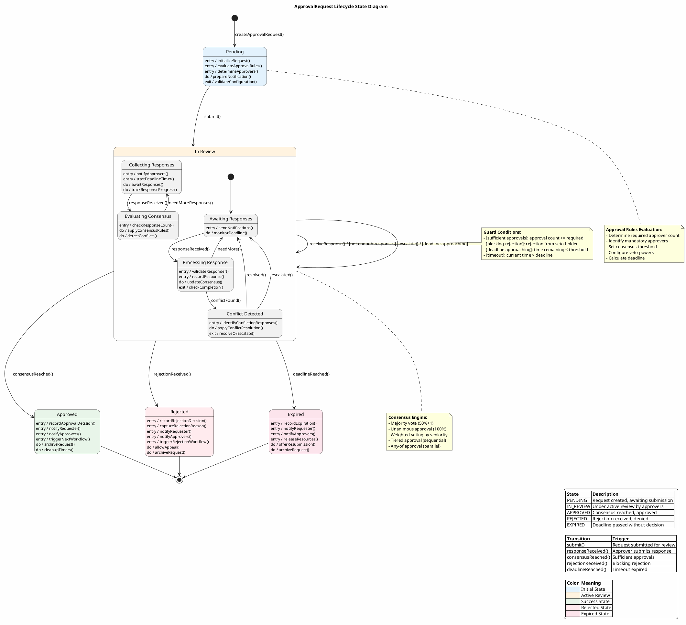

# Unified Development Specification
## AI-Powered Workflow & Meeting Management Platform

---

# Dev Spec Header

## Version and Date

| Version | Date | Description | Author |
|---------|------|-------------|--------|
| 1.0.0 | 2026-02-15 | Initial Workflow Management Spec (Spec 1) - AI Board Generation | Luke Hill |
| 1.1.0 | 2026-02-15 | Meeting Summary Generation Spec (Spec 2) - Meeting Intelligence | Vishesh Raju |
| 1.2.0 | 2026-02-15 | Kanban Change Review Spec (Spec 3) - Change Approval | Swechcha Ambati |
| 2.0.0 | 2026-02-15 | Merged Unified Specification | Luke Hill, Vishesh Raju, Swechcha Ambati |
| 2.1.0 | 2026-03-11 | Enhanced Specification with PlantUML Diagrams | Technical Documentation Team |

## Author and Role

| Author | Role | Version | Responsibility |
|--------|------|---------|----------------|
| Luke Hill | Lead Architect | 1.0.0, 2.0.0, 2.1.0 | System architecture, Module design, API specification |
| Vishesh Raju | AI/ML Engineer | 1.1.0, 2.0.0, 2.1.0 | AI pipeline design, LLM integration, Meeting intelligence |
| Swechcha Ambati | Security Engineer | 1.2.0, 2.0.0, 2.1.0 | Security architecture, Privacy compliance, Infrastructure |

---

# Table of Contents

1. [User Stories](#user-stories)
2. [Architecture Diagram](#architecture-diagram)
3. [Class Diagram](#class-diagram)
4. [List of Classes](#list-of-classes)
5. [State Diagrams](#state-diagrams)
6. [Flow Charts](#flow-charts)
7. [Technology Stack](#technology-stack)
8. [Module Architecture](#module-architecture)
9. [APIs](#apis)
10. [Public Interfaces](#public-interfaces)
11. [Data Schemas](#data-schemas)
12. [Security and Privacy](#security-and-privacy)
13. [Possible Threats and Failures](#possible-threats-and-failures)
14. [Risks to Completion](#risks-to-completion)
15. [Deployment Architecture](#deployment-architecture)
16. [Module Dependencies](#module-dependencies)
17. [Glossary](#glossary)

---
# User Stories

## US-1: AI-Powered Workflow Management (from Spec 1)
**As a** project manager,  
**I want** to provide a brief project description and have the AI automatically generate a kanban board with appropriate workflow stages and pre-populated work items,  
**So that** I can quickly bootstrap project planning without manual setup.

## US-2: AI-Powered Meeting Summary Generation (from Spec 2)
**As a** meeting facilitator,  
**I want** to end the meeting by generating an automatic summary of all agreed-upon action items, decisions, and changes in a separate approval checklist section,  
**So that** all participants have clear accountability and next steps documented.

## US-3: Kanban Change Review and Approval (from Spec 3)
**As a** team member,  
**I want** to review and approve kanban changes from the meeting checklist before they are applied,  
**So that** I can ensure changes are appropriate and understand their impact before implementation.

---

# Architecture Diagram

```plantuml
@startuml
!define RECTANGLE class

skinparam backgroundColor #FEFEFE
skinparam packageStyle rectangle
skinparam componentStyle rectangle

skinparam package {
    BackgroundColor<<Controller>> #E3F2FD
    BackgroundColor<<Service>> #E8F5E9
    BackgroundColor<<AI>> #FFF3E0
    BackgroundColor<<Repository>> #F3E5F5
    BackgroundColor<<Security>> #FFEBEE
    BackgroundColor<<Domain>> #FFFDE7
    BackgroundColor<<Infrastructure>> #E0F7FA
    BackgroundColor<<Workflow>> #FCE4EC
    BackgroundColor<<Preview>> #E8EAF6
    BackgroundColor<<Application>> #E0F2F1
    BackgroundColor<<Audit>> #FFF8E1
}

title System Architecture - Module Overview

package "M1: AI Board Generation Pipeline" <<AI>> #FFF3E0 {
    class ProjectInputController
    class ProjectService
    class AIEngine
    class PromptBuilder
    class LLMClient
    class BoardGenerator
}

package "M2: Board & Work Item Management" <<Service>> #E8F5E9 {
    class WorkItemGenerator
    class BoardController
    class BoardService
    class CardController
    class CardService
}

package "M3: Meeting Content Capture" <<Controller>> #E3F2FD {
    class MeetingController
    class MeetingService
    class CaptureController
    class CaptureService
    class ContentClassifier
    class WebSocketService
}

package "M4: AI Summary Generation" <<AI>> #FFF3E0 {
    class SummaryController
    class SummaryService
    class AIEngine2 as "AIEngine"
    class PromptBuilder2 as "PromptBuilder"
    class LLMClient2 as "LLMClient"
    class ContentStructurer
}

package "M5: Approval Workflow" <<Workflow>> #FCE4EC {
    class ApprovalComponent
    class ApprovalController
    class ApprovalService
    class DecisionProcessor
    class ConflictResolver
    class BatchProcessor
    class ApprovalRuleEngine
    class ConsensusEngine
}

package "M6: Change Preview & Review" <<Preview>> #E8EAF6 {
    class ChangePreviewView
    class ChangePreviewController
    class DiffViewer
    class DiffCalculator
    class ImpactViewer
    class ImpactAnalyzer
    class ChangePreviewService
}

package "M7: Change Application" <<Application>> #E0F2F1 {
    class ApplicationStager
    class TransactionManager
    class ChangeApplicationService
    class ChangeValidator
    class ConsistencyChecker
    class ChangeController
    class ChangeService
    class ChangeExecutor
}

package "M8: Audit & Notification" <<Audit>> #FFF8E1 {
    class AuditLogger
    class HistoryRepository
    class AlertDispatcher
    class RealTimeUpdater
    class NotificationService
    class AuditService
}

package "M9: Data Layer" <<Repository>> #F3E5F5 {
    class UserRepository
    class BoardRepository
    class CardRepository
    class ProjectRepository
    class MeetingSessionRepository
    class MeetingNoteRepository
    class MeetingSummaryRepository
    class ActionItemRepository
    class DecisionRepository
    class ChangeRepository
    class ApprovalRepository
    class ChangeSnapshotRepository
    class AuditRepository
}

package "M10: Infrastructure & Security" <<Security>> #FFEBEE {
    class AuthController
    class AuthService
    class PermissionManager
    class JWTUtil
    class SecurityConfig
    class RateLimiter
    class CorsConfig
}

package "M11: Domain Models" <<Domain>> #FFFDE7 {
    class User
    class Project
    class Board
    class Stage
    class Card
    class MeetingSession
    class MeetingNote
    class MeetingSummary
    class ActionItem
    class Decision
    class Change
    class ApprovalRequest
    class ApprovalResponse
    class PreviewChange
    class ChangeImpact
    class ChangeSnapshot
    class ApprovalRule
    class AuditEntry
}

' === CONTROLLER LAYER DEPENDENCIES ===
ProjectInputController ..> ProjectService : uses
BoardController ..> BoardService : uses
CardController ..> CardService : uses
MeetingController ..> MeetingService : uses
CaptureController ..> CaptureService : uses
SummaryController ..> SummaryService : uses
ApprovalController ..> ApprovalService : uses
ChangePreviewController ..> ChangePreviewService : uses
ChangeController ..> ChangeService : uses
AuthController ..> AuthService : uses

' === SERVICE LAYER DEPENDENCIES ===
ProjectService ..> AIEngine : uses
ProjectService ..> BoardGenerator : uses
ProjectService ..> ProjectRepository : persists

BoardService ..> BoardRepository : persists
BoardService ..> CardRepository : persists
CardService ..> CardRepository : persists

MeetingService ..> MeetingSessionRepository : persists
MeetingService ..> MeetingNoteRepository : persists
CaptureService ..> ContentClassifier : uses
CaptureService ..> WebSocketService : uses

SummaryService ..> AIEngine2 : uses
SummaryService ..> ContentStructurer : uses
SummaryService ..> MeetingSummaryRepository : persists

ApprovalService ..> DecisionProcessor : uses
ApprovalService ..> ApprovalRuleEngine : uses
ApprovalService ..> ConsensusEngine : uses
ApprovalService ..> ApprovalRepository : persists

ChangePreviewService ..> DiffCalculator : uses
ChangePreviewService ..> ImpactAnalyzer : uses
ChangePreviewService ..> ChangeRepository : persists

ChangeService ..> ChangeApplicationService : uses
ChangeService ..> ChangeValidator : uses
ChangeService ..> ChangeExecutor : uses
ChangeService ..> ChangeRepository : persists

ChangeApplicationService ..> ApplicationStager : uses
ChangeApplicationService ..> TransactionManager : uses
ChangeApplicationService ..> ConsistencyChecker : uses

AuthService ..> PermissionManager : uses
AuthService ..> JWTUtil : uses
AuthService ..> UserRepository : persists

' === AI ENGINE DEPENDENCIES ===
AIEngine ..> PromptBuilder : uses
AIEngine ..> LLMClient : uses
AIEngine2 ..> PromptBuilder2 : uses
AIEngine2 ..> LLMClient2 : uses

' === AUDIT & NOTIFICATION DEPENDENCIES ===
AuditService ..> AuditLogger : uses
AuditService ..> AuditRepository : persists
NotificationService ..> AlertDispatcher : uses
NotificationService ..> RealTimeUpdater : uses

' === CROSS-MODULE DEPENDENCIES ===
BoardGenerator ..> BoardService : creates boards
WorkItemGenerator ..> CardService : creates cards

DecisionProcessor ..> ConflictResolver : uses
DecisionProcessor ..> BatchProcessor : uses

DiffCalculator ..> DiffViewer : renders
ImpactAnalyzer ..> ImpactViewer : renders

' === SECURITY INTEGRATION ===
PermissionManager ..> UserRepository : queries
SecurityConfig ..> JWTUtil : configures
RateLimiter ..> AuthController : protects

' === AUDIT INTEGRATION ===
ApprovalService ..> AuditService : logs
ChangeService ..> AuditService : logs
BoardService ..> AuditService : logs
MeetingService ..> AuditService : logs

' === NOTIFICATION INTEGRATION ===
ApprovalService ..> NotificationService : notifies
ChangeService ..> NotificationService : notifies
MeetingService ..> NotificationService : notifies

' === DOMAIN MODEL USAGE ===
ProjectService ..> Project : manages
ProjectService ..> Board : creates
BoardService ..> Board : manages
BoardService ..> Stage : manages
CardService ..> Card : manages
MeetingService ..> MeetingSession : manages
MeetingService ..> MeetingNote : manages
SummaryService ..> MeetingSummary : generates
ApprovalService ..> ApprovalRequest : manages
ApprovalService ..> ApprovalResponse : manages
ApprovalService ..> Decision : manages
ChangePreviewService ..> PreviewChange : manages
ChangePreviewService ..> ChangeImpact : analyzes
ChangeService ..> Change : manages
ChangeService ..> ChangeSnapshot : manages
AuditService ..> AuditEntry : creates

' === LEGEND ===
legend right
    |= Color |= Module Type |
    | <#E3F2FD> | Controllers |
    | <#E8F5E9> | Services |
    | <#FFF3E0> | AI Components |
    | <#F3E5F5> | Data Layer |
    | <#FFEBEE> | Security |
    | <#FFFDE7> | Domain Models |
    | <#E0F7FA> | Infrastructure |
    | <#FCE4EC> | Workflow |
    | <#E8EAF6> | Preview |
    | <#E0F2F1> | Application |
    | <#FFF8E1> | Audit |
    
    |= Arrow |= Meaning |
    | --> | Direct dependency |
    | ..> | Uses/References |
endlegend

```


@enduml


---

# Class Diagram

```plantuml
@startuml

skinparam backgroundColor #FEFEFE
skinparam classAttributeIconSize 0
skinparam class {
    BackgroundColor<<Entity>> #E3F2FD
    BackgroundColor<<ValueObject>> #FFF3E0
    BackgroundColor<<AggregateRoot>> #E8F5E9
    BackgroundColor<<Enum>> #F3E5F5
}

title Domain Models - Class Diagram (M11)

' === ENUMERATIONS ===
enum Status <<Enum>> #F3E5F5 {
    ACTIVE
    INACTIVE
    ARCHIVED
    DELETED
}

enum ChangeStatus <<Enum>> #F3E5F5 {
    PENDING
    UNDER_REVIEW
    APPROVED
    REJECTED
    READY_FOR_APPLICATION
    APPLYING
    APPLIED
    ROLLED_BACK
}

enum ApprovalStatus <<Enum>> #F3E5F5 {
    PENDING
    IN_REVIEW
    APPROVED
    REJECTED
    EXPIRED
}

enum Priority <<Enum>> #F3E5F5 {
    LOW
    MEDIUM
    HIGH
    CRITICAL
}

enum CardType <<Enum>> #F3E5F5 {
    TASK
    BUG
    STORY
    EPIC
    SUBTASK
}

' === BASE ENTITY ===
abstract class BaseEntity <<Entity>> #E3F2FD {
    +id: UUID
    +createdAt: DateTime
    +updatedAt: DateTime
    +createdBy: UUID
    +updatedBy: UUID
    +version: Long
    --
    +getId(): UUID
    +getCreatedAt(): DateTime
    +getUpdatedAt(): DateTime
    +updateTimestamp(): void
}

' === USER AGGREGATE ===
class User <<AggregateRoot>> #E8F5E9 {
    +email: String
    +username: String
    +passwordHash: String
    +firstName: String
    +lastName: String
    +avatarUrl: String
    +role: String
    +permissions: List<String>
    +lastLoginAt: DateTime
    +isActive: Boolean
    --
    +authenticate(password: String): Boolean
    +hasPermission(permission: String): Boolean
    +updateProfile(firstName: String, lastName: String): void
    +deactivate(): void
    +activate(): void
}

' === PROJECT AGGREGATE ===
class Project <<AggregateRoot>> #E8F5E9 {
    +name: String
    +description: String
    +ownerId: UUID
    +memberIds: List<UUID>
    +status: Status
    +startDate: Date
    +endDate: Date
    +settings: ProjectSettings
    --
    +addMember(userId: UUID): void
    +removeMember(userId: UUID): void
    +updateStatus(status: Status): void
    +isOwner(userId: UUID): Boolean
}

class ProjectSettings <<ValueObject>> #FFF3E0 {
    +defaultBoardTemplate: String
    +autoGenerateBoards: Boolean
    +approvalWorkflowEnabled: Boolean
    +notificationSettings: Map<String, Boolean>
}

' === BOARD AGGREGATE ===
class Board <<AggregateRoot>> #E8F5E9 {
    +projectId: UUID
    +name: String
    +description: String
    +stages: List<Stage>
    +status: Status
    +templateType: String
    +aiGenerated: Boolean
    +generationMetadata: Map<String, Object>
    --
    +addStage(stage: Stage): void
    +removeStage(stageId: UUID): void
    +reorderStages(stageIds: List<UUID>): void
    +getStageById(stageId: UUID): Stage
    +getCards(): List<Card>
}

class Stage <<Entity>> #E3F2FD {
    +boardId: UUID
    +name: String
    +description: String
    +order: Integer
    +cards: List<Card>
    +wipLimit: Integer
    +color: String
    --
    +addCard(card: Card): void
    +removeCard(cardId: UUID): void
    +moveCard(cardId: UUID, targetStageId: UUID): void
    +isWipLimitReached(): Boolean
}

' === CARD AGGREGATE ===
class Card <<AggregateRoot>> #E8F5E9 {
    +stageId: UUID
    +title: String
    +description: String
    +type: CardType
    +priority: Priority
    +assigneeId: UUID
    +reporterId: UUID
    +labels: List<String>
    +dueDate: DateTime
    +estimatedHours: Double
    +actualHours: Double
    +attachments: List<Attachment>
    +comments: List<Comment>
    +parentCardId: UUID
    +subtaskIds: List<UUID>
    --
    +moveToStage(stageId: UUID): void
    +assignTo(userId: UUID): void
    +updatePriority(priority: Priority): void
    +addComment(comment: Comment): void
    +addAttachment(attachment: Attachment): void
    +linkToParent(parentId: UUID): void
    +addSubtask(subtaskId: UUID): void
}

class Attachment <<ValueObject>> #FFF3E0 {
    +filename: String
    +fileUrl: String
    +fileSize: Long
    +mimeType: String
    +uploadedAt: DateTime
    +uploadedBy: UUID
}

class Comment <<ValueObject>> #FFF3E0 {
    +content: String
    +authorId: UUID
    +createdAt: DateTime
    +updatedAt: DateTime
    +mentions: List<UUID>
}

' === MEETING AGGREGATE ===
class MeetingSession <<AggregateRoot>> #E8F5E9 {
    +projectId: UUID
    +title: String
    +description: String
    +organizerId: UUID
    +participantIds: List<UUID>
    +startTime: DateTime
    +endTime: DateTime
    +status: Status
    +recordingUrl: String
    +transcriptUrl: String
    +settings: MeetingSettings
    --
    +start(): void
    +end(): void
    +addParticipant(userId: UUID): void
    +removeParticipant(userId: UUID): void
    +isActive(): Boolean
}

class MeetingSettings <<ValueObject>> #FFF3E0 {
    +autoRecord: Boolean
    +autoTranscribe: Boolean
    +enableCaptions: Boolean
    +waitingRoomEnabled: Boolean
}

class MeetingNote <<Entity>> #E3F2FD {
    +meetingSessionId: UUID
    +content: String
    +noteType: String
    +createdBy: UUID
    +timestamp: DateTime
    +category: String
    +confidence: Double
    --
    +updateContent(content: String): void
    +categorize(category: String): void
}

class MeetingSummary <<Entity>> #E3F2FD {
    +meetingSessionId: UUID
    +summaryText: String
    +keyPoints: List<String>
    +aiGenerated: Boolean
    +generatedAt: DateTime
    +approvedBy: UUID
    +approvedAt: DateTime
    --
    +approve(userId: UUID): void
    +regenerate(): void
}

' === ACTION ITEM & DECISION ===
class ActionItem <<Entity>> #E3F2FD {
    +meetingSessionId: UUID
    +description: String
    +assigneeId: UUID
    +dueDate: DateTime
    +priority: Priority
    +status: Status
    +linkedCardId: UUID
    +sourceNoteId: UUID
    --
    +assignTo(userId: UUID): void
    +linkToCard(cardId: UUID): void
    +markComplete(): void
    +convertToCard(): Card
}

class Decision <<Entity>> #E3F2FD {
    +meetingSessionId: UUID
    +description: String
    +decidedBy: UUID
    +decidedAt: DateTime
    +rationale: String
    +alternatives: List<String>
    +participants: List<UUID>
    +confidence: Double
    --
    +recordDecision(userId: UUID): void
    +addRationale(rationale: String): void
}

' === CHANGE MANAGEMENT ===
class Change <<AggregateRoot>> #E8F5E9 {
    +projectId: UUID
    +changeType: String
    +description: String
    +requestedBy: UUID
    +requestedAt: DateTime
    +status: ChangeStatus
    +priority: Priority
    +previewId: UUID
    +approvalId: UUID
    +appliedAt: DateTime
    +appliedBy: UUID
    +rollbackReason: String
    --
    +requestPreview(): PreviewChange
    +submitForApproval(): ApprovalRequest
    +apply(userId: UUID): void
    +rollback(reason: String): void
    +canApply(): Boolean
}

class PreviewChange <<Entity>> #E3F2FD {
    +changeId: UUID
    +originalState: Map<String, Object>
    +proposedState: Map<String, Object>
    +diff: ChangeDiff
    +impact: ChangeImpact
    +status: ChangeStatus
    +createdBy: UUID
    +reviewedBy: UUID
    +reviewedAt: DateTime
    +comments: List<String>
    --
    +calculateDiff(): ChangeDiff
    +analyzeImpact(): ChangeImpact
    +submitForReview(userId: UUID): void
    +approve(userId: UUID): void
    +reject(userId: UUID, reason: String): void
}

class ChangeDiff <<ValueObject>> #FFF3E0 {
    +added: List<DiffEntry>
    +modified: List<DiffEntry>
    +removed: List<DiffEntry>
    +unchanged: List<DiffEntry>
    +totalChanges: Integer
    --
    +hasChanges(): Boolean
    +getChangeCount(): Integer
}

class DiffEntry <<ValueObject>> #FFF3E0 {
    +fieldPath: String
    +oldValue: Object
    +newValue: Object
    +changeType: String
}

class ChangeImpact <<ValueObject>> #FFF3E0 {
    +affectedEntities: List<String>
    +affectedCards: List<UUID>
    +affectedStages: List<UUID>
    +conflictCount: Integer
    +riskLevel: String
    +estimatedEffort: String
    +breakingChanges: Boolean
    +recommendations: List<String>
    --
    +isHighRisk(): Boolean
    +hasConflicts(): Boolean
}

class ChangeSnapshot <<Entity>> #E3F2FD {
    +changeId: UUID
    +snapshotType: String
    +entityType: String
    +entityId: UUID
    +snapshotData: Map<String, Object>
    +createdAt: DateTime
    +createdBy: UUID
    --
    +restore(): void
    +compareWith(other: ChangeSnapshot): ChangeDiff
}

' === APPROVAL WORKFLOW ===
class ApprovalRequest <<AggregateRoot>> #E8F5E9 {
    +changeId: UUID
    +requestType: String
    +requestedBy: UUID
    +requestedAt: DateTime
    +status: ApprovalStatus
    +approvers: List<UUID>
    +requiredApprovals: Integer
    +currentApprovals: Integer
    +deadline: DateTime
    +priority: Priority
    +ruleId: UUID
    --
    +submit(): void
    +addApprover(userId: UUID): void
    +removeApprover(userId: UUID): void
    +approve(userId: UUID, comment: String): void
    +reject(userId: UUID, reason: String): void
    +checkExpiration(): Boolean
    +isApproved(): Boolean
    +canDecide(userId: UUID): Boolean
}

class ApprovalResponse <<Entity>> #E3F2FD {
    +approvalRequestId: UUID
    +responderId: UUID
    +responseType: String
    +comment: String
    +respondedAt: DateTime
    +delegatedTo: UUID
    --
    +isApproval(): Boolean
    +isRejection(): Boolean
}

class ApprovalRule <<Entity>> #E3F2FD {
    +name: String
    +description: String
    +projectId: UUID
    +changeTypes: List<String>
    +requiredApprovers: Integer
    +minSeniority: String
    +autoApproveThreshold: Double
    +conflictResolution: String
    +isActive: Boolean
    --
    +evaluate(change: Change): Boolean
    +getRequiredApprovers(change: Change): List<UUID>
    +appliesTo(changeType: String): Boolean
}

' === AUDIT ===
class AuditEntry <<Entity>> #E3F2FD {
    +entityType: String
    +entityId: UUID
    +action: String
    +performedBy: UUID
    +performedAt: DateTime
    +oldValues: Map<String, Object>
    +newValues: Map<String, Object>
    +ipAddress: String
    +userAgent: String
    +changeReason: String
    --
    +hasChanges(): Boolean
    +getChangedFields(): List<String>
}

' === INHERITANCE RELATIONSHIPS ===
BaseEntity <|-- User
BaseEntity <|-- Project
BaseEntity <|-- Board
BaseEntity <|-- Stage
BaseEntity <|-- Card
BaseEntity <|-- MeetingSession
BaseEntity <|-- MeetingNote
BaseEntity <|-- MeetingSummary
BaseEntity <|-- ActionItem
BaseEntity <|-- Decision
BaseEntity <|-- Change
BaseEntity <|-- PreviewChange
BaseEntity <|-- ChangeSnapshot
BaseEntity <|-- ApprovalRequest
BaseEntity <|-- ApprovalResponse
BaseEntity <|-- ApprovalRule
BaseEntity <|-- AuditEntry

' === ASSOCIATIONS ===
Project "1" --> "0..*" Board : contains
Project "1" --> "0..*" MeetingSession : contains
Project "1" --> "0..*" Change : has
Project "1" --> "0..*" ApprovalRule : configures

Board "1" --> "0..*" Stage : contains
Board "1" --> "0..1" Project : belongs to

Stage "1" --> "0..*" Card : contains
Stage "*" --> "1" Board : belongs to

Card "1" --> "0..*" Attachment : has
Card "1" --> "0..*" Comment : has
Card "1" --> "0..*" Card : subtasks
Card "*" --> "1" Stage : belongs to

MeetingSession "1" --> "0..*" MeetingNote : contains
MeetingSession "1" --> "0..*" MeetingSummary : has
MeetingSession "1" --> "0..*" ActionItem : generates
MeetingSession "1" --> "0..*" Decision : records
MeetingSession "*" --> "1" Project : belongs to

MeetingNote "*" --> "1" MeetingSession : belongs to
MeetingSummary "*" --> "1" MeetingSession : summarizes

ActionItem "*" --> "1" MeetingSession : belongs to
ActionItem "0..1" --> "0..1" Card : linked to

Decision "*" --> "1" MeetingSession : belongs to

Change "1" --> "0..1" PreviewChange : previewed by
Change "1" --> "0..1" ApprovalRequest : approved by
Change "*" --> "1" Project : belongs to

PreviewChange "1" --> "1" ChangeDiff : contains
PreviewChange "1" --> "1" ChangeImpact : analyzes
PreviewChange "*" --> "1" Change : belongs to

ChangeSnapshot "*" --> "1" Change : captures

ApprovalRequest "1" --> "0..*" ApprovalResponse : receives
ApprovalRequest "*" --> "1" Change : approves
ApprovalRequest "*" --> "1" ApprovalRule : governed by

ApprovalResponse "*" --> "1" ApprovalRequest : responds to

User "1" --> "0..*" Project : owns
User "1" --> "0..*" Card : assigned to
User "1" --> "0..*" ActionItem : assigned to

' === LEGEND ===
legend right
    |= Symbol |= Meaning |
    | <<AggregateRoot>> | Aggregate Root (green) |
    | <<Entity>> | Domain Entity (blue) |
    | <<ValueObject>> | Value Object (orange) |
    | <<Enum>> | Enumeration (purple) |
    | -- | Private members |
    | + | Public members |
endlegend

```


@enduml


---

# List of Classes

## M1: AI Board Generation Pipeline

| Label | Class Name | Type | Purpose |
|-------|------------|------|---------|
| M1.C1 | ProjectInputController | Controller | Handle HTTP requests for project input and board generation |
| M1.C2 | ProjectService | Service | Orchestrate project creation workflow including AI generation |
| M1.C3 | AIEngine | Service | Core AI processing engine for board generation |
| M1.C4 | PromptBuilder | Utility | Build structured prompts for LLM interactions |
| M1.C5 | LLMClient | Client | Abstract interface to LLM providers (OpenAI, Claude) |
| M1.C6 | BoardGenerator | Service | Transform AI output into board structure |

## M2: Board & Work Item Management

| Label | Class Name | Type | Purpose |
|-------|------------|------|---------|
| M2.C1 | WorkItemGenerator | Service | Generate work items from AI suggestions |
| M2.C2 | BoardController | Controller | REST endpoints for board CRUD operations |
| M2.C3 | BoardService | Service | Business logic for board management |
| M2.C4 | CardController | Controller | REST endpoints for card CRUD operations |
| M2.C5 | CardService | Service | Business logic for card lifecycle management |

## M3: Meeting Content Capture Pipeline

| Label | Class Name | Type | Purpose |
|-------|------------|------|---------|
| M3.C1 | MeetingController | Controller | REST endpoints for meeting session management |
| M3.C2 | MeetingService | Service | Orchestrate meeting lifecycle |
| M3.C3 | CaptureController | Controller | Handle real-time content capture endpoints |
| M3.C4 | CaptureService | Service | Process and store captured meeting content |
| M3.C5 | ContentClassifier | Service | Classify meeting notes by type using AI/rules |
| M3.C6 | WebSocketService | Service | Manage WebSocket connections for real-time updates |

## M4: AI Summary Generation Pipeline

| Label | Class Name | Type | Purpose |
|-------|------------|------|---------|
| M4.C1 | SummaryController | Controller | REST endpoints for summary generation |
| M4.C2 | SummaryService | Service | Orchestrate summary generation workflow |
| M4.C3 | AIEngine | Service | Shared AI processing engine (see M1.C3) |
| M4.C4 | PromptBuilder | Utility | Meeting-specific prompt construction |
| M4.C5 | LLMClient | Client | Shared LLM interface (see M1.C5) |
| M4.C6 | ContentStructurer | Service | Structure raw meeting content for AI processing |

## M5: Approval Workflow

| Label | Class Name | Type | Purpose |
|-------|------------|------|---------|
| M5.C1 | ApprovalComponent | UI Component | React component for approval interface |
| M5.C2 | ApprovalController | Controller | REST endpoints for approval operations |
| M5.C3 | ApprovalService | Service | Core approval business logic |
| M5.C4 | DecisionProcessor | Service | Process individual approval decisions |
| M5.C5 | ConflictResolver | Service | Resolve conflicts in approval decisions |
| M5.C6 | BatchProcessor | Service | Handle batch approval operations |
| M5.C7 | ApprovalRuleEngine | Service | Evaluate approval rules and requirements |
| M5.C8 | ConsensusEngine | Service | Determine consensus from multiple approvals |

## M6: Change Preview & Review

| Label | Class Name | Type | Purpose |
|-------|------------|------|---------|
| M6.C1 | ChangePreviewView | UI Component | React component for preview display |
| M6.C2 | ChangePreviewController | Controller | REST endpoints for preview operations |
| M6.C3 | DiffViewer | UI Component | Visual diff display component |
| M6.C4 | DiffCalculator | Service | Calculate differences between states |
| M6.C5 | ImpactViewer | UI Component | Impact visualization component |
| M6.C6 | ImpactAnalyzer | Service | Analyze impact of proposed changes |
| M6.C7 | ChangePreviewService | Service | Orchestrate preview generation |

## M7: Change Application

| Label | Class Name | Type | Purpose |
|-------|------------|------|---------|
| M7.C1 | ApplicationStager | Service | Stage changes before application |
| M7.C2 | TransactionManager | Service | Manage distributed transactions |
| M7.C3 | ChangeApplicationService | Service | Apply approved changes to boards |
| M7.C4 | ChangeValidator | Service | Validate changes before application |
| M7.C5 | ConsistencyChecker | Service | Ensure data consistency post-application |
| M7.C6 | ChangeController | Controller | REST endpoints for change execution |
| M7.C7 | ChangeService | Service | Orchestrate change lifecycle |
| M7.C8 | ChangeExecutor | Service | Execute individual change operations |

## M8: Audit & Notification

| Label | Class Name | Type | Purpose |
|-------|------------|------|---------|
| M8.C1 | AuditLogger | Service | Log all system events to audit trail |
| M8.C2 | HistoryRepository | Repository | Data access for historical records |
| M8.C3 | AlertDispatcher | Service | Dispatch alerts to appropriate channels |
| M8.C4 | RealTimeUpdater | Service | Send real-time updates via WebSocket |
| M8.C5 | NotificationService | Service | Multi-channel notification delivery |
| M8.C6 | AuditService | Service | Audit query and reporting |

## M9: Data Layer

| Label | Class Name | Type | Purpose |
|-------|------------|------|---------|
| M9.C1 | UserRepository | Repository | User entity persistence operations |
| M9.C2 | BoardRepository | Repository | Board entity persistence operations |
| M9.C3 | CardRepository | Repository | Card entity persistence operations |
| M9.C4 | ProjectRepository | Repository | Project entity persistence operations |
| M9.C5 | MeetingSessionRepository | Repository | Meeting session persistence |
| M9.C6 | MeetingNoteRepository | Repository | Meeting note persistence |
| M9.C7 | MeetingSummaryRepository | Repository | Meeting summary persistence |
| M9.C8 | ActionItemRepository | Repository | Action item persistence |
| M9.C9 | DecisionRepository | Repository | Decision persistence |
| M9.C10 | ChangeRepository | Repository | Change entity persistence |
| M9.C11 | ApprovalRepository | Repository | Approval persistence |
| M9.C12 | ChangeSnapshotRepository | Repository | Snapshot persistence |
| M9.C13 | AuditRepository | Repository | Audit entry persistence |
| M9.C14 | HistoryRepository | Repository | Historical record persistence |

## M10: Infrastructure & Security

| Label | Class Name | Type | Purpose |
|-------|------------|------|---------|
| M10.C1 | AuthController | Controller | Authentication REST endpoints |
| M10.C2 | AuthService | Service | Authentication business logic |
| M10.C3 | PermissionManager | Service | Permission evaluation and enforcement |
| M10.C4 | JWTUtil | Utility | JWT token generation and validation |
| M10.C5 | SecurityConfig | Config | Spring Security configuration |
| M10.C6 | RateLimiter | Service | API rate limiting enforcement |
| M10.C7 | CorsConfig | Config | CORS policy configuration |

## M11: Domain Models (Data Storage Classes)

| Label | Class Name | Type | Purpose |
|-------|------------|------|---------|
| M11.E1 | User | Entity | System user account |
| M11.E2 | Project | Entity | Project container |
| M11.E3 | Board | Entity | Kanban board definition |
| M11.E4 | Stage | Entity | Board column/stage |
| M11.E5 | Card | Entity | Work item/card |
| M11.E6 | MeetingSession | Entity | Meeting instance |
| M11.E7 | MeetingNote | Entity | Captured meeting content |
| M11.E8 | MeetingSummary | Entity | Generated meeting summary |
| M11.E9 | ActionItem | Entity | Actionable task |
| M11.E10 | Decision | Entity | Meeting decision |
| M11.E11 | Change | Entity | Proposed change |
| M11.E12 | ApprovalRequest | Entity | Approval request |
| M11.E13 | ApprovalResponse | Entity | Approval response |
| M11.E14 | PreviewChange | Entity | Change preview data |
| M11.E15 | ChangeImpact | Entity | Impact analysis result |
| M11.E16 | ChangeSnapshot | Entity | Point-in-time snapshot |
| M11.E17 | ApprovalRule | Entity | Approval rule definition |
| M11.E18 | AuditEntry | Entity | Audit log entry |

## M11: Domain Models (DTOs - Non-Storage)

| Label | Class Name | Type | Purpose |
|-------|------------|------|---------|
| M11.D1 | ProjectInputDTO | DTO | Project description input |
| M11.D2 | BoardGenerationDTO | DTO | Generated board output |
| M11.D3 | CardDTO | DTO | Card data transfer |
| M11.D4 | MeetingSessionDTO | DTO | Meeting session data |
| M11.D5 | MeetingNoteDTO | DTO | Meeting note data |
| M11.D6 | SummaryDTO | DTO | Summary output |
| M11.D7 | ActionItemDTO | DTO | Action item data |
| M11.D8 | DecisionDTO | DTO | Decision data |
| M11.D9 | PreviewChangeDTO | DTO | Change preview data |
| M11.D10 | PreviewDetailDTO | DTO | Detailed preview |
| M11.D11 | ApprovalRequestDTO | DTO | Approval request |
| M11.D12 | DiffDTO | DTO | Diff representation |
| M11.D13 | ImpactDTO | DTO | Impact analysis data |
| M11.D14 | ApprovalResultDTO | DTO | Approval outcome |
| M11.D15 | ApplicationResultDTO | DTO | Change application result |

## M11: Domain Models (Enums)

| Label | Class Name | Values |
|-------|------------|--------|
| M11.N1 | Role | ADMIN, MANAGER, MEMBER, VIEWER |
| M11.N2 | Permission | CREATE_BOARD, EDIT_BOARD, DELETE_BOARD, CREATE_CARD, EDIT_CARD, DELETE_CARD, APPROVE_CHANGE, VIEW_AUDIT |
| M11.N3 | SessionStatus | SCHEDULED, ACTIVE, PAUSED, ENDED, CANCELLED |
| M11.N4 | NoteType | DISCUSSION, DECISION, ACTION_ITEM, QUESTION |
| M11.N5 | SummaryStatus | PENDING, GENERATING, COMPLETED, FAILED |
| M11.N6 | Priority | LOW, MEDIUM, HIGH, CRITICAL |
| M11.N7 | ActionStatus | PENDING, IN_PROGRESS, COMPLETED, CANCELLED |
| M11.N8 | ChangeType | CREATE_CARD, UPDATE_CARD, DELETE_CARD, MOVE_CARD, CREATE_STAGE, UPDATE_STAGE, DELETE_STAGE |
| M11.N9 | ImpactLevel | NONE, LOW, MEDIUM, HIGH, CRITICAL |
| M11.N10 | ApprovalStatus | PENDING, APPROVED, REJECTED, EXPIRED |
| M11.N11 | ChecklistStatus | PENDING, IN_REVIEW, APPROVED, REJECTED |
| M11.N12 | ExecutionStatus | PENDING, IN_PROGRESS, COMPLETED, FAILED, ROLLED_BACK |
| M11.N13 | SectionType | ACTION_ITEMS, DECISIONS, DISCUSSIONS |
| M11.N14 | EntityType | USER, PROJECT, BOARD, CARD, MEETING, CHANGE |
| M11.N15 | PreviewStatus | GENERATING, READY, EXPIRED |
| M11.N16 | RiskLevel | LOW, MEDIUM, HIGH, CRITICAL |
| M11.N17 | Decision | APPROVE, REJECT, ABSTAIN, REQUEST_CHANGES |

---

# State Diagrams

## System State Data Fields

```
SystemState = {
    previewChanges: List<PreviewChange>,
    pendingApprovals: Map<UUID, List<ApprovalResponse>>,
    activeWorkflows: List<ApprovalWorkflow>,
    changeSnapshots: Map<UUID, ChangeSnapshot>,
    notificationQueue: List<Notification>,
    auditLog: List<AuditEntry>,
    userSessions: Map<UUID, UserSession>
}
```

## PreviewChange State Diagram


@enduml


## ApprovalRequest State Diagram


@enduml


---

# Flow Charts

## Change Approval Flow (Sequence Diagram)

**Scenario Description:** This flow chart illustrates the complete change approval workflow from creation through application or rollback. It shows how a user creates a change, submits it for approval, reviewers make decisions, and approved changes are applied to the kanban board with full audit logging.

**State Diagram Reference:** This flow begins at **PENDING** state, transitions through **UNDER_REVIEW**, then to either **APPROVED** or **REJECTED**, and finally to **APPLIED** or **ROLLED_BACK**.

```plantuml
@startuml

skinparam backgroundColor #FEFEFE
skinparam sequence {
    ArrowColor #333333
    LifeLineBorderColor #666666
    LifeLineBackgroundColor #F5F5F5
    ParticipantBorderColor #333333
    ParticipantBackgroundColor #E3F2FD
}

title Change Approval Flow - Sequence Diagram

actor "User" as User #E8F5E9
participant "ChangePreview\nController" as CPC #E3F2FD
participant "ChangePreview\nService" as CPS #E8F5E9
participant "DiffCalculator" as DC #FFF3E0
participant "ImpactAnalyzer" as IA #FFF3E0
participant "ApprovalService" as AS #FCE4EC
participant "ApprovalRuleEngine" as ARE #FCE4EC
participant "ConsensusEngine" as CE #FCE4EC
participant "DecisionProcessor" as DP #FCE4EC
participant "ChangeApplication\nService" as CAS #E0F2F1
participant "ChangeValidator" as CV #E0F2F1
participant "TransactionManager" as TM #E0F2F1
participant "BoardService" as BS #E8F5E9
participant "CardService" as CS #E8F5E9
participant "AuditService" as AUD #FFF8E1
participant "NotificationService" as NS #FFF8E1
database "Database" as DB #F3E5F5

== Phase 1: Create and Preview Change ==

User -> CPC : createChange(changeRequest)
activate CPC
CPC -> CPS : createPreview(changeRequest)
activate CPS

CPS -> DC : calculateDiff(original, proposed)
activate DC
DC --> CPS : ChangeDiff

deactivate DC

CPS -> IA : analyzeImpact(changeRequest)
activate IA
IA --> CPS : ChangeImpact

deactivate IA

CPS -> DB : save(PreviewChange)
activate DB
DB --> CPS : savedPreview

deactivate DB

CPS -> AUD : logAudit("PREVIEW_CREATED")
activate AUD
AUD --> CPS : logged

deactivate AUD

CPS --> CPC : PreviewChange

deactivate CPS

CPC --> User : previewResponse

deactivate CPC

== Phase 2: Submit for Approval ==

User -> CPC : submitForApproval(previewId)
activate CPC
CPC -> CPS : submitForApproval(previewId)
activate CPS

CPS -> CPS : validatePreviewComplete()
CPS -> DB : updateStatus(PENDING_REVIEW)
activate DB
DB --> CPS : updated

deactivate DB

CPS -> AS : createApprovalRequest(previewId)
activate AS

AS -> ARE : evaluateRules(changeType)
activate ARE
ARE --> AS : ApprovalRule

deactivate ARE

AS -> AS : determineApprovers(rule)
AS -> AS : setDeadline(rule)

AS -> DB : save(ApprovalRequest)
activate DB
DB --> AS : savedRequest

deactivate DB

AS -> NS : notifyApprovers(approverList)
activate NS
NS --> AS : notified

deactivate NS

AS -> AUD : logAudit("APPROVAL_REQUESTED")
activate AUD
AUD --> AS : logged

deactivate AUD

AS --> CPS : ApprovalRequest

deactivate AS

CPS --> CPC : approvalSubmitted

deactivate CPS

CPC --> User : approvalResponse

deactivate CPC

== Phase 3: Approval Decision ==

User -> CPC : approve(approvalId, comment)
activate CPC
CPC -> AS : recordApproval(approvalId, userId, comment)
activate AS

AS -> AS : validateApprover(userId)
AS -> CE : checkConsensus(approvalRequest)
activate CE
CE --> AS : consensusStatus

deactivate CE

alt Consensus Reached
    AS -> AS : markApproved()
    AS -> DP : processDecision(approvalRequest)
    activate DP
    
    DP -> DP : validateNoConflicts()
    DP -> DP : prepareApplication()
    
    DP -> CPS : transitionToReady(previewId)
    activate CPS
    CPS -> DB : updateStatus(READY_FOR_APPLICATION)
    activate DB
    DB --> CPS : updated
    
    deactivate DB
    CPS --> DP : transitioned
    
    deactivate CPS
    
    DP --> AS : processed
    
    deactivate DP
    
    AS -> NS : notifyApprovalComplete()
    activate NS
    NS --> AS : notified
    
    deactivate NS
    
else Need More Approvals
    AS -> NS : notifyProgress()
    activate NS
    NS --> AS : notified
    
    deactivate NS
end

AS -> AUD : logAudit("APPROVAL_RECORDED")
activate AUD
AUD --> AS : logged

deactivate AUD

AS --> CPC : approvalResult

deactivate AS

CPC --> User : decisionResponse

deactivate CPC

== Phase 4: Apply Change ==

User -> CPC : applyChange(previewId)
activate CPC
CPC -> CPS : applyChange(previewId)
activate CPS

CPS -> CAS : executeChange(previewId)
activate CAS

CAS -> CV : validateChange(previewId)
activate CV
CV -> DB : fetchPreviewChange()
activate DB
DB --> CV : PreviewChange

deactivate DB

CV --> CAS : validationResult

deactivate CV

alt Validation Passed
    CAS -> TM : beginTransaction()
    activate TM
    TM --> CAS : transaction
    
    deactivate TM
    
    CAS -> CPS : updateStatus(APPLYING)
    activate CPS
    CPS -> DB : updateStatus()
    activate DB
    DB --> CPS : updated
    
    deactivate DB
    CPS --> CAS : updated
    
    deactivate CPS
    
    loop For Each Change Operation
        CAS -> BS : applyBoardChange(operation)
        activate BS
        BS -> DB : update(Board)
        activate DB
        DB --> BS : updated
        
        deactivate DB
        BS --> CAS : applied
        
        deactivate BS
        
        CAS -> CS : applyCardChange(operation)
        activate CS
        CS -> DB : update(Card)
        activate DB
        DB --> CS : updated
        
        deactivate DB
        CS --> CAS : applied
        
        deactivate CS
    end
    
    CAS -> TM : commitTransaction()
    activate TM
    TM --> CAS : committed
    
    deactivate TM
    
    CAS -> CPS : updateStatus(APPLIED)
    activate CPS
    CPS -> DB : updateStatus()
    activate DB
    DB --> CPS : updated
    
    deactivate DB
    CPS --> CAS : updated
    
    deactivate CPS
    
    CAS -> AS : completeApproval(approvalId)
    activate AS
    AS --> CAS : completed
    
    deactivate AS
    
else Validation Failed
    CAS --> CPS : validationError
    CPS -> CPS : updateStatus(REJECTED)
end

CAS -> AUD : logAudit("CHANGE_APPLIED")
activate AUD
AUD --> CAS : logged

deactivate AUD

CAS -> NS : notifyChangeApplied()
activate NS
NS --> CAS : notified

deactivate NS

CAS --> CPS : applicationResult

deactivate CAS

CPS --> CPC : changeApplied

deactivate CPS

CPC --> User : applicationResponse

deactivate CPC

== Phase 5: Rollback (if needed) ==

opt Rollback Scenario
    User -> CPC : rollbackChange(previewId, reason)
    activate CPC
    CPC -> CAS : rollback(previewId, reason)
    activate CAS
    
    CAS -> TM : beginTransaction()
    activate TM
    TM --> CAS : transaction
    
    deactivate TM
    
    CAS -> CPS : updateStatus(ROLLING_BACK)
    activate CPS
    CPS -> DB : updateStatus()
    activate DB
    DB --> CPS : updated
    
    deactivate DB
    CPS --> CAS : updated
    
    deactivate CPS
    
    CAS -> CPS : getSnapshot(previewId)
    activate CPS
    CPS -> DB : fetchSnapshot()
    activate DB
    DB --> CPS : ChangeSnapshot
    
    deactivate DB
    CPS --> CAS : snapshot
    
    deactivate CPS
    
    CAS -> BS : restoreFromSnapshot(snapshot)
    activate BS
    BS -> DB : restore(Board)
    activate DB
    DB --> BS : restored
    
    deactivate DB
    BS --> CAS : restored
    
    deactivate BS
    
    CAS -> TM : commitTransaction()
    activate TM
    TM --> CAS : committed
    
    deactivate TM
    
    CAS -> CPS : updateStatus(ROLLED_BACK)
    activate CPS
    CPS -> DB : updateStatus()
    activate DB
    DB --> CPS : updated
    
    deactivate DB
    CPS --> CAS : updated
    
    deactivate CPS
    
    CAS -> AUD : logAudit("CHANGE_ROLLED_BACK")
    activate AUD
    AUD --> CAS : logged
    
    deactivate AUD
    
    CAS -> NS : notifyRollbackComplete()
    activate NS
    NS --> CAS : notified
    
    deactivate NS
    
    CAS --> CPC : rollbackResult
    
    deactivate CAS
    
    CPC --> User : rollbackResponse
    
    deactivate CPC
end

```


@enduml


---


# Technology Stack

| Category | Technology | Version | Purpose | URL | Build vs Buy |
|----------|-----------|---------|---------|-----|--------------|
| **Backend Framework** | Java | 21 | Primary language | https://www.oracle.com/java/ | Build (Core platform) |
| | Spring Boot | 3.2.x | Application framework | https://spring.io/projects/spring-boot | Build (Standard) |
| | Spring Data JPA | 3.2.x | Data persistence | https://spring.io/projects/spring-data-jpa | Build (Standard) |
| | Spring WebFlux | 3.2.x | Reactive programming | https://docs.spring.io/spring-framework/reference/web/webflux.html | Build (Standard) |
| | Spring Security | 6.2.x | Authentication & authorization | https://spring.io/projects/spring-security | Build (Standard) |
| **AI/ML** | OpenAI GPT-4 | Latest | Primary LLM | https://platform.openai.com/ | Buy (API service) |
| | OpenAI GPT-4 Turbo | Latest | Enhanced LLM capabilities | https://platform.openai.com/ | Buy (API service) |
| | Anthropic Claude | Latest | Alternative LLM | https://www.anthropic.com/claude | Buy (API service) |
| | LangChain4j | 0.24.0 | LLM integration framework | https://github.com/langchain4j/langchain4j | Build (Open source) |
| **Database** | PostgreSQL | 16.1 | Primary database | https://www.postgresql.org/ | Buy (Managed service recommended) |
| | Redis | 7.2.3/7.x | Caching & session storage | https://redis.io/ | Buy (Managed service recommended) |
| | Flyway | 10.x | Database migrations | https://flywaydb.org/ | Build (Open source) |
| **Frontend** | React | 18.2.0/18.x | UI framework | https://react.dev/ | Build (Standard) |
| | TypeScript | 5.3.x | Type-safe JavaScript | https://www.typescriptlang.org/ | Build (Standard) |
| | Material-UI | 5.14.x | UI component library | https://mui.com/ | Build (Open source) |
| | Zustand | Latest | State management | https://github.com/pmndrs/zustand | Build (Open source) |
| | Axios | Latest | HTTP client | https://axios-http.com/ | Build (Open source) |
| **Utilities** | diff-match-patch | Latest | Diff calculation | https://github.com/google/diff-match-patch | Build (Open source) |
| | jose4j | 0.9.3 | JWT handling | https://bitbucket.org/b_c/jose4j/wiki/Home | Build (Open source) |
| **Testing** | JUnit | 5.10.1 | Unit testing | https://junit.org/junit5/ | Build (Standard) |
| | Testcontainers | 1.19.3 | Integration testing | https://www.testcontainers.org/ | Build (Open source) |
| **Build & Deploy** | Gradle | 8.5 | Build tool | https://gradle.org/ | Build (Standard) |
| | Docker | 24.0.7/24.x | Containerization | https://www.docker.com/ | Build (Standard) |
| | Kubernetes | 1.28.x | Orchestration | https://kubernetes.io/ | Buy (Managed K8s recommended) |
| **Monitoring** | Prometheus | 2.48.x | Metrics collection | https://prometheus.io/ | Build (Open source) |
| | ELK Stack | 8.x | Logging & analytics | https://www.elastic.co/elastic-stack | Buy (Managed service recommended) |

---


# Module Architecture

### M1: AI Board Generation Pipeline
**Purpose:** Automatically generate kanban boards from project descriptions using AI

| Component | Type | Responsibility |
|-----------|------|----------------|
| M1.C1 - ProjectInputController | Controller | Handle project description input |
| M1.C2 - ProjectService | Service | Orchestrate project creation flow |
| M1.C3 - AIEngine | Service | Core AI processing engine |
| M1.C4 - PromptBuilder | Utility | Construct LLM prompts |
| M1.C5 - LLMClient | Client | Interface with LLM providers |
| M1.C6 - BoardGenerator | Service | Generate board structure from AI output |

**Dependencies:** M10 (Security), M11 (Domain Models), M9 (Data Layer)

---

### M2: Board & Work Item Management
**Purpose:** Manage kanban boards, stages, and work items

| Component | Type | Responsibility |
|-----------|------|----------------|
| M2.C1 - WorkItemGenerator | Service | Generate work items from AI suggestions |
| M2.C2 - BoardController | Controller | Board CRUD operations |
| M2.C3 - BoardService | Service | Board business logic |
| M2.C4 - CardController | Controller | Card CRUD operations |
| M2.C5 - CardService | Service | Card business logic |

**Dependencies:** M10 (Security), M11 (Domain Models), M9 (Data Layer)

---

### M3: Meeting Content Capture Pipeline
**Purpose:** Capture and classify meeting content in real-time

| Component | Type | Responsibility |
|-----------|------|----------------|
| M3.C1 - MeetingController | Controller | Meeting session management |
| M3.C2 - MeetingService | Service | Meeting orchestration |
| M3.C3 - CaptureController | Controller | Real-time content capture |
| M3.C4 - CaptureService | Service | Content processing |
| M3.C5 - ContentClassifier | Service | Classify notes by type |
| M3.C6 - WebSocketService | Service | Real-time communication |

**Dependencies:** M10 (Security), M11 (Domain Models), M9 (Data Layer)

---

### M4: AI Summary Generation Pipeline
**Purpose:** Generate intelligent meeting summaries using AI

| Component | Type | Responsibility |
|-----------|------|----------------|
| M4.C1 - SummaryController | Controller | Summary generation endpoints |
| M4.C2 - SummaryService | Service | Summary orchestration |
| M4.C3 - AIEngine | Service | Core AI processing (shared with M1) |
| M4.C4 - PromptBuilder | Utility | Meeting-specific prompts (shared with M1) |
| M4.C5 - LLMClient | Client | LLM interface (shared with M1) |
| M4.C6 - ContentStructurer | Service | Structure raw content for AI |

**Dependencies:** M10 (Security), M11 (Domain Models), M9 (Data Layer), M3 (Meeting Capture)

---

### M5: Approval Workflow
**Purpose:** Manage approval processes for changes and decisions

| Component | Type | Responsibility |
|-----------|------|----------------|
| M5.C1 - ApprovalComponent | UI Component | Approval interface |
| M5.C2 - ApprovalController | Controller | Approval API endpoints |
| M5.C3 - ApprovalService | Service | Approval business logic |
| M5.C4 - DecisionProcessor | Service | Process approval decisions |
| M5.C5 - ConflictResolver | Service | Resolve approval conflicts |
| M5.C6 - BatchProcessor | Service | Batch approval processing |
| M5.C7 - ApprovalRuleEngine | Service | Evaluate approval rules |
| M5.C8 - ConsensusEngine | Service | Determine consensus (from spec 2) |

**Dependencies:** M10 (Security), M11 (Domain Models), M9 (Data Layer), M6 (Change Preview)

---

### M6: Change Preview & Review
**Purpose:** Preview and review changes before approval

| Component | Type | Responsibility |
|-----------|------|----------------|
| M6.C1 - ChangePreviewView | UI Component | Change preview interface |
| M6.C2 - ChangePreviewController | Controller | Preview API endpoints |
| M6.C3 - DiffViewer | UI Component | Visual diff display |
| M6.C4 - DiffCalculator | Service | Calculate diffs between states |
| M6.C5 - ImpactViewer | UI Component | Impact visualization |
| M6.C6 - ImpactAnalyzer | Service | Analyze change impact |
| M6.C7 - ChangePreviewService | Service | Preview orchestration |

**Dependencies:** M10 (Security), M11 (Domain Models), M9 (Data Layer)

---

### M7: Change Application
**Purpose:** Apply approved changes with transaction safety

| Component | Type | Responsibility |
|-----------|------|----------------|
| M7.C1 - ApplicationStager | Service | Stage changes for application |
| M7.C2 - TransactionManager | Service | Manage change transactions |
| M7.C3 - ChangeApplicationService | Service | Apply changes to boards |
| M7.C4 - ChangeValidator | Service | Validate changes pre-application |
| M7.C5 - ConsistencyChecker | Service | Ensure data consistency |
| M7.C6 - ChangeController | Controller | Change execution endpoints (from spec 2) |
| M7.C7 - ChangeService | Service | Change orchestration (from spec 2) |
| M7.C8 - ChangeExecutor | Service | Execute changes (from spec 2) |

**Dependencies:** M10 (Security), M11 (Domain Models), M9 (Data Layer), M2 (Board Management)

---

### M8: Audit & Notification
**Purpose:** Comprehensive audit logging and notifications

| Component | Type | Responsibility |
|-----------|------|----------------|
| M8.C1 - AuditLogger | Service | Log all system events |
| M8.C2 - HistoryRepository | Repository | Store historical data |
| M8.C3 - AlertDispatcher | Service | Send alerts |
| M8.C4 - RealTimeUpdater | Service | Real-time update notifications |
| M8.C5 - NotificationService | Service | Multi-channel notifications |
| M8.C6 - AuditService | Service | Audit query and reporting (from spec 2) |

**Dependencies:** M10 (Security), M11 (Domain Models), M9 (Data Layer)

---

### M9: Data Layer
**Purpose:** Unified data access layer

| Component | Type | Responsibility |
|-----------|------|----------------|
| M9.C1 - UserRepository | Repository | User data access |
| M9.C2 - BoardRepository | Repository | Board data access |
| M9.C3 - CardRepository | Repository | Card data access |
| M9.C4 - ProjectRepository | Repository | Project data access |
| M9.C5 - MeetingSessionRepository | Repository | Meeting session data |
| M9.C6 - MeetingNoteRepository | Repository | Meeting notes data |
| M9.C7 - MeetingSummaryRepository | Repository | Meeting summaries |
| M9.C8 - ActionItemRepository | Repository | Action items data |
| M9.C9 - DecisionRepository | Repository | Decisions data |
| M9.C10 - ChangeRepository | Repository | Changes data |
| M9.C11 - ApprovalRepository | Repository | Approvals data |
| M9.C12 - ChangeSnapshotRepository | Repository | Change snapshots |
| M9.C13 - AuditRepository | Repository | Audit trail data |
| M9.C14 - HistoryRepository | Repository | Historical records |

**Dependencies:** M11 (Domain Models)

---

### M10: Infrastructure & Security
**Purpose:** Cross-cutting infrastructure and security concerns

| Component | Type | Responsibility |
|-----------|------|----------------|
| M10.C1 - AuthController | Controller | Authentication endpoints |
| M10.C2 - AuthService | Service | Authentication business logic |
| M10.C3 - PermissionManager | Service | Permission evaluation |
| M10.C4 - JWTUtil | Utility | JWT token handling |
| M10.C5 - SecurityConfig | Config | Security configuration |
| M10.C6 - RateLimiter | Service | API rate limiting |
| M10.C7 - CorsConfig | Config | CORS configuration |

**Dependencies:** M11 (Domain Models), M9 (Data Layer)

---

### M11: Domain Models
**Purpose:** Centralized domain entities, enums, and DTOs

#### Entities (Data Storage Classes)
| Entity | Description | Storage Type |
|--------|-------------|--------------|
| M11.E1 - User | System user | Persistent (PostgreSQL) |
| M11.E2 - Project | Project container | Persistent (PostgreSQL) |
| M11.E3 - Board | Kanban board | Persistent (PostgreSQL) |
| M11.E4 - Stage | Board column | Persistent (PostgreSQL) |
| M11.E5 - Card | Work item | Persistent (PostgreSQL) |
| M11.E6 - MeetingSession | Meeting instance | Persistent (PostgreSQL) |
| M11.E7 - MeetingNote | Captured meeting content | Persistent (PostgreSQL) |
| M11.E8 - MeetingSummary | Generated summary | Persistent (PostgreSQL) |
| M11.E9 - ActionItem | Actionable task from meeting | Persistent (PostgreSQL) |
| M11.E10 - Decision | Decision from meeting | Persistent (PostgreSQL) |
| M11.E11 - Change | Proposed change | Persistent (PostgreSQL) |
| M11.E12 - ApprovalRequest | Request for approval | Persistent (PostgreSQL) |
| M11.E13 - ApprovalResponse | Approval decision | Persistent (PostgreSQL) |
| M11.E14 - PreviewChange | Change preview | Persistent (PostgreSQL) |
| M11.E15 - ChangeImpact | Impact analysis | Persistent (PostgreSQL) |
| M11.E16 - ChangeSnapshot | Point-in-time snapshot | Persistent (PostgreSQL) |
| M11.E17 - ApprovalRule | Approval rule definition | Persistent (PostgreSQL) |
| M11.E18 - AuditEntry | Audit log entry | Persistent (PostgreSQL) |

#### DTOs (Non-Storage Classes)
| DTO | Description | Type |
|-----|-------------|------|
| M11.D1 - ProjectInputDTO | Project description input | Request DTO |
| M11.D2 - BoardGenerationDTO | Generated board output | Response DTO |
| M11.D3 - CardDTO | Card data transfer | Bidirectional DTO |
| M11.D4 - MeetingSessionDTO | Meeting session data | Bidirectional DTO |
| M11.D5 - MeetingNoteDTO | Meeting note data | Bidirectional DTO |
| M11.D6 - SummaryDTO | Summary output | Response DTO |
| M11.D7 - ActionItemDTO | Action item data | Bidirectional DTO |
| M11.D8 - DecisionDTO | Decision data | Bidirectional DTO |
| M11.D9 - PreviewChangeDTO | Change preview data | Response DTO |
| M11.D10 - PreviewDetailDTO | Detailed preview | Response DTO |
| M11.D11 - ApprovalRequestDTO | Approval request | Bidirectional DTO |
| M11.D12 - DiffDTO | Diff representation | Response DTO |
| M11.D13 - ImpactDTO | Impact analysis data | Response DTO |
| M11.D14 - ApprovalResultDTO | Approval outcome | Response DTO |
| M11.D15 - ApplicationResultDTO | Change application result | Response DTO |

#### Enums
| Enum | Values |
|------|--------|
| M11.N1 - Role | ADMIN, MANAGER, MEMBER, VIEWER |
| M11.N2 - Permission | CREATE_BOARD, EDIT_BOARD, DELETE_BOARD, CREATE_CARD, EDIT_CARD, DELETE_CARD, APPROVE_CHANGE, VIEW_AUDIT |
| M11.N3 - SessionStatus | SCHEDULED, ACTIVE, PAUSED, ENDED, CANCELLED |
| M11.N4 - NoteType | DISCUSSION, DECISION, ACTION_ITEM, QUESTION |
| M11.N5 - SummaryStatus | PENDING, GENERATING, COMPLETED, FAILED |
| M11.N6 - Priority | LOW, MEDIUM, HIGH, CRITICAL |
| M11.N7 - ActionStatus | PENDING, IN_PROGRESS, COMPLETED, CANCELLED |
| M11.N8 - ChangeType | CREATE_CARD, UPDATE_CARD, DELETE_CARD, MOVE_CARD, CREATE_STAGE, UPDATE_STAGE, DELETE_STAGE |
| M11.N9 - ImpactLevel | NONE, LOW, MEDIUM, HIGH, CRITICAL |
| M11.N10 - ApprovalStatus | PENDING, APPROVED, REJECTED, EXPIRED |
| M11.N11 - ChecklistStatus | PENDING, IN_REVIEW, APPROVED, REJECTED |
| M11.N12 - ExecutionStatus | PENDING, IN_PROGRESS, COMPLETED, FAILED, ROLLED_BACK |
| M11.N13 - SectionType | ACTION_ITEMS, DECISIONS, DISCUSSIONS |
| M11.N14 - EntityType | USER, PROJECT, BOARD, CARD, MEETING, CHANGE |
| M11.N15 - PreviewStatus | GENERATING, READY, EXPIRED |
| M11.N16 - RiskLevel | LOW, MEDIUM, HIGH, CRITICAL |
| M11.N17 - Decision | APPROVE, REJECT, ABSTAIN, REQUEST_CHANGES |

---


# APIs

### 8.1 Board Generation APIs (M1)

| Endpoint | Method | Description | Request | Response |
|----------|--------|-------------|---------|----------|
| /api/v1/projects | POST | Create project with AI board | ProjectInputDTO | BoardGenerationDTO |
| /api/v1/projects/{id}/regenerate | POST | Regenerate board | - | BoardGenerationDTO |
| /api/v1/ai/generate-board | POST | Generate board without saving | ProjectInputDTO | BoardGenerationDTO |

### 8.2 Board Management APIs (M2)

| Endpoint | Method | Description | Request | Response |
|----------|--------|-------------|---------|----------|
| /api/v1/boards | GET | List boards | - | List<BoardDTO> |
| /api/v1/boards/{id} | GET | Get board details | - | BoardDTO |
| /api/v1/boards/{id} | PUT | Update board | BoardDTO | BoardDTO |
| /api/v1/boards/{id} | DELETE | Delete board | - | 204 |
| /api/v1/boards/{id}/stages | POST | Add stage | StageDTO | StageDTO |
| /api/v1/boards/{id}/stages/reorder | PUT | Reorder stages | List<UUID> | List<StageDTO> |
| /api/v1/cards | POST | Create card | CardDTO | CardDTO |
| /api/v1/cards/{id} | GET | Get card | - | CardDTO |
| /api/v1/cards/{id} | PUT | Update card | CardDTO | CardDTO |
| /api/v1/cards/{id} | DELETE | Delete card | - | 204 |
| /api/v1/cards/{id}/move | PUT | Move card | MoveCardDTO | CardDTO |

### 8.3 Meeting APIs (M3)

| Endpoint | Method | Description | Request | Response |
|----------|--------|-------------|---------|----------|
| /api/v1/meetings | POST | Create meeting | MeetingSessionDTO | MeetingSessionDTO |
| /api/v1/meetings | GET | List meetings | - | List<MeetingSessionDTO> |
| /api/v1/meetings/{id} | GET | Get meeting | - | MeetingSessionDTO |
| /api/v1/meetings/{id}/start | POST | Start meeting | - | MeetingSessionDTO |
| /api/v1/meetings/{id}/end | POST | End meeting | - | MeetingSessionDTO |
| /api/v1/meetings/{id}/notes | POST | Add note | MeetingNoteDTO | MeetingNoteDTO |
| /api/v1/meetings/{id}/notes/stream | WS | Stream notes | - | WebSocket stream |

### 8.4 Summary APIs (M4)

| Endpoint | Method | Description | Request | Response |
|----------|--------|-------------|---------|----------|
| /api/v1/meetings/{id}/summaries | POST | Generate summary | - | SummaryDTO |
| /api/v1/meetings/{id}/summaries | GET | Get summary | - | SummaryDTO |
| /api/v1/summaries/{id} | GET | Get summary by ID | - | SummaryDTO |
| /api/v1/summaries/{id}/regenerate | POST | Regenerate summary | - | SummaryDTO |
| /api/v1/meetings/{id}/action-items | GET | Get action items | - | List<ActionItemDTO> |
| /api/v1/meetings/{id}/decisions | GET | Get decisions | - | List<DecisionDTO> |

### 8.5 Approval APIs (M5)

| Endpoint | Method | Description | Request | Response |
|----------|--------|-------------|---------|----------|
| /api/v1/approvals | GET | List pending approvals | - | List<ApprovalRequestDTO> |
| /api/v1/approvals/{id} | GET | Get approval details | - | ApprovalDetailDTO |
| /api/v1/approvals/{id}/respond | POST | Respond to approval | ApprovalResponseDTO | ApprovalResultDTO |
| /api/v1/approvals/batch | POST | Batch approval | BatchApprovalDTO | List<ApprovalResultDTO> |
| /api/v1/boards/{id}/approval-rules | GET | Get approval rules | - | List<ApprovalRuleDTO> |
| /api/v1/boards/{id}/approval-rules | POST | Create approval rule | ApprovalRuleDTO | ApprovalRuleDTO |

### 8.6 Change Preview APIs (M6)

| Endpoint | Method | Description | Request | Response |
|----------|--------|-------------|---------|----------|
| /api/v1/changes/{id}/preview | GET | Get change preview | - | PreviewChangeDTO |
| /api/v1/changes/{id}/diff | GET | Get diff view | - | DiffDTO |
| /api/v1/changes/{id}/impact | GET | Get impact analysis | - | ImpactDTO |
| /api/v1/meetings/{id}/changes/preview | POST | Preview all changes | - | List<PreviewChangeDTO> |
| /api/v1/changes/batch/preview | POST | Preview batch changes | List<UUID> | List<PreviewChangeDTO> |

### 8.7 Change Application APIs (M7)

| Endpoint | Method | Description | Request | Response |
|----------|--------|-------------|---------|----------|
| /api/v1/changes/{id}/apply | POST | Apply change | - | ApplicationResultDTO |
| /api/v1/changes/batch/apply | POST | Apply batch changes | List<UUID> | List<ApplicationResultDTO> |
| /api/v1/changes/{id}/rollback | POST | Rollback change | - | ApplicationResultDTO |
| /api/v1/changes/{id}/status | GET | Get change status | - | ChangeStatusDTO |
| /api/v1/boards/{id}/changes | GET | Get board changes | - | List<ChangeDTO> |

### 8.8 Audit APIs (M8)

| Endpoint | Method | Description | Request | Response |
|----------|--------|-------------|---------|----------|
| /api/v1/audit | GET | Query audit log | AuditQueryDTO | Page<AuditEntryDTO> |
| /api/v1/audit/{entityType}/{id} | GET | Get entity audit | - | List<AuditEntryDTO> |
| /api/v1/notifications | GET | Get notifications | - | List<NotificationDTO> |
| /api/v1/notifications/{id}/read | PUT | Mark as read | - | NotificationDTO |
| /api/v1/notifications/subscribe | WS | Subscribe to notifications | - | WebSocket stream |

### 8.9 Authentication APIs (M10)

| Endpoint | Method | Description | Request | Response |
|----------|--------|-------------|---------|----------|
| /api/v1/auth/register | POST | Register user | RegisterDTO | UserDTO |
| /api/v1/auth/login | POST | Login | LoginDTO | TokenDTO |
| /api/v1/auth/refresh | POST | Refresh token | RefreshDTO | TokenDTO |
| /api/v1/auth/logout | POST | Logout | - | 204 |
| /api/v1/auth/me | GET | Get current user | - | UserDTO |
| /api/v1/auth/change-password | PUT | Change password | ChangePasswordDTO | 204 |

---

# Public Interfaces

### M1.C1 - ProjectInputController

| Method | Visibility | Return Type | Parameters | Description |
|--------|------------|-------------|------------|-------------|
| createProject | public | ResponseEntity<BoardGenerationDTO> | ProjectInputDTO input | Create project with AI-generated board |
| regenerateBoard | public | ResponseEntity<BoardGenerationDTO> | UUID projectId | Regenerate board for existing project |
| generateBoardPreview | public | ResponseEntity<BoardGenerationDTO> | ProjectInputDTO input | Generate board without saving |

**Cross-Component Dependencies:** M1.C2 (ProjectService), M10.C3 (PermissionManager)

### M1.C2 - ProjectService

| Method | Visibility | Return Type | Parameters | Description |
|--------|------------|-------------|------------|-------------|
| createProject | public | Project | ProjectInputDTO input | Create project and orchestrate board generation |
| regenerateBoard | public | Board | UUID projectId | Regenerate board for project |
| validateInput | private | boolean | ProjectInputDTO input | Validate project input data |
| saveProject | private | Project | Project project | Persist project to database |

**Cross-Component Dependencies:** M1.C3 (AIEngine), M1.C6 (BoardGenerator), M9.C4 (ProjectRepository)

### M1.C3 - AIEngine

| Method | Visibility | Return Type | Parameters | Description |
|--------|------------|-------------|------------|-------------|
| generateBoardStructure | public | BoardStructure | String projectDescription | Generate board structure from description |
| generateWorkItems | public | List<WorkItem> | String stageName, String context | Generate work items for stage |
| processWithRetry | private | String | String prompt, int maxRetries | Process prompt with retry logic |
| validateOutput | private | boolean | String output | Validate AI output format |

**Cross-Component Dependencies:** M1.C4 (PromptBuilder), M1.C5 (LLMClient)

### M1.C4 - PromptBuilder

| Method | Visibility | Return Type | Parameters | Description |
|--------|------------|-------------|------------|-------------|
| buildBoardGenerationPrompt | public | String | String projectDescription | Build prompt for board generation |
| buildWorkItemPrompt | public | String | String stageName, String context | Build prompt for work item generation |
| addContextConstraints | private | String | String basePrompt | Add constraints to prompt |

**Cross-Component Dependencies:** None (Utility class)

### M1.C5 - LLMClient

| Method | Visibility | Return Type | Parameters | Description |
|--------|------------|-------------|------------|-------------|
| sendPrompt | public | String | String prompt, LLMProvider provider | Send prompt to LLM and return response |
| getFallbackProvider | private | LLMProvider | LLMProvider failedProvider | Get fallback LLM provider |
| handleRateLimit | private | void | - | Handle rate limit errors |

**Cross-Component Dependencies:** External LLM APIs (OpenAI, Anthropic)

### M1.C6 - BoardGenerator

| Method | Visibility | Return Type | Parameters | Description |
|--------|------------|-------------|------------|-------------|
| generateBoard | public | Board | String aiOutput, Project project | Generate board from AI output |
| parseAIOutput | private | BoardStructure | String aiOutput | Parse AI JSON output |
| createStages | private | List<Stage> | BoardStructure structure | Create stage entities |
| createCards | private | List<Card> | List<WorkItem> items, Stage stage | Create card entities |

**Cross-Component Dependencies:** M2.C1 (WorkItemGenerator), M9.C2 (BoardRepository)

### M2.C2 - BoardController

| Method | Visibility | Return Type | Parameters | Description |
|--------|------------|-------------|------------|-------------|
| getBoards | public | ResponseEntity<List<BoardDTO>> | - | List all accessible boards |
| getBoard | public | ResponseEntity<BoardDTO> | UUID boardId | Get board details |
| updateBoard | public | ResponseEntity<BoardDTO> | UUID boardId, BoardDTO dto | Update board |
| deleteBoard | public | ResponseEntity<Void> | UUID boardId | Delete board |
| addStage | public | ResponseEntity<StageDTO> | UUID boardId, StageDTO dto | Add stage to board |
| reorderStages | public | ResponseEntity<List<StageDTO>> | UUID boardId, List<UUID> stageIds | Reorder stages |

**Cross-Component Dependencies:** M2.C3 (BoardService), M10.C3 (PermissionManager)

### M2.C3 - BoardService

| Method | Visibility | Return Type | Parameters | Description |
|--------|------------|-------------|------------|-------------|
| getBoard | public | Board | UUID boardId | Retrieve board by ID |
| updateBoard | public | Board | UUID boardId, BoardDTO dto | Update board properties |
| deleteBoard | public | void | UUID boardId | Delete board and children |
| addStage | public | Stage | UUID boardId, StageDTO dto | Add new stage |
| reorderStages | public | List<Stage> | UUID boardId, List<UUID> stageIds | Reorder stages |
| validateAccess | private | boolean | UUID boardId, UUID userId | Validate user access |

**Cross-Component Dependencies:** M9.C2 (BoardRepository), M9.C3 (StageRepository), M8.C1 (AuditLogger)

### M2.C4 - CardController

| Method | Visibility | Return Type | Parameters | Description |
|--------|------------|-------------|------------|-------------|
| createCard | public | ResponseEntity<CardDTO> | CardDTO dto | Create new card |
| getCard | public | ResponseEntity<CardDTO> | UUID cardId | Get card details |
| updateCard | public | ResponseEntity<CardDTO> | UUID cardId, CardDTO dto | Update card |
| deleteCard | public | ResponseEntity<Void> | UUID cardId | Delete card |
| moveCard | public | ResponseEntity<CardDTO> | UUID cardId, MoveCardDTO dto | Move card to different stage |

**Cross-Component Dependencies:** M2.C5 (CardService), M10.C3 (PermissionManager)

### M2.C5 - CardService

| Method | Visibility | Return Type | Parameters | Description |
|--------|------------|-------------|------------|-------------|
| createCard | public | Card | CardDTO dto | Create new card |
| getCard | public | Card | UUID cardId | Retrieve card by ID |
| updateCard | public | Card | UUID cardId, CardDTO dto | Update card properties |
| deleteCard | public | void | UUID cardId | Delete card |
| moveCard | public | Card | UUID cardId, UUID targetStageId, Integer position | Move card |
| validateWIPLimit | private | boolean | UUID stageId | Check WIP limit |

**Cross-Component Dependencies:** M9.C3 (CardRepository), M9.C4 (StageRepository), M8.C1 (AuditLogger)

### M3.C1 - MeetingController

| Method | Visibility | Return Type | Parameters | Description |
|--------|------------|-------------|------------|-------------|
| createMeeting | public | ResponseEntity<MeetingSessionDTO> | MeetingSessionDTO dto | Create meeting session |
| getMeetings | public | ResponseEntity<List<MeetingSessionDTO>> | - | List meetings |
| getMeeting | public | ResponseEntity<MeetingSessionDTO> | UUID meetingId | Get meeting details |
| startMeeting | public | ResponseEntity<MeetingSessionDTO> | UUID meetingId | Start meeting session |
| endMeeting | public | ResponseEntity<MeetingSessionDTO> | UUID meetingId | End meeting session |

**Cross-Component Dependencies:** M3.C2 (MeetingService), M10.C3 (PermissionManager)

### M3.C2 - MeetingService

| Method | Visibility | Return Type | Parameters | Description |
|--------|------------|-------------|------------|-------------|
| createMeeting | public | MeetingSession | MeetingSessionDTO dto | Create meeting session |
| startMeeting | public | MeetingSession | UUID meetingId | Start meeting |
| endMeeting | public | MeetingSession | UUID meetingId | End meeting and trigger summary |
| getMeeting | public | MeetingSession | UUID meetingId | Get meeting by ID |
| validateFacilitator | private | boolean | UUID meetingId, UUID userId | Validate facilitator access |

**Cross-Component Dependencies:** M3.C4 (CaptureService), M4.C2 (SummaryService), M9.C5 (MeetingSessionRepository)

### M3.C3 - CaptureController

| Method | Visibility | Return Type | Parameters | Description |
|--------|------------|-------------|------------|-------------|
| addNote | public | ResponseEntity<MeetingNoteDTO> | UUID meetingId, MeetingNoteDTO dto | Add meeting note |
| streamNotes | public | SseEmitter | UUID meetingId | Stream notes via SSE |

**Cross-Component Dependencies:** M3.C4 (CaptureService), M3.C6 (WebSocketService)

### M3.C4 - CaptureService

| Method | Visibility | Return Type | Parameters | Description |
|--------|------------|-------------|------------|-------------|
| captureNote | public | MeetingNote | UUID meetingId, MeetingNoteDTO dto | Capture and store note |
| classifyContent | public | NoteType | String content | Classify note content |
| broadcastNote | private | void | MeetingNote note | Broadcast to subscribers |

**Cross-Component Dependencies:** M3.C5 (ContentClassifier), M9.C6 (MeetingNoteRepository), M3.C6 (WebSocketService)

### M3.C5 - ContentClassifier

| Method | Visibility | Return Type | Parameters | Description |
|--------|------------|-------------|------------|-------------|
| classify | public | NoteType | String content | Classify content type |
| isActionItem | private | boolean | String content | Check if action item |
| isDecision | private | boolean | String content | Check if decision |

**Cross-Component Dependencies:** M1.C3 (AIEngine) - optional for enhanced classification

### M3.C6 - WebSocketService

| Method | Visibility | Return Type | Parameters | Description |
|--------|------------|-------------|------------|-------------|
| subscribe | public | void | UUID meetingId, WebSocketSession session | Subscribe to meeting |
| broadcast | public | void | UUID meetingId, Object message | Broadcast to subscribers |
| unsubscribe | public | void | UUID meetingId, WebSocketSession session | Unsubscribe from meeting |

**Cross-Component Dependencies:** None (Manages WebSocket sessions)

### M4.C1 - SummaryController

| Method | Visibility | Return Type | Parameters | Description |
|--------|------------|-------------|------------|-------------|
| generateSummary | public | ResponseEntity<SummaryDTO> | UUID meetingId | Generate meeting summary |
| getSummary | public | ResponseEntity<SummaryDTO> | UUID meetingId | Get existing summary |
| regenerateSummary | public | ResponseEntity<SummaryDTO> | UUID summaryId | Regenerate summary |
| getActionItems | public | ResponseEntity<List<ActionItemDTO>> | UUID meetingId | Get action items |
| getDecisions | public | ResponseEntity<List<DecisionDTO>> | UUID meetingId | Get decisions |

**Cross-Component Dependencies:** M4.C2 (SummaryService), M10.C3 (PermissionManager)

### M4.C2 - SummaryService

| Method | Visibility | Return Type | Parameters | Description |
|--------|------------|-------------|------------|-------------|
| generateSummary | public | MeetingSummary | UUID meetingId | Generate summary for meeting |
| getSummary | public | MeetingSummary | UUID meetingId | Retrieve summary |
| regenerateSummary | public | MeetingSummary | UUID summaryId | Regenerate existing summary |
| extractActionItems | public | List<ActionItem> | MeetingSummary summary | Extract action items |
| extractDecisions | public | List<Decision> | MeetingSummary summary | Extract decisions |

**Cross-Component Dependencies:** M4.C3 (AIEngine), M4.C6 (ContentStructurer), M9.C7 (MeetingSummaryRepository)

### M4.C6 - ContentStructurer

| Method | Visibility | Return Type | Parameters | Description |
|--------|------------|-------------|------------|-------------|
| structureForSummary | public | StructuredContent | List<MeetingNote> notes | Structure notes for AI |
| groupByType | private | Map<NoteType, List<MeetingNote>> | List<MeetingNote> notes | Group notes by type |
| formatForLLM | private | String | StructuredContent content | Format for LLM input |

**Cross-Component Dependencies:** M9.C6 (MeetingNoteRepository)

### M5.C2 - ApprovalController

| Method | Visibility | Return Type | Parameters | Description |
|--------|------------|-------------|------------|-------------|
| getPendingApprovals | public | ResponseEntity<List<ApprovalRequestDTO>> | - | List pending approvals |
| getApproval | public | ResponseEntity<ApprovalDetailDTO> | UUID approvalId | Get approval details |
| respondToApproval | public | ResponseEntity<ApprovalResultDTO> | UUID approvalId, ApprovalResponseDTO dto | Submit approval response |
| batchApprove | public | ResponseEntity<List<ApprovalResultDTO>> | BatchApprovalDTO dto | Process batch approval |

**Cross-Component Dependencies:** M5.C3 (ApprovalService), M10.C3 (PermissionManager)

### M5.C3 - ApprovalService

| Method | Visibility | Return Type | Parameters | Description |
|--------|------------|-------------|------------|-------------|
| createApprovalRequest | public | ApprovalRequest | UUID changeId, ApprovalRequestDTO dto | Create approval request |
| processResponse | public | ApprovalResult | UUID requestId, ApprovalResponseDTO dto | Process approval response |
| getPendingApprovals | public | List<ApprovalRequest> | UUID userId | Get pending for user |
| checkConsensus | public | boolean | UUID requestId | Check if consensus reached |
| evaluateRules | private | boolean | UUID requestId | Evaluate approval rules |

**Cross-Component Dependencies:** M5.C4 (DecisionProcessor), M5.C7 (ApprovalRuleEngine), M5.C8 (ConsensusEngine), M9.C11 (ApprovalRepository)

### M5.C7 - ApprovalRuleEngine

| Method | Visibility | Return Type | Parameters | Description |
|--------|------------|-------------|------------|-------------|
| evaluateRules | public | RuleResult | UUID requestId | Evaluate all rules |
| addRule | public | ApprovalRule | UUID boardId, ApprovalRuleDTO dto | Add approval rule |
| removeRule | public | void | UUID ruleId | Remove approval rule |

**Cross-Component Dependencies:** M9.C15 (ApprovalRuleRepository)

### M5.C8 - ConsensusEngine

| Method | Visibility | Return Type | Parameters | Description |
|--------|------------|-------------|------------|-------------|
| determineConsensus | public | ConsensusResult | UUID requestId | Determine if consensus reached |
| calculateVoteTally | private | VoteTally | List<ApprovalResponse> responses | Calculate vote distribution |

**Cross-Component Dependencies:** M9.C11 (ApprovalRepository)

### M6.C2 - ChangePreviewController

| Method | Visibility | Return Type | Parameters | Description |
|--------|------------|-------------|------------|-------------|
| getPreview | public | ResponseEntity<PreviewChangeDTO> | UUID changeId | Get change preview |
| getDiff | public | ResponseEntity<DiffDTO> | UUID changeId | Get diff view |
| getImpact | public | ResponseEntity<ImpactDTO> | UUID changeId | Get impact analysis |
| previewAllChanges | public | ResponseEntity<List<PreviewChangeDTO>> | UUID meetingId | Preview all meeting changes |

**Cross-Component Dependencies:** M6.C7 (ChangePreviewService), M10.C3 (PermissionManager)

### M6.C4 - DiffCalculator

| Method | Visibility | Return Type | Parameters | Description |
|--------|------------|-------------|------------|-------------|
| calculateDiff | public | DiffResult | Object before, Object after | Calculate diff between states |
| generateUnifiedDiff | public | String | DiffResult diff | Generate unified diff format |
| generateSideBySideDiff | public | SideBySideDiff | DiffResult diff | Generate side-by-side diff |

**Cross-Component Dependencies:** diff-match-patch library

### M6.C6 - ImpactAnalyzer

| Method | Visibility | Return Type | Parameters | Description |
|--------|------------|-------------|------------|-------------|
| analyzeImpact | public | ChangeImpact | UUID changeId | Analyze change impact |
| calculateImpactLevel | private | ImpactLevel | ChangeImpact impact | Calculate severity |
| identifyAffectedEntities | private | List<EntityReference> | UUID changeId | Find affected entities |

**Cross-Component Dependencies:** M9.C10 (ChangeRepository), M9.C3 (CardRepository)

### M6.C7 - ChangePreviewService

| Method | Visibility | Return Type | Parameters | Description |
|--------|------------|-------------|------------|-------------|
| generatePreview | public | PreviewChange | UUID changeId | Generate change preview |
| getPreview | public | PreviewChange | UUID changeId | Retrieve preview |
| expirePreviews | public | void | - | Expire old previews |

**Cross-Component Dependencies:** M6.C4 (DiffCalculator), M6.C6 (ImpactAnalyzer), M9.C12 (ChangeSnapshotRepository)

### M7.C3 - ChangeApplicationService

| Method | Visibility | Return Type | Parameters | Description |
|--------|------------|-------------|------------|-------------|
| applyChange | public | ApplicationResult | UUID changeId | Apply single change |
| applyBatch | public | List<ApplicationResult> | List<UUID> changeIds | Apply batch changes |
| rollbackChange | public | ApplicationResult | UUID changeId | Rollback applied change |
| validateChange | private | ValidationResult | UUID changeId | Validate before application |

**Cross-Component Dependencies:** M7.C2 (TransactionManager), M7.C4 (ChangeValidator), M7.C8 (ChangeExecutor), M8.C1 (AuditLogger)

### M7.C2 - TransactionManager

| Method | Visibility | Return Type | Parameters | Description |
|--------|------------|-------------|------------|-------------|
| beginTransaction | public | TransactionContext | - | Begin new transaction |
| commit | public | void | TransactionContext ctx | Commit transaction |
| rollback | public | void | TransactionContext ctx | Rollback transaction |

**Cross-Component Dependencies:** Spring TransactionManager

### M7.C8 - ChangeExecutor

| Method | Visibility | Return Type | Parameters | Description |
|--------|------------|-------------|------------|-------------|
| execute | public | ExecutionResult | Change change | Execute change operation |
| executeCreateCard | private | Card | Change change | Execute card creation |
| executeUpdateCard | private | Card | Change change | Execute card update |
| executeDeleteCard | private | void | Change change | Execute card deletion |
| executeMoveCard | private | Card | Change change | Execute card move |

**Cross-Component Dependencies:** M9.C3 (CardRepository), M9.C4 (StageRepository)

### M8.C1 - AuditLogger

| Method | Visibility | Return Type | Parameters | Description |
|--------|------------|-------------|------------|-------------|
| logEvent | public | void | AuditEvent event | Log audit event |
| logEntityChange | public | void | EntityType type, UUID id, Action action, Object oldVal, Object newVal | Log entity change |
| logSecurityEvent | public | void | SecurityEventType type, UUID userId, String details | Log security event |
| queryAuditLog | public | Page<AuditEntry> | AuditQuery query | Query audit entries |

**Cross-Component Dependencies:** M9.C13 (AuditRepository)

### M8.C5 - NotificationService

| Method | Visibility | Return Type | Parameters | Description |
|--------|------------|-------------|------------|-------------|
| sendNotification | public | void | Notification notification | Send notification |
| sendEmail | private | void | String email, String subject, String body | Send email notification |
| sendPush | private | void | UUID userId, PushMessage message | Send push notification |
| sendInApp | private | void | UUID userId, InAppMessage message | Send in-app notification |

**Cross-Component Dependencies:** M9.C14 (NotificationRepository), External email/push services

### M10.C1 - AuthController

| Method | Visibility | Return Type | Parameters | Description |
|--------|------------|-------------|------------|-------------|
| register | public | ResponseEntity<UserDTO> | RegisterDTO dto | Register new user |
| login | public | ResponseEntity<TokenDTO> | LoginDTO dto | Authenticate user |
| refreshToken | public | ResponseEntity<TokenDTO> | RefreshDTO dto | Refresh access token |
| logout | public | ResponseEntity<Void> | - | Logout user |
| getCurrentUser | public | ResponseEntity<UserDTO> | - | Get current user |
| changePassword | public | ResponseEntity<Void> | ChangePasswordDTO dto | Change password |

**Cross-Component Dependencies:** M10.C2 (AuthService)

### M10.C2 - AuthService

| Method | Visibility | Return Type | Parameters | Description |
|--------|------------|-------------|------------|-------------|
| register | public | User | RegisterDTO dto | Register user |
| authenticate | public | TokenPair | LoginDTO dto | Authenticate and issue tokens |
| refreshToken | public | TokenPair | String refreshToken | Refresh access token |
| validateToken | public | boolean | String token | Validate JWT token |
| getCurrentUser | public | User | - | Get authenticated user |
| changePassword | public | void | UUID userId, String oldPass, String newPass | Change password |

**Cross-Component Dependencies:** M10.C4 (JWTUtil), M9.C1 (UserRepository)

### M10.C3 - PermissionManager

| Method | Visibility | Return Type | Parameters | Description |
|--------|------------|-------------|------------|-------------|
| hasPermission | public | boolean | UUID userId, Permission permission, Resource resource | Check permission |
| hasAnyPermission | public | boolean | UUID userId, List<Permission> permissions, Resource resource | Check any permission |
| grantPermission | public | void | UUID userId, Permission permission, Resource resource | Grant permission |
| revokePermission | public | void | UUID userId, Permission permission, Resource resource | Revoke permission |

**Cross-Component Dependencies:** M9.C1 (UserRepository), Redis for caching

### M10.C4 - JWTUtil

| Method | Visibility | Return Type | Parameters | Description |
|--------|------------|-------------|------------|-------------|
| generateToken | public | String | User user, TokenType type | Generate JWT token |
| validateToken | public | boolean | String token | Validate token |
| extractUserId | public | UUID | String token | Extract user ID |
| extractClaims | public | Claims | String token | Extract all claims |
| getExpiration | public | Date | TokenType type | Get token expiration |

**Cross-Component Dependencies:** jose4j library

### M10.C6 - RateLimiter

| Method | Visibility | Return Type | Parameters | Description |
|--------|------------|-------------|------------|-------------|
| isAllowed | public | boolean | String key, int maxRequests, Duration window | Check if request allowed |
| incrementCounter | private | void | String key | Increment request counter |
| getRemaining | public | int | String key | Get remaining requests |

**Cross-Component Dependencies:** Redis for distributed rate limiting

---


# Data Schemas

### 7.1 Core Tables with Runtime Mapping

#### users (M11.E1 - User Entity)
```sql
CREATE TABLE users (
    id UUID PRIMARY KEY DEFAULT gen_random_uuid(),
    email VARCHAR(255) UNIQUE NOT NULL,
    password_hash VARCHAR(255) NOT NULL,
    first_name VARCHAR(100) NOT NULL,
    last_name VARCHAR(100) NOT NULL,
    role VARCHAR(50) NOT NULL DEFAULT 'MEMBER',
    is_active BOOLEAN DEFAULT true,
    created_at TIMESTAMP WITH TIME ZONE DEFAULT CURRENT_TIMESTAMP,
    updated_at TIMESTAMP WITH TIME ZONE DEFAULT CURRENT_TIMESTAMP,
    last_login_at TIMESTAMP WITH TIME ZONE
);

-- Indexes
CREATE INDEX idx_users_email ON users(email);
CREATE INDEX idx_users_role ON users(role);
CREATE INDEX idx_users_active ON users(is_active);

-- Storage Estimate: ~500 bytes per row
-- Estimated Rows: 10,000 (small org) to 1,000,000 (enterprise)
```

| Column | Type | Runtime Class | Nullable | Storage (bytes) |
|--------|------|---------------|----------|-----------------|
| id | UUID | java.util.UUID | No | 16 |
| email | VARCHAR(255) | String | No | 255 |
| password_hash | VARCHAR(255) | String | No | 255 |
| first_name | VARCHAR(100) | String | No | 100 |
| last_name | VARCHAR(100) | String | No | 100 |
| role | VARCHAR(50) | Enum (M11.N1) | No | 50 |
| is_active | BOOLEAN | Boolean | No | 1 |
| created_at | TIMESTAMP WITH TIME ZONE | Instant | No | 8 |
| updated_at | TIMESTAMP WITH TIME ZONE | Instant | No | 8 |
| last_login_at | TIMESTAMP WITH TIME ZONE | Instant | Yes | 8 |
| **Total** | | | | **~800 bytes/row** |

#### projects (M11.E2 - Project Entity)
```sql
CREATE TABLE projects (
    id UUID PRIMARY KEY DEFAULT gen_random_uuid(),
    name VARCHAR(255) NOT NULL,
    description TEXT,
    owner_id UUID REFERENCES users(id),
    status VARCHAR(50) DEFAULT 'ACTIVE',
    created_at TIMESTAMP WITH TIME ZONE DEFAULT CURRENT_TIMESTAMP,
    updated_at TIMESTAMP WITH TIME ZONE DEFAULT CURRENT_TIMESTAMP
);

-- Indexes
CREATE INDEX idx_projects_owner ON projects(owner_id);
CREATE INDEX idx_projects_status ON projects(status);

-- Storage Estimate: ~1 KB per row
-- Estimated Rows: 1,000 to 100,000
```

| Column | Type | Runtime Class | Nullable | Storage (bytes) |
|--------|------|---------------|----------|-----------------|
| id | UUID | java.util.UUID | No | 16 |
| name | VARCHAR(255) | String | No | 255 |
| description | TEXT | String | Yes | variable |
| owner_id | UUID | java.util.UUID | No | 16 |
| status | VARCHAR(50) | Enum | No | 50 |
| created_at | TIMESTAMP WITH TIME ZONE | Instant | No | 8 |
| updated_at | TIMESTAMP WITH TIME ZONE | Instant | No | 8 |
| **Total** | | | | **~400 bytes/row + description** |

#### boards (M11.E3 - Board Entity)
```sql
CREATE TABLE boards (
    id UUID PRIMARY KEY DEFAULT gen_random_uuid(),
    project_id UUID REFERENCES projects(id) ON DELETE CASCADE,
    name VARCHAR(255) NOT NULL,
    description TEXT,
    ai_generated BOOLEAN DEFAULT false,
    created_at TIMESTAMP WITH TIME ZONE DEFAULT CURRENT_TIMESTAMP,
    updated_at TIMESTAMP WITH TIME ZONE DEFAULT CURRENT_TIMESTAMP
);

-- Indexes
CREATE INDEX idx_boards_project ON boards(project_id);
CREATE INDEX idx_boards_ai_generated ON boards(ai_generated);

-- Storage Estimate: ~800 bytes per row
-- Estimated Rows: 5,000 to 500,000
```

| Column | Type | Runtime Class | Nullable | Storage (bytes) |
|--------|------|---------------|----------|-----------------|
| id | UUID | java.util.UUID | No | 16 |
| project_id | UUID | java.util.UUID | No | 16 |
| name | VARCHAR(255) | String | No | 255 |
| description | TEXT | String | Yes | variable |
| ai_generated | BOOLEAN | Boolean | No | 1 |
| created_at | TIMESTAMP WITH TIME ZONE | Instant | No | 8 |
| updated_at | TIMESTAMP WITH TIME ZONE | Instant | No | 8 |
| **Total** | | | | **~350 bytes/row + description** |

#### stages (M11.E4 - Stage Entity)
```sql
CREATE TABLE stages (
    id UUID PRIMARY KEY DEFAULT gen_random_uuid(),
    board_id UUID REFERENCES boards(id) ON DELETE CASCADE,
    name VARCHAR(255) NOT NULL,
    position INTEGER NOT NULL,
    wip_limit INTEGER DEFAULT 0,
    created_at TIMESTAMP WITH TIME ZONE DEFAULT CURRENT_TIMESTAMP
);

-- Indexes
CREATE INDEX idx_stages_board ON stages(board_id);
CREATE INDEX idx_stages_position ON stages(board_id, position);

-- Storage Estimate: ~300 bytes per row
-- Estimated Rows: 20,000 to 2,000,000 (avg 4 stages per board)
```

| Column | Type | Runtime Class | Nullable | Storage (bytes) |
|--------|------|---------------|----------|-----------------|
| id | UUID | java.util.UUID | No | 16 |
| board_id | UUID | java.util.UUID | No | 16 |
| name | VARCHAR(255) | String | No | 255 |
| position | INTEGER | Integer | No | 4 |
| wip_limit | INTEGER | Integer | No | 4 |
| created_at | TIMESTAMP WITH TIME ZONE | Instant | No | 8 |
| **Total** | | | | **~320 bytes/row** |

#### cards (M11.E5 - Card Entity)
```sql
CREATE TABLE cards (
    id UUID PRIMARY KEY DEFAULT gen_random_uuid(),
    stage_id UUID REFERENCES stages(id) ON DELETE CASCADE,
    title VARCHAR(500) NOT NULL,
    description TEXT,
    priority VARCHAR(50) DEFAULT 'MEDIUM',
    assignee_id UUID REFERENCES users(id),
    due_date TIMESTAMP WITH TIME ZONE,
    position INTEGER NOT NULL,
    ai_generated BOOLEAN DEFAULT false,
    created_at TIMESTAMP WITH TIME ZONE DEFAULT CURRENT_TIMESTAMP,
    updated_at TIMESTAMP WITH TIME ZONE DEFAULT CURRENT_TIMESTAMP
);

-- Indexes
CREATE INDEX idx_cards_stage ON cards(stage_id);
CREATE INDEX idx_cards_position ON cards(stage_id, position);
CREATE INDEX idx_cards_assignee ON cards(assignee_id);
CREATE INDEX idx_cards_priority ON cards(priority);
CREATE INDEX idx_cards_due_date ON cards(due_date);

-- Storage Estimate: ~2 KB per row
-- Estimated Rows: 100,000 to 10,000,000 (avg 20 cards per board)
```

| Column | Type | Runtime Class | Nullable | Storage (bytes) |
|--------|------|---------------|----------|-----------------|
| id | UUID | java.util.UUID | No | 16 |
| stage_id | UUID | java.util.UUID | No | 16 |
| title | VARCHAR(500) | String | No | 500 |
| description | TEXT | String | Yes | variable |
| priority | VARCHAR(50) | Enum (M11.N6) | No | 50 |
| assignee_id | UUID | java.util.UUID | Yes | 16 |
| due_date | TIMESTAMP WITH TIME ZONE | Instant | Yes | 8 |
| position | INTEGER | Integer | No | 4 |
| ai_generated | BOOLEAN | Boolean | No | 1 |
| created_at | TIMESTAMP WITH TIME ZONE | Instant | No | 8 |
| updated_at | TIMESTAMP WITH TIME ZONE | Instant | No | 8 |
| **Total** | | | | **~650 bytes/row + description** |

### 7.2 Meeting Tables with Runtime Mapping

#### meeting_sessions (M11.E6 - MeetingSession Entity)
```sql
CREATE TABLE meeting_sessions (
    id UUID PRIMARY KEY DEFAULT gen_random_uuid(),
    title VARCHAR(255) NOT NULL,
    description TEXT,
    facilitator_id UUID REFERENCES users(id),
    board_id UUID REFERENCES boards(id),
    status VARCHAR(50) DEFAULT 'SCHEDULED',
    scheduled_start TIMESTAMP WITH TIME ZONE,
    scheduled_end TIMESTAMP WITH TIME ZONE,
    actual_start TIMESTAMP WITH TIME ZONE,
    actual_end TIMESTAMP WITH TIME ZONE,
    created_at TIMESTAMP WITH TIME ZONE DEFAULT CURRENT_TIMESTAMP
);

-- Indexes
CREATE INDEX idx_meetings_facilitator ON meeting_sessions(facilitator_id);
CREATE INDEX idx_meetings_board ON meeting_sessions(board_id);
CREATE INDEX idx_meetings_status ON meeting_sessions(status);
CREATE INDEX idx_meetings_scheduled ON meeting_sessions(scheduled_start);

-- Storage Estimate: ~1.5 KB per row
-- Estimated Rows: 50,000 to 5,000,000
```

| Column | Type | Runtime Class | Nullable | Storage (bytes) |
|--------|------|---------------|----------|-----------------|
| id | UUID | java.util.UUID | No | 16 |
| title | VARCHAR(255) | String | No | 255 |
| description | TEXT | String | Yes | variable |
| facilitator_id | UUID | java.util.UUID | No | 16 |
| board_id | UUID | java.util.UUID | Yes | 16 |
| status | VARCHAR(50) | Enum (M11.N3) | No | 50 |
| scheduled_start | TIMESTAMP WITH TIME ZONE | Instant | Yes | 8 |
| scheduled_end | TIMESTAMP WITH TIME ZONE | Instant | Yes | 8 |
| actual_start | TIMESTAMP WITH TIME ZONE | Instant | Yes | 8 |
| actual_end | TIMESTAMP WITH TIME ZONE | Instant | Yes | 8 |
| created_at | TIMESTAMP WITH TIME ZONE | Instant | No | 8 |
| **Total** | | | | **~450 bytes/row + description** |

#### meeting_notes (M11.E7 - MeetingNote Entity)
```sql
CREATE TABLE meeting_notes (
    id UUID PRIMARY KEY DEFAULT gen_random_uuid(),
    session_id UUID REFERENCES meeting_sessions(id) ON DELETE CASCADE,
    author_id UUID REFERENCES users(id),
    content TEXT NOT NULL,
    note_type VARCHAR(50) NOT NULL,
    timestamp TIMESTAMP WITH TIME ZONE DEFAULT CURRENT_TIMESTAMP,
    is_processed BOOLEAN DEFAULT false
);

-- Indexes
CREATE INDEX idx_notes_session ON meeting_notes(session_id);
CREATE INDEX idx_notes_author ON meeting_notes(author_id);
CREATE INDEX idx_notes_type ON meeting_notes(note_type);
CREATE INDEX idx_notes_timestamp ON meeting_notes(timestamp);
CREATE INDEX idx_notes_processed ON meeting_notes(is_processed);

-- Storage Estimate: ~5 KB per row (content-heavy)
-- Estimated Rows: 500,000 to 50,000,000 (avg 10 notes per meeting)
```

| Column | Type | Runtime Class | Nullable | Storage (bytes) |
|--------|------|---------------|----------|-----------------|
| id | UUID | java.util.UUID | No | 16 |
| session_id | UUID | java.util.UUID | No | 16 |
| author_id | UUID | java.util.UUID | No | 16 |
| content | TEXT | String | No | variable |
| note_type | VARCHAR(50) | Enum (M11.N4) | No | 50 |
| timestamp | TIMESTAMP WITH TIME ZONE | Instant | No | 8 |
| is_processed | BOOLEAN | Boolean | No | 1 |
| **Total** | | | | **~120 bytes/row + content** |

#### meeting_summaries (M11.E8 - MeetingSummary Entity)
```sql
CREATE TABLE meeting_summaries (
    id UUID PRIMARY KEY DEFAULT gen_random_uuid(),
    session_id UUID REFERENCES meeting_sessions(id) ON DELETE CASCADE,
    content TEXT NOT NULL,
    status VARCHAR(50) DEFAULT 'PENDING',
    generated_at TIMESTAMP WITH TIME ZONE DEFAULT CURRENT_TIMESTAMP,
    approved_at TIMESTAMP WITH TIME ZONE,
    approved_by UUID REFERENCES users(id)
);

-- Indexes
CREATE INDEX idx_summaries_session ON meeting_summaries(session_id);
CREATE INDEX idx_summaries_status ON meeting_summaries(status);

-- Storage Estimate: ~10 KB per row (content-heavy)
-- Estimated Rows: 50,000 to 5,000,000 (1 per meeting)
```

| Column | Type | Runtime Class | Nullable | Storage (bytes) |
|--------|------|---------------|----------|-----------------|
| id | UUID | java.util.UUID | No | 16 |
| session_id | UUID | java.util.UUID | No | 16 |
| content | TEXT | String | No | variable |
| status | VARCHAR(50) | Enum (M11.N5) | No | 50 |
| generated_at | TIMESTAMP WITH TIME ZONE | Instant | No | 8 |
| approved_at | TIMESTAMP WITH TIME ZONE | Instant | Yes | 8 |
| approved_by | UUID | java.util.UUID | Yes | 16 |
| **Total** | | | | **~120 bytes/row + content** |

#### action_items (M11.E9 - ActionItem Entity)
```sql
CREATE TABLE action_items (
    id UUID PRIMARY KEY DEFAULT gen_random_uuid(),
    session_id UUID REFERENCES meeting_sessions(id) ON DELETE CASCADE,
    summary_id UUID REFERENCES meeting_summaries(id),
    description TEXT NOT NULL,
    assignee_id UUID REFERENCES users(id),
    priority VARCHAR(50) DEFAULT 'MEDIUM',
    status VARCHAR(50) DEFAULT 'PENDING',
    due_date TIMESTAMP WITH TIME ZONE,
    created_at TIMESTAMP WITH TIME ZONE DEFAULT CURRENT_TIMESTAMP
);

-- Indexes
CREATE INDEX idx_action_items_session ON action_items(session_id);
CREATE INDEX idx_action_items_assignee ON action_items(assignee_id);
CREATE INDEX idx_action_items_status ON action_items(status);
CREATE INDEX idx_action_items_priority ON action_items(priority);
CREATE INDEX idx_action_items_due ON action_items(due_date);

-- Storage Estimate: ~1 KB per row
-- Estimated Rows: 200,000 to 20,000,000 (avg 4 per meeting)
```

| Column | Type | Runtime Class | Nullable | Storage (bytes) |
|--------|------|---------------|----------|-----------------|
| id | UUID | java.util.UUID | No | 16 |
| session_id | UUID | java.util.UUID | No | 16 |
| summary_id | UUID | java.util.UUID | Yes | 16 |
| description | TEXT | String | No | variable |
| assignee_id | UUID | java.util.UUID | Yes | 16 |
| priority | VARCHAR(50) | Enum (M11.N6) | No | 50 |
| status | VARCHAR(50) | Enum (M11.N7) | No | 50 |
| due_date | TIMESTAMP WITH TIME ZONE | Instant | Yes | 8 |
| created_at | TIMESTAMP WITH TIME ZONE | Instant | No | 8 |
| **Total** | | | | **~200 bytes/row + description** |

#### decisions (M11.E10 - Decision Entity)
```sql
CREATE TABLE decisions (
    id UUID PRIMARY KEY DEFAULT gen_random_uuid(),
    session_id UUID REFERENCES meeting_sessions(id) ON DELETE CASCADE,
    summary_id UUID REFERENCES meeting_summaries(id),
    description TEXT NOT NULL,
    context TEXT,
    approved_by UUID REFERENCES users(id),
    approved_at TIMESTAMP WITH TIME ZONE,
    created_at TIMESTAMP WITH TIME ZONE DEFAULT CURRENT_TIMESTAMP
);

-- Indexes
CREATE INDEX idx_decisions_session ON decisions(session_id);
CREATE INDEX idx_decisions_approved_by ON decisions(approved_by);

-- Storage Estimate: ~2 KB per row
-- Estimated Rows: 100,000 to 10,000,000 (avg 2 per meeting)
```

| Column | Type | Runtime Class | Nullable | Storage (bytes) |
|--------|------|---------------|----------|-----------------|
| id | UUID | java.util.UUID | No | 16 |
| session_id | UUID | java.util.UUID | No | 16 |
| summary_id | UUID | java.util.UUID | Yes | 16 |
| description | TEXT | String | No | variable |
| context | TEXT | String | Yes | variable |
| approved_by | UUID | java.util.UUID | Yes | 16 |
| approved_at | TIMESTAMP WITH TIME ZONE | Instant | Yes | 8 |
| created_at | TIMESTAMP WITH TIME ZONE | Instant | No | 8 |
| **Total** | | | | **~100 bytes/row + description + context** |

### 7.3 Change Management Tables with Runtime Mapping

#### changes (M11.E11 - Change Entity)
```sql
CREATE TABLE changes (
    id UUID PRIMARY KEY DEFAULT gen_random_uuid(),
    session_id UUID REFERENCES meeting_sessions(id),
    board_id UUID REFERENCES boards(id),
    change_type VARCHAR(50) NOT NULL,
    target_entity_type VARCHAR(50) NOT NULL,
    target_entity_id UUID,
    payload JSONB NOT NULL,
    status VARCHAR(50) DEFAULT 'PENDING',
    created_by UUID REFERENCES users(id),
    created_at TIMESTAMP WITH TIME ZONE DEFAULT CURRENT_TIMESTAMP
);

-- Indexes
CREATE INDEX idx_changes_session ON changes(session_id);
CREATE INDEX idx_changes_board ON changes(board_id);
CREATE INDEX idx_changes_type ON changes(change_type);
CREATE INDEX idx_changes_status ON changes(status);
CREATE INDEX idx_changes_target ON changes(target_entity_type, target_entity_id);
CREATE INDEX idx_changes_payload ON changes USING GIN(payload);

-- Storage Estimate: ~3 KB per row (JSONB payload)
-- Estimated Rows: 500,000 to 50,000,000
```

| Column | Type | Runtime Class | Nullable | Storage (bytes) |
|--------|------|---------------|----------|-----------------|
| id | UUID | java.util.UUID | No | 16 |
| session_id | UUID | java.util.UUID | Yes | 16 |
| board_id | UUID | java.util.UUID | No | 16 |
| change_type | VARCHAR(50) | Enum (M11.N8) | No | 50 |
| target_entity_type | VARCHAR(50) | Enum (M11.N14) | No | 50 |
| target_entity_id | UUID | java.util.UUID | Yes | 16 |
| payload | JSONB | JsonNode | No | variable |
| status | VARCHAR(50) | Enum (M11.N12) | No | 50 |
| created_by | UUID | java.util.UUID | No | 16 |
| created_at | TIMESTAMP WITH TIME ZONE | Instant | No | 8 |
| **Total** | | | | **~250 bytes/row + payload** |

#### preview_changes (M11.E14 - PreviewChange Entity)
```sql
CREATE TABLE preview_changes (
    id UUID PRIMARY KEY DEFAULT gen_random_uuid(),
    change_id UUID REFERENCES changes(id),
    board_id UUID REFERENCES boards(id),
    preview_status VARCHAR(50) DEFAULT 'GENERATING',
    before_state JSONB,
    after_state JSONB,
    diff_data JSONB,
    generated_at TIMESTAMP WITH TIME ZONE DEFAULT CURRENT_TIMESTAMP,
    expires_at TIMESTAMP WITH TIME ZONE
);

-- Indexes
CREATE INDEX idx_preview_change_id ON preview_changes(change_id);
CREATE INDEX idx_preview_board ON preview_changes(board_id);
CREATE INDEX idx_preview_status ON preview_changes(preview_status);
CREATE INDEX idx_preview_expires ON preview_changes(expires_at);

-- Storage Estimate: ~10 KB per row (JSONB data)
-- Estimated Rows: 500,000 to 50,000,000 (1 per change)
```

| Column | Type | Runtime Class | Nullable | Storage (bytes) |
|--------|------|---------------|----------|-----------------|
| id | UUID | java.util.UUID | No | 16 |
| change_id | UUID | java.util.UUID | No | 16 |
| board_id | UUID | java.util.UUID | No | 16 |
| preview_status | VARCHAR(50) | Enum (M11.N15) | No | 50 |
| before_state | JSONB | JsonNode | Yes | variable |
| after_state | JSONB | JsonNode | Yes | variable |
| diff_data | JSONB | JsonNode | Yes | variable |
| generated_at | TIMESTAMP WITH TIME ZONE | Instant | No | 8 |
| expires_at | TIMESTAMP WITH TIME ZONE | Instant | Yes | 8 |
| **Total** | | | | **~140 bytes/row + JSONB data** |

#### approval_requests (M11.E12 - ApprovalRequest Entity)
```sql
CREATE TABLE approval_requests (
    id UUID PRIMARY KEY DEFAULT gen_random_uuid(),
    change_id UUID REFERENCES changes(id),
    requested_by UUID REFERENCES users(id),
    requested_at TIMESTAMP WITH TIME ZONE DEFAULT CURRENT_TIMESTAMP,
    deadline TIMESTAMP WITH TIME ZONE,
    required_approvals INTEGER DEFAULT 1,
    current_approvals INTEGER DEFAULT 0,
    status VARCHAR(50) DEFAULT 'PENDING'
);

-- Indexes
CREATE INDEX idx_approval_requests_change ON approval_requests(change_id);
CREATE INDEX idx_approval_requests_requester ON approval_requests(requested_by);
CREATE INDEX idx_approval_requests_status ON approval_requests(status);
CREATE INDEX idx_approval_requests_deadline ON approval_requests(deadline);

-- Storage Estimate: ~500 bytes per row
-- Estimated Rows: 500,000 to 50,000,000 (1 per change)
```

| Column | Type | Runtime Class | Nullable | Storage (bytes) |
|--------|------|---------------|----------|-----------------|
| id | UUID | java.util.UUID | No | 16 |
| change_id | UUID | java.util.UUID | No | 16 |
| requested_by | UUID | java.util.UUID | No | 16 |
| requested_at | TIMESTAMP WITH TIME ZONE | Instant | No | 8 |
| deadline | TIMESTAMP WITH TIME ZONE | Instant | Yes | 8 |
| required_approvals | INTEGER | Integer | No | 4 |
| current_approvals | INTEGER | Integer | No | 4 |
| status | VARCHAR(50) | Enum (M11.N10) | No | 50 |
| **Total** | | | | **~140 bytes/row** |

#### approval_responses (M11.E13 - ApprovalResponse Entity)
```sql
CREATE TABLE approval_responses (
    id UUID PRIMARY KEY DEFAULT gen_random_uuid(),
    request_id UUID REFERENCES approval_requests(id) ON DELETE CASCADE,
    responder_id UUID REFERENCES users(id),
    decision VARCHAR(50) NOT NULL,
    comment TEXT,
    responded_at TIMESTAMP WITH TIME ZONE DEFAULT CURRENT_TIMESTAMP
);

-- Indexes
CREATE INDEX idx_approval_responses_request ON approval_responses(request_id);
CREATE INDEX idx_approval_responses_responder ON approval_responses(responder_id);
CREATE INDEX idx_approval_responses_decision ON approval_responses(decision);

-- Storage Estimate: ~1 KB per row
-- Estimated Rows: 1,000,000 to 100,000,000 (avg 2 per request)
```

| Column | Type | Runtime Class | Nullable | Storage (bytes) |
|--------|------|---------------|----------|-----------------|
| id | UUID | java.util.UUID | No | 16 |
| request_id | UUID | java.util.UUID | No | 16 |
| responder_id | UUID | java.util.UUID | No | 16 |
| decision | VARCHAR(50) | Enum (M11.N17) | No | 50 |
| comment | TEXT | String | Yes | variable |
| responded_at | TIMESTAMP WITH TIME ZONE | Instant | No | 8 |
| **Total** | | | | **~120 bytes/row + comment** |

#### change_snapshots (M11.E16 - ChangeSnapshot Entity)
```sql
CREATE TABLE change_snapshots (
    id UUID PRIMARY KEY DEFAULT gen_random_uuid(),
    board_id UUID REFERENCES boards(id),
    change_id UUID REFERENCES changes(id),
    snapshot_data JSONB NOT NULL,
    created_at TIMESTAMP WITH TIME ZONE DEFAULT CURRENT_TIMESTAMP
);

-- Indexes
CREATE INDEX idx_snapshots_board ON change_snapshots(board_id);
CREATE INDEX idx_snapshots_change ON change_snapshots(change_id);
CREATE INDEX idx_snapshots_created ON change_snapshots(created_at);

-- Storage Estimate: ~50 KB per row (full board snapshot)
-- Estimated Rows: 100,000 to 10,000,000 (retention: 30 days)
```

| Column | Type | Runtime Class | Nullable | Storage (bytes) |
|--------|------|---------------|----------|-----------------|
| id | UUID | java.util.UUID | No | 16 |
| board_id | UUID | java.util.UUID | No | 16 |
| change_id | UUID | java.util.UUID | No | 16 |
| snapshot_data | JSONB | JsonNode | No | variable |
| created_at | TIMESTAMP WITH TIME ZONE | Instant | No | 8 |
| **Total** | | | | **~60 bytes/row + snapshot_data** |

#### approval_rules (M11.E17 - ApprovalRule Entity)
```sql
CREATE TABLE approval_rules (
    id UUID PRIMARY KEY DEFAULT gen_random_uuid(),
    board_id UUID REFERENCES boards(id),
    rule_name VARCHAR(255) NOT NULL,
    rule_expression TEXT NOT NULL,
    required_approvals INTEGER DEFAULT 1,
    is_active BOOLEAN DEFAULT true,
    created_at TIMESTAMP WITH TIME ZONE DEFAULT CURRENT_TIMESTAMP
);

-- Indexes
CREATE INDEX idx_approval_rules_board ON approval_rules(board_id);
CREATE INDEX idx_approval_rules_active ON approval_rules(is_active);

-- Storage Estimate: ~1 KB per row
-- Estimated Rows: 1,000 to 100,000 (avg 1-2 per board)
```

| Column | Type | Runtime Class | Nullable | Storage (bytes) |
|--------|------|---------------|----------|-----------------|
| id | UUID | java.util.UUID | No | 16 |
| board_id | UUID | java.util.UUID | No | 16 |
| rule_name | VARCHAR(255) | String | No | 255 |
| rule_expression | TEXT | String | No | variable |
| required_approvals | INTEGER | Integer | No | 4 |
| is_active | BOOLEAN | Boolean | No | 1 |
| created_at | TIMESTAMP WITH TIME ZONE | Instant | No | 8 |
| **Total** | | | | **~320 bytes/row + expression** |

### 7.4 Audit Tables with Runtime Mapping

#### audit_trail (M11.E18 - AuditEntry Entity)
```sql
CREATE TABLE audit_trail (
    id UUID PRIMARY KEY DEFAULT gen_random_uuid(),
    entity_type VARCHAR(50) NOT NULL,
    entity_id UUID NOT NULL,
    action VARCHAR(50) NOT NULL,
    performed_by UUID REFERENCES users(id),
    old_values JSONB,
    new_values JSONB,
    ip_address INET,
    user_agent TEXT,
    timestamp TIMESTAMP WITH TIME ZONE DEFAULT CURRENT_TIMESTAMP
);

-- Indexes
CREATE INDEX idx_audit_entity ON audit_trail(entity_type, entity_id);
CREATE INDEX idx_audit_performed_by ON audit_trail(performed_by);
CREATE INDEX idx_audit_timestamp ON audit_trail(timestamp);
CREATE INDEX idx_audit_action ON audit_trail(action);

-- Partition by timestamp for performance
-- Storage Estimate: ~5 KB per row
-- Estimated Rows: 10,000,000+ (high volume, retention: 1 year)
```

| Column | Type | Runtime Class | Nullable | Storage (bytes) |
|--------|------|---------------|----------|-----------------|
| id | UUID | java.util.UUID | No | 16 |
| entity_type | VARCHAR(50) | Enum (M11.N14) | No | 50 |
| entity_id | UUID | java.util.UUID | No | 16 |
| action | VARCHAR(50) | String | No | 50 |
| performed_by | UUID | java.util.UUID | Yes | 16 |
| old_values | JSONB | JsonNode | Yes | variable |
| new_values | JSONB | JsonNode | Yes | variable |
| ip_address | INET | String | Yes | 16 |
| user_agent | TEXT | String | Yes | variable |
| timestamp | TIMESTAMP WITH TIME ZONE | Instant | No | 8 |
| **Total** | | | | **~200 bytes/row + JSONB + user_agent** |

#### notifications
```sql
CREATE TABLE notifications (
    id UUID PRIMARY KEY DEFAULT gen_random_uuid(),
    user_id UUID REFERENCES users(id) ON DELETE CASCADE,
    type VARCHAR(50) NOT NULL,
    title VARCHAR(255) NOT NULL,
    message TEXT NOT NULL,
    is_read BOOLEAN DEFAULT false,
    related_entity_type VARCHAR(50),
    related_entity_id UUID,
    created_at TIMESTAMP WITH TIME ZONE DEFAULT CURRENT_TIMESTAMP
);

-- Indexes
CREATE INDEX idx_notifications_user ON notifications(user_id);
CREATE INDEX idx_notifications_read ON notifications(user_id, is_read);
CREATE INDEX idx_notifications_created ON notifications(created_at);

-- Storage Estimate: ~2 KB per row
-- Estimated Rows: 1,000,000 to 100,000,000 (retention: 90 days)
```

| Column | Type | Runtime Class | Nullable | Storage (bytes) |
|--------|------|---------------|----------|-----------------|
| id | UUID | java.util.UUID | No | 16 |
| user_id | UUID | java.util.UUID | No | 16 |
| type | VARCHAR(50) | String | No | 50 |
| title | VARCHAR(255) | String | No | 255 |
| message | TEXT | String | No | variable |
| is_read | BOOLEAN | Boolean | No | 1 |
| related_entity_type | VARCHAR(50) | Enum (M11.N14) | Yes | 50 |
| related_entity_id | UUID | java.util.UUID | Yes | 16 |
| created_at | TIMESTAMP WITH TIME ZONE | Instant | No | 8 |
| **Total** | | | | **~430 bytes/row + message** |

---


# Security and Privacy

## Authentication
- JWT-based authentication with access and refresh tokens
- Token expiration: Access (15 minutes), Refresh (7 days)
- Password requirements: Minimum 12 characters, uppercase, lowercase, number, special character
- Multi-factor authentication support (optional)
- Account lockout after 5 failed attempts (30-minute lockout)
- Password history enforcement (last 5 passwords cannot be reused)

## Authorization
- Role-based access control (RBAC) with four roles: ADMIN, MANAGER, MEMBER, VIEWER
- Permission-based fine-grained access (8 permissions defined)
- Resource-level permissions (board-specific, project-specific)
- Dynamic permission evaluation at runtime
- Permission caching in Redis for performance

## Complete PII Inventory

#### Long-Term PII Storage

| PII Field | Table | Purpose | Retention | Encryption |
|-----------|-------|---------|-----------|------------|
| email | users | User identification and login | Account lifetime | AES-256 at rest |
| first_name | users | User display name | Account lifetime | AES-256 at rest |
| last_name | users | User display name | Account lifetime | AES-256 at rest |
| password_hash | users | Authentication | Account lifetime | bcrypt (irreversible) |
| ip_address | audit_trail | Security audit | 1 year | AES-256 at rest |
| user_agent | audit_trail | Security audit | 1 year | AES-256 at rest |

#### Temporary PII Processing

| PII Field | Context | Purpose | Retention | Handling |
|-----------|---------|---------|-----------|----------|
| email | Notification service | Send notifications | 30 days in queue | Masked in logs |
| user_id | All operations | Authorization tracking | Session only | Anonymized in analytics |
| meeting_content | AI processing | Summary generation | 24 hours (processing) | Anonymized before LLM |

#### Minor PII Handling

| Scenario | Data | Handling |
|----------|------|----------|
| Guest users | Temporary email, display name | Auto-delete after 30 days of inactivity |
| Demo accounts | Synthetic data only | No real PII stored |
| Test environments | Masked production data | PII scrubbed before transfer |

## Data Flow Paths

#### User Registration Flow
```
Client → M10.C1 (AuthController.register) → M10.C2 (AuthService.register) 
→ M10.C4 (JWTUtil) → M9.C1 (UserRepository.save) → PostgreSQL (users table)
→ M8.C1 (AuditLogger.logSecurityEvent) → PostgreSQL (audit_trail table)
```

#### AI Board Generation Flow
```
Client → M1.C1 (ProjectInputController.createProject) → M1.C2 (ProjectService.createProject)
→ M1.C4 (PromptBuilder.buildBoardGenerationPrompt) → M1.C5 (LLMClient.sendPrompt)
→ OpenAI API → M1.C3 (AIEngine.generateBoardStructure) → M1.C6 (BoardGenerator.generateBoard)
→ M9.C2 (BoardRepository.save) → PostgreSQL (boards table)
→ M8.C1 (AuditLogger.logEntityChange) → PostgreSQL (audit_trail table)
```

#### Meeting Capture Flow
```
Client → M3.C3 (CaptureController.addNote) → M3.C4 (CaptureService.captureNote)
→ M3.C5 (ContentClassifier.classify) → M9.C6 (MeetingNoteRepository.save)
→ PostgreSQL (meeting_notes table) → M3.C6 (WebSocketService.broadcast)
→ Connected Clients → M8.C1 (AuditLogger.logEvent)
```

#### Summary Generation Flow
```
M3.C2 (MeetingService.endMeeting) → M4.C2 (SummaryService.generateSummary)
→ M4.C6 (ContentStructurer.structureForSummary) → M9.C6 (MeetingNoteRepository.findBySessionId)
→ M4.C4 (PromptBuilder.buildSummaryPrompt) → M4.C5 (LLMClient.sendPrompt)
→ OpenAI API → M4.C3 (AIEngine.processOutput) → M9.C7 (MeetingSummaryRepository.save)
→ M9.C8 (ActionItemRepository.saveAll) → M9.C9 (DecisionRepository.saveAll)
→ M8.C5 (NotificationService.sendNotification) → Users
```

#### Change Approval Flow
```
M5.C3 (ApprovalService.createApprovalRequest) → M9.C11 (ApprovalRepository.save)
→ M5.C7 (ApprovalRuleEngine.evaluateRules) → M8.C5 (NotificationService.sendNotification)
→ Approvers → M5.C2 (ApprovalController.respondToApproval)
→ M5.C3 (ApprovalService.processResponse) → M5.C4 (DecisionProcessor.process)
→ M5.C8 (ConsensusEngine.determineConsensus) → M5.C5 (ConflictResolver.resolve)
→ M7.C3 (ChangeApplicationService.applyChange) [if approved]
→ M9.C10 (ChangeRepository.updateStatus) → M8.C1 (AuditLogger.logEntityChange)
```

## Data Protection
- All data encrypted at rest using AES-256
- TLS 1.3 for data in transit
- PII data minimization - only collect necessary data
- GDPR-compliant data deletion (right to be forgotten)
- Data anonymization for analytics and ML training
- Field-level encryption for sensitive fields (email, name)

## API Security
- Rate limiting: 100 requests/minute per user
- Input validation and sanitization at all entry points
- SQL injection prevention via parameterized queries and ORM
- XSS protection via output encoding
- CSRF tokens for state-changing operations
- API key rotation every 90 days

## Audit & Compliance
- All security events logged to audit_trail table
- Failed login attempts tracked with exponential backoff
- Data access audit trails for all PII access
- Compliance reporting for SOC 2, GDPR, CCPA
- Quarterly security audits
- Annual penetration testing

## Personnel Responsibilities

| Role | Responsibility | Access Level |
|------|----------------|--------------|
| Security Engineer (Swechcha Ambati) | Security architecture, incident response, compliance | Production read-only, staging full |
| Backend Lead (Luke Hill) | Application security, secure coding practices | Production read-only, staging full |
| AI/ML Engineer (Vishesh Raju) | AI pipeline security, data anonymization | Production limited, staging full |
| DevOps Team | Infrastructure security, secrets management | Production limited, staging full |
| Database Administrator | Database security, access controls | Production limited, staging full |
| QA Team | Security testing, vulnerability scanning | Staging only |

## Audit Procedures

| Procedure | Frequency | Responsible | Description |
|-----------|-----------|-------------|-------------|
| Access Review | Quarterly | Security Engineer | Review all user access permissions |
| Log Analysis | Weekly | Security Engineer | Analyze audit logs for anomalies |
| Vulnerability Scan | Weekly | QA Team | Automated vulnerability scanning |
| Penetration Test | Annual | External Vendor | Full penetration test |
| Code Review | Per PR | All Engineers | Security-focused code review |
| Dependency Audit | Monthly | Backend Lead | Check for vulnerable dependencies |
| PII Inventory Review | Quarterly | Security Engineer | Review and update PII inventory |

---

# Possible Threats and Failures

## Security Threats

| ID | Threat | Component | Impact | Likelihood | Mitigation |
|----|--------|-----------|--------|------------|------------|
| T-001 | JWT token theft | M10 | High | Medium | Short expiry, refresh rotation, HTTPS only |
| T-002 | Prompt injection | M1, M4 | High | Medium | Input sanitization, prompt boundaries |
| T-003 | Unauthorized board access | M2 | High | Low | Permission checks, resource-level ACL |
| T-004 | Meeting content exposure | M3 | High | Low | End-to-end encryption, access controls |
| T-005 | SQL injection | M9 | Critical | Low | Parameterized queries, ORM |
| T-006 | Rate limit bypass | M10 | Medium | Low | IP-based + user-based limits |
| T-007 | LLM API key exposure | M1, M4 | Critical | Low | Secrets management, rotation |
| T-008 | Privilege escalation | M10 | High | Low | Role hierarchy, permission verification |

## Failure Scenarios

| ID | Failure | Component | Impact | Detection | Recovery |
|----|---------|-----------|--------|-----------|----------|
| F-001 | LLM service unavailable | M1, M4 | High | Health check | Fallback to Claude, queue for retry |
| F-002 | Database connection failure | M9 | Critical | Connection pool | Circuit breaker, retry with backoff |
| F-003 | Redis cache failure | M10 | Medium | Health check | Fallback to DB, alert ops |
| F-004 | Change application deadlock | M7 | High | Timeout | Rollback, retry with ordering |
| F-005 | WebSocket connection drop | M3 | Medium | Heartbeat | Auto-reconnect, message replay |
| F-006 | Approval rule evaluation error | M5 | High | Exception logging | Default deny, manual review |
| F-007 | Audit log write failure | M8 | Critical | Write error | Queue locally, retry, alert |
| F-008 | Diff calculation timeout | M6 | Medium | Timeout | Async processing, progress updates |

## Privacy Risks

| ID | Risk | Mitigation |
|----|------|------------|
| P-001 | Meeting recording storage | Encryption, retention policies, consent |
| P-002 | User data exposure in logs | PII masking, log filtering |
| P-003 | Third-party LLM data sharing | Data anonymization, DPA agreements |
| P-004 | Board content visibility | Strict access controls, audit trails |

---

# Risks to Completion

## Per-Module Risk Assessment

| Module | Risk Level | Key Risks | Mitigation Priority |
|--------|------------|-----------|---------------------|
| M1 - AI Board Generation | **HIGH** | LLM API reliability, output quality, rate limiting | P1 |
| M2 - Board Management | **MEDIUM** | Data consistency, concurrent modifications | P2 |
| M3 - Meeting Capture | **MEDIUM** | Real-time performance, WebSocket stability | P2 |
| M4 - AI Summary Generation | **HIGH** | LLM API reliability, summary accuracy, processing time | P1 |
| M5 - Approval Workflow | **HIGH** | Complex business logic, consensus algorithms | P1 |
| M6 - Change Preview | **MEDIUM** | Diff calculation performance, large dataset handling | P2 |
| M7 - Change Application | **HIGH** | Transaction safety, rollback complexity | P1 |
| M8 - Audit & Notification | **MEDIUM** | High volume logging, notification delivery | P2 |
| M9 - Data Layer | **MEDIUM** | Query performance, data migration | P2 |
| M10 - Infrastructure & Security | **HIGH** | Authentication security, rate limiting accuracy | P1 |
| M11 - Domain Models | **LOW** | Model consistency across modules | P3 |

## Per-Class Risk Assessment (Key Classes)

| Class ID | Class Name | Risk Level | Key Risks | Mitigation |
|----------|------------|------------|-----------|------------|
| M1.C3 | AIEngine | **HIGH** | LLM failures, inconsistent output | Fallback providers, output validation |
| M1.C5 | LLMClient | **HIGH** | API key exposure, rate limiting | Secrets management, request queuing |
| M3.C6 | WebSocketService | **MEDIUM** | Connection stability, memory leaks | Connection pooling, heartbeat checks |
| M5.C3 | ApprovalService | **HIGH** | Race conditions, consensus errors | Optimistic locking, idempotent operations |
| M5.C7 | ApprovalRuleEngine | **MEDIUM** | Rule evaluation errors | Sandboxed execution, rule validation |
| M6.C4 | DiffCalculator | **MEDIUM** | Performance on large diffs | Async processing, diff size limits |
| M7.C2 | TransactionManager | **HIGH** | Distributed transaction failures | Saga pattern, compensation logic |
| M7.C3 | ChangeApplicationService | **HIGH** | Partial application, data corruption | Atomic operations, rollback capability |
| M7.C8 | ChangeExecutor | **MEDIUM** | Execution errors, side effects | Dry-run mode, validation pre-execution |
| M8.C1 | AuditLogger | **HIGH** | Log loss, write failures | Async queue, local buffering |
| M10.C2 | AuthService | **HIGH** | Authentication bypass, token issues | Multi-layer validation, short expiry |
| M10.C3 | PermissionManager | **HIGH** | Permission bypass, caching issues | Cache invalidation, DB verification |

## Build vs Buy Analysis by Technology

| Technology | Decision | Rationale | Risk Level |
|------------|----------|-----------|------------|
| **Backend Framework (Spring Boot)** | **BUILD** | Core competency, standard framework | LOW |
| **AI/LLM (OpenAI/Claude)** | **BUY** | Specialized service, cost-effective | MEDIUM |
| **LLM Integration (LangChain4j)** | **BUILD** | Open source, customizable | LOW |
| **Primary Database (PostgreSQL)** | **BUY** | Managed service (AWS RDS/Aurora) | LOW |
| **Cache (Redis)** | **BUY** | Managed service (AWS ElastiCache) | LOW |
| **Frontend (React)** | **BUILD** | Core competency, standard framework | LOW |
| **Container Orchestration (K8s)** | **BUY** | Managed service (EKS/GKE) | LOW |
| **Monitoring (Prometheus/ELK)** | **HYBRID** | Open source with managed option | LOW |
| **Authentication (JWT)** | **BUILD** | Standard implementation | LOW |
| **Diff Calculation** | **BUILD** | Open source library (diff-match-patch) | LOW |

## Risk Matrix

```
Impact
  H |                    T-005
    |         T-001 T-002 F-002
  M |    T-006 F-001 F-004
    | T-003 T-004 F-003 F-005 F-006 F-008
  L |
    +---------------------------
      L      M      H
            Probability
```

## Risk Mitigation Timeline

| Phase | Timeline | Risk Focus |
|-------|----------|------------|
| Phase 1 (MVP) | Weeks 1-4 | M1, M2, M10 - Core functionality and security |
| Phase 2 | Weeks 5-8 | M3, M4 - Meeting and AI features |
| Phase 3 | Weeks 9-12 | M5, M6, M7 - Approval and change management |
| Phase 4 | Weeks 13-16 | M8, M9 - Audit and data layer optimization |
| Phase 5 | Weeks 17-20 | Performance, security hardening, load testing |

---

# Deployment Architecture

### 12.1 Container Strategy
- Spring Boot applications containerized with Docker
- Multi-stage builds for optimized images
- Kubernetes for orchestration
- Horizontal pod autoscaling based on CPU/memory

### 12.2 Database Strategy
- PostgreSQL primary with read replicas
- Redis cluster for caching
- Flyway for migrations
- Automated backups with point-in-time recovery

### 12.3 Monitoring
- Prometheus for metrics collection
- ELK stack for logging and analytics
- Grafana dashboards for visualization
- PagerDuty for critical alerts

---

# Module Dependencies

```
M11 (Domain Models)
    ^
    |
M9 (Data Layer) ----> M10 (Infrastructure)
    ^                       ^
    |                       |
M1 (AI Board Gen) <--------+------+------+------+------+
    |                             |      |      |      |
M2 (Board Mgmt) <---------------+      |      |      |
    ^                                    |      |      |
    |                                    |      |      |
M3 (Meeting Capture) --------------------+      |      |
    |                                           |      |
M4 (AI Summary) <-------------------------------+      |
    |                                                   |
M6 (Change Preview) -----> M5 (Approval) ------> M7 (Change App)
    |                          |                        |
    +--------------------------+------------------------+
                               |
                               v
                         M8 (Audit & Notify)
```

---

# Glossary

| Term | Definition |
|------|------------|
| AI Engine | Core service for LLM interactions |
| Board | Kanban board containing stages and cards |
| Card | Work item within a kanban board |
| Change | Proposed modification to board state |
| Diff | Difference between two states |
| Impact | Effect analysis of a change |
| LLM | Large Language Model |
| PII | Personally Identifiable Information |
| Preview | Pre-application view of changes |
| RBAC | Role-Based Access Control |
| Stage | Column in a kanban board |
| WIP | Work In Progress |

---

*Document Version: 2.1.0*  
*Last Updated: 2024-03-15*  
*Source Specs: Workflow Management (v1.0.0), Meeting Summary (v1.1.0), Change Review (v1.2.0)*  
*Authors: Luke Hill (Lead Architect), Vishesh Raju (AI/ML Engineer), Swechcha Ambati (Security Engineer)*
